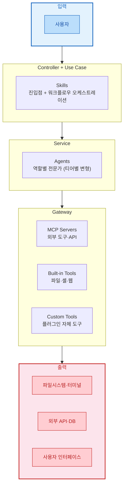
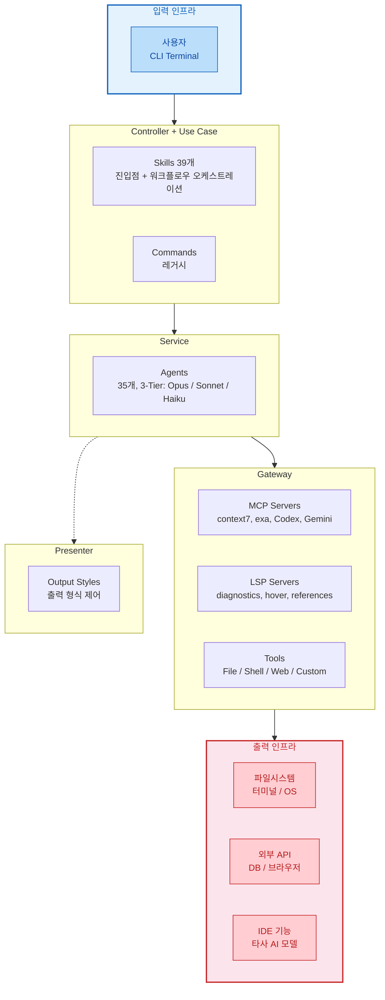
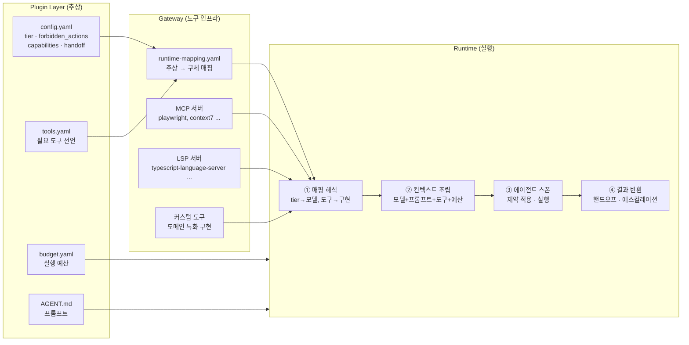

# 플러그인 표준
- [플러그인 표준](#플러그인-표준)
  - [문서 목적](#문서-목적)
  - [플러그인 개요](#플러그인-개요)
    - [범용 아키텍처](#범용-아키텍처)
    - [OMC 구현 예시](#omc-구현-예시)
  - [네임스페이스 및 충돌 방지](#네임스페이스-및-충돌-방지)
    - [네임스페이스 적용 방식](#네임스페이스-적용-방식)
    - [네임스페이스 슬래시 명령 등록](#네임스페이스-슬래시-명령-등록)
    - [충돌 해소 우선순위](#충돌-해소-우선순위)
    - [충돌 방지 체크리스트](#충돌-방지-체크리스트)
- [플러그인 디렉토리 구조 표준](#플러그인-디렉토리-구조-표준)
  - [최소 필수 구조](#최소-필수-구조)
  - [표준 디렉토리 전체 구조](#표준-디렉토리-전체-구조)
  - [디렉토리별 상세](#디렉토리별-상세)
    - [`.claude-plugin/plugin.json` (필수)](#claude-pluginpluginjson-필수)
    - [`.claude-plugin/marketplace.json` (배포 시 필요)](#claude-pluginmarketplacejson-배포-시-필요)
    - [`skills/` (선택)](#skills-선택)
    - [`agents/` (선택)](#agents-선택)
    - [`hooks/hooks.json` (선택)](#hookshooksjson-선택)
    - [`gateway/` (선택)](#gateway-선택)
  - [자동 탐색 vs 명시적 등록](#자동-탐색-vs-명시적-등록)
- [SKILL](#skill)
  - [개요](#개요)
  - [스킬 작성 원칙](#스킬-작성-원칙)
    - [역할 경계](#역할-경계)
    - [프롬프트 깊이 차등화](#프롬프트-깊이-차등화)
    - [위임 프롬프트 권장 구성](#위임-프롬프트-권장-구성)
  - [스킬 유형 분류](#스킬-유형-분류)
  - [스킬 활성화의 3계층 구조](#스킬-활성화의-3계층-구조)
  - [공통 필수 섹션](#공통-필수-섹션)
  - [유형별 권장 섹션](#유형별-권장-섹션)
    - [Core (핵심스킬)](#core-핵심스킬)
    - [Setup (설정스킬)](#setup-설정스킬)
    - [Planning (계획스킬)](#planning-계획스킬)
    - [Orchestrator (지휘자스킬)](#orchestrator-지휘자스킬)
    - [Executor (수행자스킬)](#executor-수행자스킬)
    - [Supervisor (감독자스킬)](#supervisor-감독자스킬)
    - [Utility (유틸리티스킬)](#utility-유틸리티스킬)
  - [공통 선택 섹션](#공통-선택-섹션)
  - [유형별 표준 골격 요약](#유형별-표준-골격-요약)
- [Agent](#agent)
  - [개요](#개요-1)
  - [에이전트 이름 규칙 (Task 호출 시)](#에이전트-이름-규칙-task-호출-시)
  - [에이전트 설계 원칙](#에이전트-설계-원칙)
    - [역할 단일성](#역할-단일성)
    - [티어 분리 (3-Tier 모델)](#티어-분리-3-tier-모델)
    - [자율성과 캡슐화](#자율성과-캡슐화)
  - [AGENT.md 표준](#agentmd-표준)
    - [Frontmatter](#frontmatter)
    - [마크다운 프롬프트 구성](#마크다운-프롬프트-구성)
    - [AGENT.md 예시](#agentmd-예시)
    - [원칙](#원칙)
  - [config.yaml 표준](#configyaml-표준)
    - [표준 필드](#표준-필드)
    - [표준 필드 구성](#표준-필드-구성)
    - [필드 분류](#필드-분류)
    - [표준 액션 카테고리](#표준-액션-카테고리)
    - [기본 에이전트 예시 (architect/)](#기본-에이전트-예시-architect)
    - [티어 변형 에이전트 예시 (architect-low/)](#티어-변형-에이전트-예시-architect-low)
  - [tools.yaml 표준](#toolsyaml-표준)
  - [budget.yaml 표준](#budgetyaml-표준)
    - [티어 변형 에이전트 패키지](#티어-변형-에이전트-패키지)
- [Gateway](#gateway)
  - [개요](#개요-2)
  - [Gateway 디렉토리 구조](#gateway-디렉토리-구조)
  - [install.yaml 표준](#installyaml-표준)
    - [설치 시점](#설치-시점)
    - [표준 포맷](#표준-포맷)
    - [필드 설명](#필드-설명)
    - [설치 실행 메커니즘](#설치-실행-메커니즘)
  - [runtime-mapping.yaml 표준](#runtime-mappingyaml-표준)
    - [작성 가이드](#작성-가이드)
- [Runtime](#runtime)
  - [개요](#개요-3)
  - [실행 흐름](#실행-흐름)
  - [런타임 책임](#런타임-책임)
  - [런타임 유형별 매핑 해석](#런타임-유형별-매핑-해석)
    - [LLM 런타임 권장사항](#llm-런타임-권장사항)
    - [코드 런타임 권장사항](#코드-런타임-권장사항)
- [플러그인 배포](#플러그인-배포)
  - [배포 가능 플러그인 요건](#배포-가능-플러그인-요건)
  - [배포 방식](#배포-방식)
    - [마켓플레이스 배포 (상세)](#마켓플레이스-배포-상세)
      - [STEP 1. `marketplace.json` 작성](#step-1-marketplacejson-작성)
      - [STEP 2. 마켓플레이스 등록](#step-2-마켓플레이스-등록)
      - [STEP 3. 플러그인 설치](#step-3-플러그인-설치)
      - [마켓플레이스 관리 명령어](#마켓플레이스-관리-명령어)
      - [플러그인 관리 명령어](#플러그인-관리-명령어)
      - [실제 예시: Abra 플러그인 마켓플레이스 배포](#실제-예시-abra-플러그인-마켓플레이스-배포)
      - [설치 scope 옵션](#설치-scope-옵션)
    - [로컬 경로 배포 (상세)](#로컬-경로-배포-상세)
      - [실행 방법](#실행-방법)
      - [필수 디렉토리 구조](#필수-디렉토리-구조)
      - [사전 검증 (필수)](#사전-검증-필수)
      - [실제 예시: Abra 플러그인 로컬 실행](#실제-예시-abra-플러그인-로컬-실행)
      - [디버그 모드와 함께 사용](#디버그-모드와-함께-사용)
      - [여러 플러그인 동시 로드](#여러-플러그인-동시-로드)
      - [주의사항](#주의사항)
  - [설치 흐름](#설치-흐름)
  - [README 작성 표준](#readme-작성-표준)
    - [섹션 구성](#섹션-구성)
    - [섹션별 작성 가이드](#섹션별-작성-가이드)
    - [OMC README 구조 분석 (레퍼런스)](#omc-readme-구조-분석-레퍼런스)
    - [작성 체크리스트](#작성-체크리스트)

---

## 문서 목적

본 문서는 **Claude Code 플러그인의 범용 템플릿 표준**을 정의함.

코드 개발용 플러그인에 한정하지 않고,
**어떤 작업이든 플러그인으로 제작할 때 공통적으로 적용할 수 있는 구조·패턴·작성 규칙**을 제공하는 것이 목적임.

- 교육 커리큘럼 설계, 문서 자동화, 데이터 분석 파이프라인, 워크플로우 오케스트레이션 등
  **도메인에 무관하게** 플러그인 골격을 빠르게 구성할 수 있는 템플릿 역할
- Oh-My-ClaudeCode(OMC) 플러그인의 구조를 분석하여 추출한 **실증적 패턴** 기반
- 표준 준수 항목과 OMC 고유 확장을 명확히 구분하여, 필요한 부분만 선택적으로 적용 가능

> **한글 사용 원칙**:
> 본 문서 및 본 문서를 기반으로 작성하는 플러그인의 모든 산출물(SKILL.md, 에이전트 프롬프트,
> Hook 스크립트 주석, 문서 등)은 **한글**로 작성함.
> 코드 식별자(변수명, 함수명 등)와 CLI 명령어는 영문 유지하되,
> 설명·주석·사용자 메시지·문서는 한글을 기본으로 함.

---

[Top](#플러그인-표준)

---

## 플러그인 개요

Claude Code 플러그인은 표준 컴포넌트로 구성되며,
**단방향 호출 흐름**(Skills → Agents → Gateway)에 **Hooks가 횡단적으로 개입**하는 계층 구조를 형성함.
레이어명은 Clean Architecture 용어와 통일함.

### 범용 아키텍처



> **Hooks (Cross-cutting)**: 모든 계층의 이벤트를 횡단적으로 가로챔 (AOP Aspect).
> 다이어그램에 표현하지 않으나, `UserPromptSubmit`, `PreToolUse`, `SessionStart` 등
> 이벤트마다 개입 가능.

**컴포넌트별 역할**

| 컴포넌트 | Clean Architecture 레이어 | 역할 | 트리거 방식 |
|----------|--------------------------|------|-------------|
| **Skills** | Controller + Use Case | 사용자 진입점 + 워크플로우 오케스트레이션 | 명시적 호출 |
| **Agents** | Service | 역할별 전문가 — 위임받은 작업을 자율 수행 | Skills가 위임 |
| **Hooks** | Cross-cutting (AOP) | 시스템 이벤트 가로채기 (감시·강제·로깅) | 이벤트 구동 (자동) |
| **MCP Servers** | Gateway | 외부 도구·API를 MCP 프로토콜로 제공 | 상시 대기 |
| **Built-in Tools** | Gateway | 플랫폼 기본 도구 (Read, Write, Bash, Grep 등) | 상시 대기 |
| **Custom Tools** | Gateway | 플러그인 자체 확장 도구 | MCP 경유 호출 |

### OMC 구현 예시

> 아래는 Oh-My-ClaudeCode(OMC) 플러그인의 구체적 구현임.
> 범용 아키텍처가 실제로 어떻게 구체화되는지 참조용으로 제시함.



**OMC Hook 핸들러 예시**

| 이벤트 | 개입 시점 | 대표 핸들러 |
|--------|----------|------------|
| `UserPromptSubmit` | 사용자 입력 직후 | keyword-detector.mjs (매직 키워드 감지) |
| `SessionStart` | 세션 시작 시 | session-start.mjs (상태 복원, 컨텍스트 주입) |
| `PreToolUse` | 도구 호출 직전 | pre-tool-enforcer.mjs (위임 강제, 권한 검사) |
| `PostToolUse` | 도구 호출 직후 | post-tool-verifier.mjs (결과 검증) |
| `SubagentStart` | 서브에이전트 시작 | subagent-tracker.mjs (에이전트 추적) |
| `SubagentStop` | 서브에이전트 종료 | subagent-tracker.mjs (결과 수집) |
| `Stop` | 실행 중단 시도 시 | persistent-mode.cjs (중단 방지, 계속 실행 강제) |
| `PreCompact` | 컨텍스트 압축 직전 | pre-compact.mjs (상태 체크포인트 저장) |

**OMC 컴포넌트 상세**

| 컴포넌트 | Clean Architecture 레이어 | 역할 | 트리거 방식 |
|----------|--------------------------|------|-------------|
| **Skills** | Controller + Use Case | 사용자 진입점 + 에이전트 워크플로우 오케스트레이션 | 명시적 호출 |
| **Commands** | Controller | Skills의 전신, 단순 라우팅만 수행 (레거시) | 명시적 호출 |
| **Agents** | Service | 프롬프트 + 도구를 갖춘 작업 수행 주체 | Skills 또는 Claude가 위임 |
| **Hooks** | Cross-cutting (AOP) | 시스템 이벤트를 가로채 개입하는 횡단 관심사 | 이벤트 구동 (자동) |
| **MCP Servers** | Gateway | 외부 도구/API를 MCP 프로토콜로 제공 | 상시 대기 |
| **LSP Servers** | Gateway | IDE 수준 언어 분석 기능 제공 | 상시 대기 |
| **Built-in Tools** | Gateway | Claude Code 자체 제공 (Read, Write, Bash, Grep 등) | 상시 대기 |
| **OMC Custom Tools** | Gateway | 플러그인 자체 도구 (AST, REPL, state, notepad 등) | MCP 경유 호출 |
| **Output Styles** | Presenter | 최종 출력 형식 제어 (기능 무관) | 자동 적용 |

**Skills의 이중 역할 — Controller + Use Case 겸임**

Skills는 단순한 진입점(Controller)이 아니라 SKILL.md 프롬프트 안에
**워크플로우 오케스트레이션 로직**(Use Case)을 포함함.

| Skill 예시 | 오케스트레이션 패턴 |
|-----------|-------------------|
| autopilot | 기획 → 병렬 실행 → 검증 → QA 전환까지 전체 워크플로우 지휘 |
| ralph | 반복 루프: 에이전트 위임 → architect 검증 → 미완 시 재시도 |
| ultrawork | 다수 에이전트 병렬 동시 실행 조율 |
| pipeline | 순차 에이전트 체이닝 + 단계 간 데이터 전달 |
| swarm | N개 에이전트의 태스크 풀 경쟁적 점유 관리 |

**Gateway 세분류 — 에이전트가 사용하는 도구 전체 분류**

| 유형 | 도구 | 대응하는 외부 시스템 |
|------|------|-------------------|
| **File** | Read, Write, Edit, Glob, Grep | 파일 시스템 |
| **Shell** | Bash | 터미널 / OS |
| **Web** | WebSearch, WebFetch | 웹 / 검색엔진 |
| **MCP** | MCP Servers (context7, exa, playwright 등) | 외부 API, DB, 브라우저 |
| **Language** | LSP Servers (diagnostics, hover, references 등) | IDE 수준 언어 분석 |
| **Bridge** | Codex (`mcp__x__*`), Gemini (`mcp__g__*`) | 타사 AI 모델 (OpenAI, Google) |
| **Custom Tool** | AST grep, Python REPL, state, notepad, memory | OMC 자체 확장 도구 |

[Top](#플러그인-표준)

---

## 네임스페이스 및 충돌 방지

플러그인의 스킬은 **`{plugin-name}:{skill-name}`** 형식의 네임스페이스 접두사로 식별함.
이를 통해 서로 다른 플러그인 간, 그리고 플랫폼 내장 명령과의 이름 충돌을 방지함.

### 네임스페이스 적용 방식

`plugin.json`의 **`name`** 필드가 네임스페이스 접두사로 사용됨.
스킬의 이름은 `skills/` 하위 **디렉토리명**으로 결정되며, `plugin.json`의 `name`과 자동 조합됨.

```
plugin.json:     { "name": "abra" }
스킬 디렉토리:    skills/setup/SKILL.md
→ 슬래시 명령:    /abra:setup  ✅
```

| 항목 | 형식 | 예시 |
|------|------|------|
| 스킬 전체 이름 | `{plugin-name}:{skill-dir-name}` | `abra:scenario` |
| 사용자 호출 | `/{plugin-name}:{skill-dir-name}` | `/abra:scenario` |

### 네임스페이스 슬래시 명령 등록

사용자가 `/{plugin-name}:{skill-name}` 형식으로 스킬을 호출하려면
`commands/` 디렉토리에 **진입점 파일**을 작성해야 함.
commands 파일이 없으면 슬래시 명령 목록에 표시되지 않음.

```
commands/setup.md
─────────────────
---
description: {Command 설명}
---

Use the Skill tool to invoke the `{plugin-name}:{skill-name}` skill with all arguments passed through.
```

예시)  
```
commands/setup.md
─────────────────
---
description: Abra 플러그인 초기 설정
---

Use the Skill tool to invoke the `abra:setup` skill with all arguments passed through.
```

각 commands 파일은 해당 skill로 위임하는 1줄짜리 얇은 wrapper 역할:

| 레이어 | 역할 | 비유 |
|--------|------|------|
| `commands/*.md` | 사용자 진입점 (슬래시 명령 등록) | API Gateway |
| `skills/*/SKILL.md` | 스킬 로직 | Controller |
| `agents/*/AGENT.md` | 실행 전문가 | Service |

### 충돌 해소 우선순위

동일한 스킬명이 여러 출처에서 등록될 경우, 다음 우선순위로 해소함:

| 우선순위 | 출처 | 설명 |
|---------|------|------|
| 1 (최고) | 플랫폼 내장 명령 | `/help`, `/clear` 등 — 제외 목록으로 보호 |
| 2 | Enterprise | 조직 관리 설정으로 배포된 스킬 |
| 3 | Personal | `~/.claude/skills/` 디렉토리에 정의된 스킬 |
| 4 | Project | 프로젝트 `.claude/skills/` 디렉토리에 정의된 스킬 |
| 5 (최저) | 플러그인 | 플러그인 패키지에 포함된 스킬 (`plugin-name:skill-name` 형식) |

> **설계 원칙**: 플러그인 스킬은 `plugin-name:skill-name` 네임스페이스를 사용하므로
> 다른 레벨의 스킬과 충돌하지 않음.
> 예: `plugin-a:deploy`와 `plugin-b:deploy`는 별개의 스킬로 취급.

### 충돌 방지 체크리스트

플러그인 제작 시 다음을 확인:

- [ ] `plugin.json`의 `name`을 고유하게 지정 (네임스페이스 접두사로 사용됨)
- [ ] 스킬 디렉토리명이 곧 스킬명 — 명확하고 중복 없는 이름 사용
- [ ] 플랫폼 내장 명령(`help`, `clear`, `exit` 등)과 동일한 스킬명 회피
- [ ] 같은 플러그인 내 스킬 간 디렉토리명 중복 없음


---

# 플러그인 디렉토리 구조 표준

[Top](#플러그인-표준)

---

## 최소 필수 구조

Claude Code 플러그인이 인식되기 위한 최소 구조:

```
my-plugin/
├── .claude-plugin/
│   └── plugin.json            # 플러그인 매니페스트 (유일한 필수 파일)
```

`plugin.json`만 존재하면 플러그인으로 인식됨. 나머지 디렉토리는 모두 선택.

[Top](#플러그인-표준)

---

## 표준 디렉토리 전체 구조

```
my-plugin/
├── .claude-plugin/              # 플러그인 메타데이터 (필수)
│   ├── plugin.json             # 매니페스트: name, description, version 등
│   └── marketplace.json        # 마켓플레이스 매니페스트 (배포 시 필요)
│
├── skills/                      # 스킬 정의 (선택, 자동 탐색)
│   ├── skill-name/
│   │   ├── SKILL.md            # 메인 지시 파일 (스킬당 필수)
│   │   ├── scripts/            # 실행 스크립트 (선택)
│   │   ├── references/         # 참고 문서 (선택)
│   │   └── assets/             # 템플릿, 바이너리 (선택)
│
├── agents/                      # 에이전트 정의 (선택, 자동 탐색)
│   └── agent-name/             # 에이전트 패키지 (디렉토리)
│       ├── AGENT.md            # 프롬프트 (필수)
│       ├── config.yaml         # 역량·제약·핸드오프 (필수)
│       ├── tools.yaml          # 필요 도구 선언 (선택)
│       └── budget.yaml         # 실행 예산 (선택)
│
├── gateway/                     # 도구 인프라 및 런타임 매핑 (선택)
│   ├── install.yaml            # 설치 매니페스트
│   ├── runtime-mapping.yaml    # 티어·도구·액션 매핑
│   ├── mcp/                    # MCP 서버 설정
│   ├── lsp/                    # LSP 서버 설정
│   └── tools/                  # 커스텀 도구
│
├── commands/                    # 슬래시 명령 진입점 (선택)
│   └── skill-name.md           # 스킬별 슬래시 명령 등록 (YAML frontmatter + 위임)
│
├── hooks/                       # 이벤트 핸들러 (선택, 자동 탐색)
│   └── hooks.json              # Hook 이벤트 → 스크립트 매핑
│
└── package.json                 # NPM 패키지 (배포 시 필요)
```

[Top](#플러그인-표준)

---

## 디렉토리별 상세

### `.claude-plugin/plugin.json` (필수)

플러그인 매니페스트. Claude Code가 플러그인을 인식하는 유일한 진입점.

```json
{
  "name": "my-plugin",
  "version": "1.0.0",
  "description": "플러그인 설명",
  "author": { "name": "팀명", "email": "team@example.com" },
  "license": "MIT"
}
```

| 필드 | 필수 | 타입 | 설명 |
|------|------|------|------|
| `name` | ✅ | 문자열 | 플러그인 식별자 (kebab-case) |
| `version` | 권장 | 문자열 | 시맨틱 버전 |
| `description` | 권장 | 문자열 | 기능 설명 |
| `author` | 선택 | **객체** | `{ "name": "...", "email": "..." }` — 문자열 불가 |
| `license` | 선택 | 문자열 | 라이선스 (예: `"MIT"`) |
| `skills` | 선택 | 스킬 디렉토리 경로 (비표준 위치일 때만 필요) |
| `agents` | 선택 | 에이전트 디렉토리 경로 |
| `gateway` | 선택 | Gateway 디렉토리 경로 |
| `hooks` | 선택 | hooks.json 경로 |
| `outputStyles` | 선택 | 출력 스타일 설정 |

> **경로 등록 규칙**: 표준 위치(`skills/`, `agents/`, `hooks/hooks.json`)에 있으면
> Claude Code가 자동 탐색하므로 plugin.json에 등록 불필요.
> 비표준 위치에 있을 때만 명시적 경로 등록 필요.

### `.claude-plugin/marketplace.json` (배포 시 필요)

마켓플레이스 배포 시 필요한 매니페스트. `claude plugin marketplace add`로 등록하려면 필수.

```json
{
  "$schema": "https://anthropic.com/claude-code/marketplace.schema.json",
  "name": "my-marketplace",
  "description": "마켓플레이스 설명",
  "owner": { "name": "팀명", "email": "team@example.com" },
  "plugins": [
    { "name": "my-plugin", "description": "플러그인 설명", "version": "1.0.0", "source": "./" }
  ]
}
```

| 필드 | 필수 | 설명 |
|------|------|------|
| `name` | ✅ | 마켓플레이스 식별자 (`plugin@marketplace` 형식으로 사용) |
| `description` | 권장 | 마켓플레이스 설명 |
| `owner` | 선택 | 소유자 정보 (`name`, `email`) |
| `plugins` | ✅ | 포함 플러그인 배열 (`name`, `description`, `version`, `source`) |

### `skills/` (선택)

스킬은 **자기 완결형 디렉토리** 단위로 구성됨.

| 파일/디렉토리 | 필수 | 설명 |
|--------------|------|------|
| `SKILL.md` | ✅ (스킬당) | YAML frontmatter + Markdown 프롬프트 |
| `scripts/` | 선택 | Python/Bash 실행 스크립트 |
| `references/` | 선택 | 온디맨드 로드 참고 문서 |
| `assets/` | 선택 | 템플릿, 바이너리 등 |

**`commands/` — 슬래시 명령 등록:**
스킬을 `/plugin-name:skill-name` 형식의 슬래시 명령으로 노출하려면   
`commands/` 디렉토리에 진입점 파일을 작성해야 함.  
**commands 파일이 없으면 슬래시 명령 목록에 표시되지 않음.**
각 파일은 YAML frontmatter(`description`)와 Skill 위임 1줄로 구성되는 얇은 wrapper 역할.
예시: 
`commands/setup.md` → `Use the Skill tool to invoke the \`abra:setup\` skill with all arguments passed through.`
   
**SKILL.md frontmatter 주요 필드:**

| 필드 | 설명 | 기본값 |
|------|------|--------|
| `name` | 스킬 식별자 (소문자+하이픈, 최대 64자) | 디렉토리명 |
| `description` | 기능 설명 (최대 1024자, **반드시 한 줄**) | 첫 문단 |
| `user-invocable` | 슬래시 메뉴 표시 여부 | `true` |
| `disable-model-invocation` | Claude 자동 호출 방지 | `false` |
| `allowed-tools` | 사전 승인 도구 (쉼표 구분) | 없음 |
| `model` | 모델 오버라이드 (haiku/sonnet/opus) | 기본값 |
| `context` | `fork` 시 서브에이전트에서 실행 | `inline` |
| `agent` | `context: fork` 시 서브에이전트 유형 | `general-purpose` |

### `agents/` (선택)

에이전트는 **디렉토리 패키지** 단위로 정의됨. 각 에이전트 디렉토리에는
프롬프트(AGENT.md)와 선언형 설정(config.yaml 등)이 함께 포함됨.

```
agents/
├── architect/                # 에이전트 패키지
│   ├── AGENT.md             # 프롬프트 (필수)
│   ├── config.yaml          # 역량·제약·핸드오프 (필수)
│   ├── tools.yaml           # 필요 도구 선언 (선택)
│   └── budget.yaml          # 실행 예산 (선택)
└── executor/
    ├── AGENT.md
    ├── config.yaml
    └── ...
```

각 파일의 표준은 [Agent](#agent) 섹션에서 상세히 정의함.

### `hooks/hooks.json` (선택)

시스템 이벤트에 반응하는 핸들러를 정의.

| 이벤트 | 시점 |
|--------|------|
| `UserPromptSubmit` | 사용자 입력 직후 |
| `SessionStart` | 세션 시작 |
| `PreToolUse` | 도구 호출 직전 |
| `PostToolUse` | 도구 호출 직후 |
| `SubagentStart` | 서브에이전트 시작 |
| `SubagentStop` | 서브에이전트 종료 |
| `Stop` | 실행 중단 시도 |
| `PreCompact` | 컨텍스트 압축 직전 |

> **사용 시 주의**:
> - Hook은 **전역 공유 자원**(`~/.claude/settings.json` 등)에 등록되므로,
>   오케스트레이션 플러그인(예: OMC)이 이미 주요 이벤트를 점유하고 있으면 **충돌 위험**이 있음
> - 키워드 감지, 위임 강제, 결과 검증 등 대부분의 기능은
>   **Core 스킬의 프롬프트 지시**(Phase 0 Intent Gate 등)로 대체 가능
> - Hook이 반드시 필요한 시나리오(`Stop` 중단 방지, `PreCompact` 체크포인트 저장)는
>   오케스트레이션 플러그인에 한정되며, 일반 비즈니스 플러그인에서는 거의 불필요
> - **권장**: 비즈니스 플러그인은 Hook 대신 스킬과 에이전트만으로 워크플로우를 구성하고,
>   Hook은 오케스트레이션 플러그인의 고유 영역으로 남겨둘 것

### `gateway/` (선택)

도구 인프라 및 런타임 매핑을 관리하는 디렉토리.
MCP/LSP/커스텀 도구 설정과 런타임 매핑 테이블을 포함함.

| 파일/디렉토리 | 필수 | 설명 |
|--------------|------|------|
| `install.yaml` | 권장 | 설치 매니페스트 — setup 스킬이 참조 |
| `runtime-mapping.yaml` | 권장 | 티어·도구·액션 매핑 테이블 |
| `mcp/` | 선택 | MCP 서버 설정 파일 |
| `lsp/` | 선택 | LSP 서버 설정 파일 |
| `tools/` | 선택 | 커스텀 도구 구현체 |

각 파일의 표준은 [Gateway](#gateway) 섹션에서 상세히 정의함.

---

[Top](#플러그인-표준)

---

## 자동 탐색 vs 명시적 등록

| 디렉토리/파일 | 표준 위치 | 자동 탐색 | plugin.json 등록 |
|--------------|----------|----------|-----------------|
| `skills/` | ✅ | ✅ | 불필요 |
| `agents/` | ✅ | ✅ | 불필요 |
| `gateway/` | 표준 정의 | ❌ | 플러그인 표준이 정의한 경로. setup 스킬이 참조 |
| `hooks/hooks.json` | ✅ | ✅ | 불필요 |
| 비표준 경로 | ❌ | ❌ | **필요** |

> 표준 위치에 있으면 등록 생략 가능.

---

# SKILL 

[Top](#플러그인-표준)

---

## 개요

SKILL.md는 YAML Frontmatter + Markdown Content로 구성됨.
Frontmatter는 메타데이터(name, description 등)를, Markdown Content는 Claude에게 전달되는 **프롬프트 지시문**을 담음.
본 섹션은 Markdown Content의 표준 구조를 정의하여 스킬 간 일관성을 확보함.

```
---
name: my-skill                    ← YAML Frontmatter (메타데이터)
description: 스킬 기능 설명
---
                                   ← 여기부터 Markdown Content (프롬프트 지시문)
# My Skill                        ← H1 타이틀
[MY-SKILL ACTIVATED]               ← 활성화 공지 배너 (선택)

## Overview                        ← 핵심 기능 설명
## Activation                      ← 활성화 조건 (자기 선언)
## Usage                           ← 사용법
## Workflow                        ← 워크플로우
...
```

---

[Top](#플러그인-표준)

---

## 스킬 작성 원칙

스킬은 **라우터(Router)와 오케스트레이터(Orchestrator)** 역할에 집중함.
직접 작업을 수행하는 것이 아니라, 요청을 분석하고 적절한 에이전트에게 위임하는 것이 핵심 역할임.

### 역할 경계

| 스킬이 직접 수행 | 에이전트에 위임 |
|------------------|----------------|
| 요청 의도 분류 (라우팅) | 코드 작성·수정 |
| 워크플로우 분기 결정 | 탐색·분석·조사 |
| 사용자 상호작용 (질문, 안내) | 문서 작성 |
| 상태 관리 (진행률, 반복 카운트) | 검증·테스트 |
| 에이전트 결과 취합·보고 | 설계·아키텍처 결정 |

### 프롬프트 깊이 차등화

스킬이 직접 수행하는 영역과 에이전트에 위임하는 영역은 **프롬프트 작성의 깊이**가 달라야 함:

| 영역 | 프롬프트 깊이 | 작성 지침 |
|------|-------------|-----------|
| **라우팅/분기 로직** | **상세** | 의도 분류 기준, 조건별 분기, 모드 전환 로직을 빠짐없이 기술 |
| **사용자 상호작용** | **상세** | 질문 형식, 응답 처리, 오류 안내 등 UX 흐름을 구체적으로 정의 |
| **에이전트 위임 지시** | **간결** | 목표(WHAT)와 제약(MUST NOT)만 명시, 방법(HOW)은 에이전트에 위임 |
| **상태 관리** | **중간** | 상태 파일 경로·구조는 명시, 세부 로직은 간결하게 |

> **핵심**: 스킬 프롬프트가 에이전트의 작업 방법까지 상세히 기술하면
> 에이전트의 자율성이 떨어지고 유지보수 비용이 증가함.
> **"무엇을 달성할 것인가"**에 집중하고, **"어떻게 달성할 것인가"**는 에이전트에 맡김.

### 위임 프롬프트 권장 구성

에이전트에 작업을 위임할 때 프롬프트에 포함해야 할 항목:

```
1. TASK: 원자적이고 구체적인 목표 (하나의 작업당 하나의 위임)
2. EXPECTED OUTCOME: 구체적 산출물과 성공 기준
3. MUST DO: 반드시 수행해야 할 요건 — 빠짐없이 나열
4. MUST NOT DO: 금지 행위 — 에이전트의 월권 방지
5. CONTEXT: 파일 경로, 기존 패턴, 제약 조건
```

> **간결 원칙**: 위 5항목 외에 에이전트의 내부 사고 방식이나 단계별 절차는 기술하지 않음.
> 에이전트는 자신의 AGENT.md에 정의된 역할과 워크플로우를 따름.

---

[Top](#플러그인-표준)

---

## 스킬 유형 분류

스킬은 역할에 따라 7가지 유형으로 분류됨.
각 유형은 공통 골격 위에 고유 섹션을 추가하여 정체성을 형성함.

| 유형 | 영문명 | 역할 | 예시 |
|------|--------|------|------|
| 핵심스킬 | Core | 시스템 전체 행동 규범 정의, 항상 활성화 | orchestrate |
| 설정스킬 | Setup | 설치 · 설정 마법사 제공 | omc-setup, mcp-setup |
| 계획스킬 | Planning | 전략적 계획 수립 · 검토 | plan, ralplan, review |
| 지휘자스킬 | Orchestrator | 워크플로우 조율, 병렬 실행 관리 | autopilot, ralph, ultrawork |
| 수행자스킬 | Executor | 특정 작업 수행 (분석, 리뷰, 빌드 수정 등) | analyze, code-review, tdd |
| 감독자스킬 | Supervisor | 다른 스킬/모드의 상태 감시 · 제어 | cancel |
| 유틸리티스킬 | Utility | 도구, 헬퍼, 문서화 등 보조 기능 | note, doctor, help |

---

[Top](#플러그인-표준)

---

## 스킬 활성화의 3계층 구조

스킬이 활성화되기까지 세 가지 계층이 관여함.
각 계층은 역할이 다르며, 모두 필요하지만 목적이 분리됨.

**CLAUDE.md — 라우팅 테이블 (항상 로드)**

CLAUDE.md는 런타임이 항상 읽는 파일임.
사용자 요청이 어떤 플러그인의 어떤 스킬과 매칭되는지를 선언하는 라우팅 테이블을 포함함.
setup 스킬이 플러그인 설치 시 이 라우팅 테이블을 CLAUDE.md에 추가함.
예: `"코드 품질 분석 요청" → code-quality 플러그인 → orchestrate 스킬`

**핵심 스킬 — 오케스트레이션 실행 (조건 매칭 시 로드)**

핵심 스킬(예: `orchestrate`)은 라우팅에 의해 활성화된 후 실제 오케스트레이션을 수행함.
Gateway의 `runtime-mapping.yaml`을 참조하여 매핑을 해석하고 에이전트를 스폰(생성·초기화)함.
활성화 조건이 핵심 스킬 안에만 있으면 스킬을 로드하기 위해 조건을 먼저 알아야 하는
순환 문제가 발생하므로, 라우팅 테이블은 CLAUDE.md에 분리함.


---

[Top](#플러그인-표준)

---

## 공통 필수 섹션

모든 스킬이 포함해야 할 기본 골격:

| 순서 | 표준 섹션명 | 필수 | 설명 |
|------|------------|------|------|
| 1 | `# {스킬명}` | ✅ | H1 타이틀 + 역할 요약 (한 줄) |
| 2 | `[{스킬명} 활성화]` | 선택 | 활성화 공지 배너 — 스킬 진입 후 출력하는 선언문 (프롬프트 지시) |
| 3 | `## 개요` | ✅ | 핵심 기능 설명 |
| 4 | `## 활성화 조건` | 권장 | 이 스킬이 활성화되는 조건 · 상황 (자기 선언) |
| 5 | `## 사용법` | 권장 | 사용법 / 명령어 구문 |
| 6 | `## 워크플로우` | 권장 | 워크플로우 / 단계별 접근법 |


> **섹션명 통일 규칙**: 동일 목적의 섹션은 표준명 사용 권장
>
> | 목적 | 표준명 | 비권장 (혼용 사례) |
> |------|--------|-------------------|
> | 기능 설명 | `## 개요` | Overview, What It Does, Core Concept |
> | 활성화 조건 | `## 활성화 조건` | Activation, When to Use, Magic Keywords |
> | 사용법 | `## 사용법` | Usage, Commands, Quick Commands |
> | 워크플로우 | `## 워크플로우` | Workflow, Phases, Approach, Step N |

> **유형별 활성화 조건 작성 가이드**:
>
> | 유형 | 활성화 조건 내용 | 예시 |
> |------|-----------------|------|
> | Core | 광범위 조건 매칭 시 자동 활성화 | "위임이 필요한 작업 감지 시 활성화" |
> | Setup | 명시적 호출만 (`/command`) | "사용자가 `/omc-setup` 호출 시" |
> | Planning | 키워드 감지 또는 명시적 호출 | "broad request 감지 시 또는 `/plan` 호출 시" |
> | Orchestrator | 키워드 감지 + 매직 키워드 | "autopilot, build me 키워드 감지 시" |
> | Executor | 컨텍스트 감지 또는 명시적 호출 | "코드 변경 후 자동 또는 `/code-review` 호출 시" |
> | Supervisor | 사용자 취소 요청 시 | "cancelomc, stopomc 키워드 감지 시" |
> | Utility | 명시적 호출만 | "사용자가 `/note` 호출 시" |

---

[Top](#플러그인-표준)

---

## 유형별 권장 섹션

### Core (핵심스킬)

항상 활성화되어 시스템 전체 행동 규범을 정의하는 스킬.

공통 골격(`# {스킬명}`, `## 개요`, `## 워크플로우` 등)에 더해 Core 고유 섹션:

| 섹션 | 필수 | 설명 |
|------|------|------|
| `## 작업 관리` | 권장 | 작업 관리 규칙 (Todo 생성 기준, 워크플로우) |
| `## 어조와 스타일` | 권장 | 커뮤니케이션 스타일 (간결성, 사용자 맞춤) |
| `## 제약 사항` | 권장 | 소프트 가이드라인 (기존 라이브러리 선호 등) |

**워크플로우 섹션의 Phase 구조**:

Core 스킬의 `## 워크플로우`는 `### Phase N` 하위 헤딩으로 구성됨.
각 Phase에서 정의해야 할 항목:

| Phase | 이름 | 실행 시점 | 정의 항목 |
|-------|------|----------|----------|
| **Phase 0** | 의도 분류 (Intent Gate) | 매 메시지마다 | 요청 분류 규칙, 스킬/워크플로우 매칭 조건, 미매칭 시 다음 Phase 진행 조건 |
| **Phase 1** | 현황 파악 (Context Assessment) | 작업 착수 전 | 작업 대상의 현재 상태 파악, 상태 분류 기준 정의, 상태별 행동 전략 결정 |
| **Phase 2** | 실행 (Execution) | 실제 작업 수행 | **2A 탐색**: 위임 전 계획, 에이전트 선택 기준, 병렬 실행 패턴  **2B 구현**: Todo 생성 규칙, 위임 프롬프트 구조, 검증·증거 요건  **2C 실패 복구**: 연속 실패 시 중단→복원→기록→상위 상담 프로토콜 |
| **Phase 3** | 완료 (Completion) | 작업 완료 시 | Self-Check 체크리스트, 검증자(Architect 등) 승인 프로토콜, 상태 정리 |

> **Phase 설계 가이드**:
> - Phase 0~3은 **범용 골격**이며, 도메인에 따라 Phase를 추가·생략·세분화 가능
> - Phase 1(현황 파악)은 도메인에 따라 내용이 크게 달라짐
>   - 코드 개발: 코드베이스 상태 분류 (Disciplined/Legacy/Greenfield 등)
>   - 교육 설계: 학습자 수준 파악, 기존 커리큘럼 현황 조사
>   - 문서 자동화: 기존 문서 구조·포맷 분석
> - Phase 2는 서브 Phase(2A/2B/2C)로 세분화하여 탐색·구현·복구를 분리하는 것을 권장

특징:
- 활성화 조건에 매칭 시 **자동 활성화**
- `{{PROMPT}}` 치환 없음 — 항상 적용되는 행동 규범

### Setup (설정스킬)

설치 · 설정 마법사를 제공하는 스킬.

공통 골격에 더해 Setup 고유 섹션:

| 섹션 | 필수 | 설명 |
|------|------|------|
| `## 사용자 상호작용` | ✅ | AskUserQuestion으로 사용자 선택지를 UI로 제공하여 분기 |
| `## 스킬 위임` | 권장 | `Skill tool`로 다른 스킬 호출 (예: setup → hud) |
| `## 상태 관리` | 권장 | 상태 파일 기반 중단/재개 복원 |
| `## 문제 해결` | 권장 | 설치 문제 해결 안내 |

> **워크플로우 섹션 작성 시**: Setup 스킬은 `## 워크플로우` 안에
> `### Step N: {Name}` 패턴으로 번호 기반 순차 워크플로우를 정의함.
> 사용자가 진행 상황을 파악하기 쉽도록 단계별 번호를 부여함.

특징:
- bash 명령어(설치) + Write 도구(설정 파일 작성) 혼합 사용
- 설정 완료 후 검증 단계 포함 권장

**frontmatter 권장 설정:**

```yaml
---
name: setup
description: 플러그인 초기 설정
user-invocable: true
disable-model-invocation: true    # 사용자 명시적 호출만 허용
---
```

setup 스킬은 `disable-model-invocation: true`로 설정하여
런타임이 자동 호출하지 않도록 해야 함.
사용자가 `/my-plugin:setup`으로 명시적으로 호출할 때만 실행됨.

### Planning (계획스킬)

전략적 계획 수립 · 검토를 담당하는 스킬.

공통 골격에 더해 Planning 고유 섹션:

| 섹션 | 필수 | 설명 |
|------|------|------|
| `## 품질 기준` | 권장 | 계획 품질 기준 (참조율, 실현 가능성 등) |
| `## 판정 기준` | 권장 | 승인 / 수정 요청 / 반려 판정 기준 |
| `## 계획 저장` | 권장 | 계획 파일 저장 위치 |
| `## 외부 모델 검증` | 선택 | 외부 모델 크로스 검증 프로토콜 |

> **워크플로우 섹션 작성 시**: Planning 스킬은 `## 워크플로우` 안에
> 계획 모드를 정의하고, 모드별 진행 흐름을 `### {Mode Name}` 하위 헤딩으로 구성함.

**계획 모드 (Planning Mode)**:

Planning 스킬은 요구사항의 명확도에 따라 세 가지 모드 중 하나로 동작함.
이 모드는 Planning 유형에 한정하지 않고, 사용자 입력을 받아 계획을 수립하는 **모든 스킬**에 적용 가능한 패턴임.

| 모드 | 활성화 조건 | 진행 방식 | 적합한 상황 |
|------|------------|-----------|------------|
| **Interview** | 요구사항이 모호하거나 광범위 (기본값) | 사용자에게 **한 번에 한 질문**씩 순차 질의하여 요구사항 구체화 | "개선해 줘", "리팩터링해 줘" 등 대상·범위가 불명확한 요청 |
| **Direct** | 요구사항이 충분히 구체적 | 인터뷰 생략, **즉시 계획 생성** | 파일·함수·범위가 명시된 상세 요청, `--direct` 플래그 |
| **Consensus** | 복수 관점의 검증이 필요한 복잡한 과제 | 복수 에이전트(예: Planner + Architect + Critic)가 **반복 합의** → 최대 N회 | 아키텍처 결정, 대규모 리팩터링, `--consensus` 플래그 |

각 모드의 핵심 메커니즘:

| 모드 | 핵심 메커니즘 | OMC 참조 구현 |
|------|-------------|--------------|
| **Interview** | AskUserQuestion 도구로 한 번에 한 질문, 질문 전 에이전트로 팩트 선행 조사 (적응형 탐색) | `plan` 스킬 (interview 모드) |
| **Direct** | 주어진 요구사항만으로 계획 생성, 사용자 상호작용 최소화 | `plan --direct` |
| **Consensus** | 에이전트 간 제안 → 검토 → 수정 루프를 합의 도달 시까지 반복 | `ralplan` (`plan --consensus`) |

> **모드 선택 가이드**: 요구사항 명확도를 기준으로 자동 판별하되,
> 사용자가 플래그(`--direct`, `--consensus`)로 명시적 지정도 가능하게 설계함.

### Orchestrator (지휘자스킬)

워크플로우 조율 · 병렬 실행을 관리하는 스킬.

공통 골격에 더해 Orchestrator 고유 섹션:

| 섹션 | 필수 | 설명 |
|------|------|------|
| `## 완료 조건` | ✅ | 완료 조건 목록 (기능 동작, 검증 통과, 에러 0 등) |
| `## 검증 프로토콜` | ✅ | 검증 절차 — 완료 전 검증자 승인 강제 |
| `## 상태 정리` | ✅ | 상태 파일 정리 규칙 (완료 시 삭제) |
| `## 취소` / `## 재개` | ✅ | 취소 및 재개 메커니즘 |
| `## 템플릿 변수` | 권장 | `{{ITERATION}}`, `{{MAX}}`, `{{PROMPT}}` — Hook 런타임 치환 |
| `## 모델 라우팅` | 권장 | 에이전트 티어 라우팅 (haiku/sonnet/opus) |
| `## 설정` | 선택 | JSON 설정 예시 + 필드 설명 |

> **워크플로우 섹션 작성 시**: Orchestrator 스킬은 `## 워크플로우` 안에
> `### Phase N: {Name}` 패턴으로 순차/병렬 단계를 정의함.
> 각 Phase는 Goal → Agents → Output 구조를 따름.

특징:
- 가장 풍부한 구조 (평균 10+ 섹션)
- 검증 프로토콜(Iron Law): "검증 없이 완료 선언 불가" 원칙
- 모드 간 계층 관계 존재 (예: autopilot → ralph → ultrawork)
- 독립 실행 가능 스킬 vs 컴포넌트(단독 불가) 구분

### Executor (수행자스킬)

특정 작업을 수행하는 전문 스킬 (분석, 리뷰, 빌드 수정, TDD 등).

공통 골격에 더해 Executor 고유 섹션:

| 섹션 | 필수 | 설명 |
|------|------|------|
| `## 에이전트 위임` | ✅ | `Task(subagent_type=..., model=..., prompt=...)` 위임 코드 블록 |
| `## 출력 형식` | ✅ | 보고서/출력 텍스트 템플릿 |
| `## 체크리스트` | 권장 | 카테고리별 `- [ ]` 형식 검토 항목 |
| `## 심각도` / `## 승인 기준` | 선택 | 심각도 등급 (CRITICAL~LOW) 또는 판정 기준 (승인/반려) |
| `## 모범 사례` | 선택 | 모범 사례 |
| `## 외부 모델 검증` | 선택 | 외부 모델 크로스 검증 |

> **워크플로우 섹션 작성 시**: Executor 스킬은 `## 워크플로우` 안에
> 작업 수행 절차를 정의함. 단발 실행이 대부분이므로
> 간결한 순차 단계(조사 → 위임 → 검증 → 보고)로 구성함.

특징:
- Agent Delegation 패턴: 작업을 전문 에이전트에게 위임하는 코드 블록 포함
- Output Format: 최종 출력 형식을 텍스트 템플릿으로 명시
- 자동(silent) 활성화 가능: 컨텍스트 감지로 명시적 호출 없이 활성화

### Supervisor (감독자스킬)

다른 스킬/모드의 상태를 감시 · 제어하는 스킬.

공통 골격에 더해 Supervisor 고유 섹션:

| 섹션 | 필수 | 설명 |
|------|------|------|
| `## 자동 감지` | ✅ | 상태 파일 기반 활성 모드 자동 감지 |
| `## 강제 초기화` | 권장 | `--force`/`--all` 일괄 정리 플래그 |
| `## 메시지 참조` | 권장 | 모드별 메시지 테이블 |
| `## 보존 정책` | 권장 | 보존/삭제 대상 + 재개 가능 여부 테이블 |

> **워크플로우 섹션 작성 시**: Supervisor 스킬은 `## 워크플로우` 안에
> 감지 → 실행 → 정리 순서의 단계를 정의함.
> bash 스크립트를 직접 내장하여 Claude가 실행하는 패턴도 가능.

특징:
- 의존성 인식 순서: 상위 모드부터 계층적으로 처리
- 보존 정책: 모드별로 "무엇을 삭제하고 무엇을 보존하는지" 명시

### Utility (유틸리티스킬)

도구, 헬퍼, 문서화 등 보조 기능을 제공하는 스킬.

공통 골격에 더해 Utility 고유 섹션:

| 섹션 | 필수 | 설명 |
|------|------|------|
| `## 명령어` / `## 하위 명령어` | ✅ | 명령어 또는 하위 명령어 테이블 |
| `## 연동` | 선택 | 다른 시스템/스킬 연동 방식 |
| `## 파일 구조` | 선택 | 디렉토리 구조 정의 |
| `## 저장 스키마` | 선택 | 데이터 저장 형식 (JSON 스키마) |

> **워크플로우 섹션 작성 시**: Utility 스킬은 `## 워크플로우` 안에
> 동작 순서를 간결하게 정의함. 명령어/서브커맨드별 분기가 있으면
> `### {Subcommand}` 하위 헤딩으로 구성함.

특징:
- 가장 간결한 구조 (평균 5 섹션)
- 테이블 중심: 명령어, 옵션, 서브커맨드를 테이블로 정리
- 도메인 특화 가능: 창작, 환경 관리, 배포 등

---

[Top](#플러그인-표준)

---

## 공통 선택 섹션

복잡도에 따라 선택적으로 추가:

| 섹션 | 권장 시기 | 설명 |
|------|-----------|------|
| `## 외부 모델 검증` | 외부 AI 모델 활용 시 | Codex, Gemini 등 크로스 검증 프로토콜 |
| `## 설정` | 설정 가능 항목 존재 시 | JSON 설정 예시 + 필드 설명 |
| `## 문제 해결` | 실패 가능성 높은 스킬 | 문제 해결 안내 |
| `## 예시` | 복잡한 사용법 스킬 | 시나리오별 사용 예시 |
| `## 모범 사례` | 오용 가능성 있는 스킬 | 모범 사례 / 안티패턴 |
| `## 아키텍처` | 복잡한 시스템 스킬 | ASCII 아키텍처 다이어그램 |
| `## 상태 관리` | 상태 파일 사용 스킬 | 상태 파일 위치 + JSON 구조 |
| `## 매직 키워드` | 자동 활성화 지원 스킬 | 트리거 키워드 목록 |
| `## 에러 처리` | 실패 복구 필요 스킬 | 에러 유형별 대응 전략 |

---

[Top](#플러그인-표준)

---

## 유형별 표준 골격 요약

| 유형 | 공통 골격 | + 유형 고유 | + 선택 | 규모 가이드 |
|------|-----------|------------|--------|------------|
| Core | H1 + 개요 + 활성화 조건 | 작업 관리, 어조와 스타일, 제약 사항 | - | 300~600줄 |
| Setup | H1 + 개요 + 활성화 조건 + 사용법 | 사용자 상호작용, 스킬 위임 | 문제 해결 | 60~650줄 |
| Planning | H1 + 개요 + 활성화 조건 + 사용법 | 품질 기준, 판정 기준 | 외부 모델 검증, 계획 저장 | 50~250줄 |
| Orchestrator | H1 + 개요 + 활성화 조건 + 사용법 | 완료 조건, 검증 프로토콜, 상태 정리, 취소/재개 | 설정, 문제 해결 | 90~700줄 |
| Executor | H1 + 개요 + 활성화 조건 | 에이전트 위임, 출력 형식 | 체크리스트, 모범 사례 | 40~350줄 |
| Supervisor | H1 + 개요 + 활성화 조건 + 사용법 | 자동 감지, 보존 정책 | - | 200~700줄 |
| Utility | H1 + 개요 + 활성화 조건 + 사용법 | 명령어 | 연동, 파일 구조 | 60~600줄 |

> **핵심 원칙**:
> - 공통 골격(H1 + 개요 + 사용법)은 가볍게 유지 — 유형별 고유 섹션이 스킬의 정체성 결정
> - 섹션명은 한글 표준명 사용 권장 (개요, 사용법, 워크플로우)
> - 선택 섹션은 스킬 복잡도에 비례하여 추가
> - Orchestrator 유형이 가장 풍부 (10+ 섹션) vs Utility가 가장 간결 (5 섹션)

---

# Agent

[Top](#플러그인-표준)

---

## 개요

에이전트(Agent)는 스킬로부터 위임받은 작업을 **자율적으로 수행하는 전문가 단위**임.
스킬이 라우터/오케스트레이터 역할을 한다면, 에이전트는 **실제 작업을 수행하는 서비스 레이어**에 해당함.

> **런타임(Runtime)**: 에이전트를 실제로 스폰(생성·초기화)하고 실행하는 환경을 의미함.
> Claude Code, Codex CLI, Gemini CLI, Cursor 등이 런타임에 해당하며,
> 본 표준은 특정 런타임에 종속되지 않도록 추상 선언만 정의함.
> 런타임이 Gateway의 매핑 테이블을 참조하여 추상 선언을 구체 구현으로 변환함.

각 에이전트는 **독립된 디렉토리 패키지**로 구성되며, `agents/` 디렉토리에 배치함.

**표준 디렉토리 구조**    
```text
agents/
└── {agent_name}/
    ├── AGENT.md          # [필수] 프롬프트 전문 (역할, 워크플로우, 출력형식, 검증, 예시)
    ├── config.yaml       # [필수] 역량, 제약, 핸드오프 선언 (기계 판독용)
    ├── tools.yaml        # [선택] 필요한 도구 인터페이스 명세
    ├── budget.yaml       # [선택] 실행 자원 예산 (토큰, 파일 수, 타임아웃 등)
    ├── references/       # [선택] 전문 지식, 가이드라인, 참조 문서
    │   ├── guidelines/
    │   └── docs/
    └── templates/        # [선택] 출력 포맷 규격
```

[Top](#플러그인-표준)

---

## 에이전트 이름 규칙 (Task 호출 시)
공식 표준에서 네임스페이스는 스킬에만 적용되지만,
오케스트레이션 플러그인(예: OMC)은 `Task` 도구로 에이전트를 호출할 때
**자체 네이밍 규칙**을 적용함.

OMC는 `agents/` 디렉토리를 재귀 탐색하여 `.md` 파일을 발견하고,
**`{plugin-name}:{디렉토리명}:{frontmatter-name}`** 형식으로 등록함.

| 디렉토리 | AGENT.md의 name | Task 호출 시 이름 |
|----------|----------------|------------------|
| `scenario-analyst/` | `scenario-analyst` | `abra:scenario-analyst:scenario-analyst` |
| `dsl-architect/` | `dsl-architect` | `abra:dsl-architect:dsl-architect` |

> **주의**: 디렉토리명과 frontmatter name이 동일하면 `{plugin}:{name}:{name}`처럼
> 이름이 중복되어 보일 수 있음. 이는 OMC의 디렉토리 기반 탐색 방식 때문이며,
> 에이전트 호출 시 반드시 **전체 이름(fully qualified name)**을 사용해야 함.

```python
# 스킬에서 에이전트 호출 예시
Task(
    subagent_type="abra:scenario-analyst:scenario-analyst",
    model="opus",
    prompt="시나리오를 분석해주세요..."
)
```

---

[Top](#플러그인-표준)

---

## 에이전트 설계 원칙

### 역할 단일성

하나의 에이전트는 **하나의 전문 역할**만 담당함.
역할이 넓어지면 별도 에이전트로 분리함.

| 원칙 | 설명 | 예시 |
|------|------|------|
| 단일 역할 | 하나의 전문 영역에 집중 | architect = 분석·설계만, 코드 수정 안 함 |
| 명확한 경계 | "나는 무엇이다 / 무엇이 아니다" 선언 | executor = 코드 작성, 요구사항 수집은 안 함 |
| 핸드오프 규칙 | 자기 역할 밖의 요청은 적절한 에이전트로 위임 | architect → executor로 구현 위임 |

### 티어 분리 (3-Tier 모델)

동일한 역할을 **비용과 역량** 기준으로 티어별 변형 에이전트로 분리함.
이는 자원의 비용-역량 트레이드오프를 최적화하는 범용 원칙임.

| 티어 | 특성 | 적합한 작업 |
|------|------|------------|
| **LOW** | 빠르고 저비용, 단순 작업 전용 | 단건 조회, 간단한 수정, 빠른 검색 |
| **MEDIUM** | 균형잡힌 성능 | 기능 구현, 탐색, 일반 분석 |
| **HIGH** | 최고 능력, 고비용 | 복잡한 의사결정, 심층 분석, 대규모 작업 |

**도메인별 티어 적용 예시:**

| 도메인 | LOW | MEDIUM | HIGH |
|--------|-----|--------|------|
| LLM 모델 | Haiku | Sonnet | Opus |
| 클라우드 인프라 | t2.micro | m5.large | p3.xlarge |
| 고객 지원 | L1 스크립트 응대 | L2 전문가 | L3 엔지니어 |
| 검토 수준 | 자동 검사 | 담당자 검토 | 전문가 위원회 |

> **에스컬레이션 원칙**: LOW 티어가 처리할 수 없는 복잡도를 감지하면
> 스스로 작업을 중단하고 상위 티어로의 에스컬레이션을 보고함.
> 이 원칙은 자원 낭비를 방지하면서 품질을 보장하는 핵심 메커니즘임.

### 자율성과 캡슐화

에이전트는 위임받은 목표(WHAT)를 달성하기 위한 방법(HOW)을 **스스로 결정**함:

| 원칙 | 설명 |
|------|------|
| **사고 자율성** | 에이전트는 자신의 워크플로우에 따라 독립적으로 판단 |
| **도구 자율성** | 허용된 도구 범위 내에서 어떤 도구를 언제 쓸지 스스로 결정 |
| **캡슐화** | 내부 사고 과정은 외부에 노출하지 않고, 결과만 반환 |
| **이동성** | 에이전트 파일(또는 디렉토리)을 다른 프로젝트에 복사해도 동작 |

---

[Top](#플러그인-표준)

---

## AGENT.md 표준

AGENT.md는 **에이전트의 전체 프롬프트**를 마크다운으로 작성하는 파일.
Frontmatter(식별 메타데이터) + Markdown Content(프롬프트 본문)로 구성됨.
런타임이 이 파일을 읽어 프롬프트로 주입함.

### Frontmatter

```yaml
---
name: my-agent                     # 에이전트 식별자 (디렉토리명과 일치)
description: 에이전트 역할 설명      # 역할 요약 (한 줄)
---
```

### 마크다운 프롬프트 구성

Frontmatter 아래에 다음 섹션을 마크다운으로 기술함.
**필수/선택 여부는 에이전트 성격에 따라 유연하게 결정.**

| 섹션 | 필수 | 내용 |
|------|:----:|------|
| 역할 및 지시 | ✅ | 에이전트의 역할, 행동 원칙, 지시사항 (산문) |
| 워크플로우 | ✅ | 사고 절차 — 순서대로 수행할 단계 |
| 출력 형식 | 권장 | 결과물의 구조와 형식 |
| 검증 | 권장 | 완료 전 자체 점검 항목 |
| 예시 (Few-shot) | 선택 | 입력/출력 예시로 기대 품질 시연 |

### AGENT.md 예시

```markdown
---
name: architect
description: 시스템 아키텍처 분석 및 설계 자문
---

# Architect

시스템 아키텍트. 코드를 분석하고 설계를 자문함.
직접 코드를 작성하거나 수정하지 않음.

## 워크플로우

1. 대상 코드/시스템 구조 파악
2. 문제점 또는 개선 기회 식별
3. 해결 방안 제시 (복수 대안 + 트레이드오프)
4. 권장안 선택 근거 설명

## 출력 형식

분석 결과를 다음 구조로 반환:
1. 현황 요약
2. 문제점/개선 기회
3. 권장안 + 근거

## 검증

- 분석 대상 파일 모두 읽었는지 확인
- 권장안의 트레이드오프를 명시했는지 확인

## 예시

**요청**: 인증 모듈을 분석해줘

**응답**:
1. 현황: JWT 기반 인증, 만료 처리 미흡
2. 문제점: 토큰 갱신 로직 부재
3. 권장안: refresh token 도입, 만료 5분 전 자동 갱신
```

### 원칙
- AGENT.md는 **프롬프트 전문** — 사람과 LLM 모두 읽을 수 있는 마크다운
- **도구 명세 금지** — 실행할 도구의 이름, 파라미터, 호출 방법 등을 프롬프트에 기술하지 않음.
  도구 인터페이스는 `tools.yaml`에, 도구 제약은 `config.yaml`에 분리함
- 런타임 설정(모델, 도구 제한 등)은 `config.yaml`에 분리
- 런타임이 AGENT.md를 통째로 읽어 프롬프트로 주입 (system prompt 등)

[Top](#플러그인-표준)

---

## config.yaml 표준

에이전트의 **역량·제약·핸드오프**를 정형 데이터로 선언함.
오케스트레이터가 에이전트 소환 전 역량을 기계적으로 검토 가능.
워크플로우·출력 형식·검증 등 프롬프트 성격의 내용은 `AGENT.md`에 기술함.

### 표준 필드

```yaml
name: "my-agent"                     # 에이전트 식별자
version: "1.0.0"                     # 에이전트 버전
```

### 표준 필드 구성

config.yaml은 YAML 주석(`#`)을 활용하여 **자체 문서화**됨.

```yaml
# ─────────────────────────────────────────────
# 식별 (AGENT.md Frontmatter와 동일)
# ─────────────────────────────────────────────
name: "my-agent"                       # 에이전트 식별자
version: "1.0.0"                       # 에이전트 버전

# ─────────────────────────────────────────────
# 티어 (역량 요구 수준)
# ─────────────────────────────────────────────
tier: HIGH                             # LOW / MEDIUM / HIGH
                                       # 실제 모델 매핑은 런타임 환경이 결정

# ─────────────────────────────────────────────
# 상속 (선택 — 티어 변형 에이전트용)
#   기본 에이전트의 설정을 상속받고,
#   이 파일에 기술된 필드만 오버라이드
# ─────────────────────────────────────────────
# inherits: architect                  # 상속 대상 에이전트 이름

# ─────────────────────────────────────────────
# 역량 (에이전트 프로필)
#   오케스트레이터는 이 섹션만 읽으면
#   에이전트의 전체 프로필을 파악 가능
# ─────────────────────────────────────────────
capabilities:
  # 역할 — 무엇을 하는가 (산문)
  role: |
    시스템 아키텍트.
    코드를 분석하고, 설계를 자문하고, 구현 방향을 제시함.
    직접 코드를 작성하거나 수정하지 않음.

  # 정체성 — 무엇이다 / 무엇이 아니다 (구조화)
  identity:
    is:
      - 코드 분석가
      - 구현 검증자
      - 아키텍처 자문가
    is_not:
      - 요구사항 수집가
      - 계획 작성자
      - 코드 작성자

  # 제약 — 무엇을 못 하는가 (구조화)
  restrictions:
    forbidden_actions: ["file_write", "file_delete"]

# ─────────────────────────────────────────────
# 핸드오프 (역할 경계)
# ─────────────────────────────────────────────
handoff:
  - target: executor
    when: "코드 수정 필요"
    reason: "직접 수정 권한 없음"
  - target: tdd-guide
    when: "테스트 작성 필요"
    reason: "테스트 전문가에게 위임"

# ─────────────────────────────────────────────
# 에스컬레이션 (선택 — 티어 변형 에이전트용)
#   현재 에이전트의 역량을 초과하는 상황 목록.
#   해당 조건 충족 시 상위 티어 에이전트로 위임.
# ─────────────────────────────────────────────
# escalation:
#   - "다중 파일 분석 필요"
#   - "아키텍처 의사결정 필요"
```

### 필드 분류

| 분류 | 필드 | 필수 | 설명 |
|------|------|:----:|------|
| **식별** | `name`, `version` | ✅ | 에이전트 식별 및 버전 관리 |
| **티어** | `tier` | ✅ | 역량 요구 수준 (LOW / MEDIUM / HIGH), 실제 모델 매핑은 런타임이 결정 |
| **상속** | `inherits` | 선택 | 기본 에이전트 이름. 티어 변형 에이전트가 상위 설정을 상속받을 때 사용 |
| **역량** | `capabilities` | ✅ | 에이전트 프로필 컨테이너 (하위에 role, identity, restrictions 포함) |
| ↳ 역할 | `capabilities.role` | ✅ | 무엇을 하는가 (산문) |
| ↳ 정체성 | `capabilities.identity` | ✅ | 무엇이다 / 무엇이 아니다 (구조화) |
| ↳ 제약 | `capabilities.restrictions` | 권장 | 금지 액션, 예산 한도 등 (구조화) |
| **경계** | `handoff` | ✅ | 핸드오프 대상, 조건, 사유 |
| **에스컬레이션** | `escalation` | 선택 | 상위 티어로 위임하는 조건 목록. 티어 변형 에이전트에서 사용 |

> **확장 지침**: 플러그인별로 필요한 필드를 자유롭게 추가 가능.
> YAML 주석으로 필드 용도를 설명하여 자체 문서화를 유지함.

### 표준 액션 카테고리

`forbidden_actions`에 사용할 **추상 액션 카테고리** 목록.
런타임 환경이 각 카테고리를 실제 도구/권한에 매핑함.
(`tier`와 동일한 철학 — 표준은 의미를 정의하고, 구현은 런타임이 결정)

| 카테고리 | 의미 | 런타임 매핑 예시 |
|----------|------|-----------------|
| `file_read` | 파일 읽기 | Claude Code: `Read`, `Glob` |
| `file_write` | 파일 생성·수정 | Claude Code: `Write`, `Edit` |
| `file_delete` | 파일·디렉토리 삭제 | Claude Code: `Bash(rm)` |
| `code_execute` | 코드·명령 실행 | Claude Code: `Bash` |
| `network_access` | 외부 네트워크 요청 | Claude Code: `WebFetch`, `WebSearch` |
| `user_interact` | 사용자에게 직접 질문 | Claude Code: `AskUserQuestion` |
| `agent_delegate` | 다른 에이전트 호출 | Claude Code: `Task` |
| `state_mutate` | 외부 상태 변경 (DB, API 등) | 도메인별 도구 매핑 |

> **작성 가이드**:
> - 에이전트가 **하지 말아야 할 행위**만 `forbidden_actions`에 나열
> - 나열되지 않은 카테고리는 **허용**으로 간주 (블랙리스트 방식)
> - 플러그인별 도메인 카테고리 추가 가능 (예: `db_write`, `deploy`, `payment`)
> - 런타임 매핑 테이블은 **gateway 계층**에서 정의 (추상 카테고리 → 실제 도구 변환)

### 기본 에이전트 예시 (architect/)

**`architect/AGENT.md`** — 프롬프트 전문:
````markdown
---
name: architect
description: 시스템 아키텍처 분석 및 설계 자문
---

# Architect

시스템 아키텍트. 코드를 분석하고 설계를 자문함.
직접 코드를 작성하거나 수정하지 않음.

## 워크플로우

1. 대상 코드/시스템 구조 파악
2. 문제점 또는 개선 기회 식별
3. 해결 방안 제시 (복수 대안 + 트레이드오프)
4. 권장안 선택 근거 설명

## 출력 형식

1. 현황 요약
2. 문제점/개선 기회
3. 권장안 + 근거

## 검증

- 분석 대상 파일 모두 읽었는지 확인
- 권장안의 트레이드오프를 명시했는지 확인
````

**`architect/config.yaml`** — 기계 판독용 선언:
```yaml
name: "architect"
version: "1.0.0"
tier: HIGH                             # 높은 추론 능력 필요

capabilities:
  role: |
    시스템 아키텍트. 코드를 분석하고, 설계를 자문하고, 구현 방향을 제시함.
    직접 코드를 작성하거나 수정하지 않음.
  identity:
    is: ["코드 분석가", "구현 검증자", "아키텍처 자문가"]
    is_not: ["코드 작성자", "요구사항 수집가"]
  restrictions:
    forbidden_actions: ["file_write", "file_delete"]

handoff:
  - target: executor
    when: "코드 수정 필요"
    reason: "직접 수정 권한 없음"
  - target: tdd-guide
    when: "테스트 작성 필요"
    reason: "테스트 전문가에게 위임"
```

### 티어 변형 에이전트 예시 (architect-low/)

기본 에이전트를 상속하여 티어별 역할 범위를 조정:

**`architect-low/AGENT.md`** — 축소된 역할 프롬프트:
````markdown
---
name: architect-low
description: 간단한 코드 질문 및 조회 (경량)
---

# Architect (경량)

architect의 경량 변형. 빠르고 간단한 분석에 특화.
복잡한 분석이 필요하면 상위 티어(architect)로 에스컬레이션.

## 워크플로우

1. 대상 코드 빠르게 파악
2. 간단한 질문에 즉시 답변

## 출력 형식

간결한 1~2문장으로 답변.
````

**`architect-low/config.yaml`**:
```yaml
name: "architect-low"
version: "1.0.0"
tier: LOW                              # 빠르고 저비용
inherits: architect                    # 기본 에이전트 상속

# 아래는 기본 에이전트 대비 오버라이드만 기술
capabilities:
  role: |
    architect의 경량 변형. 빠르고 간단한 분석에 특화.
  restrictions:
    forbidden_actions: ["file_write", "file_delete"]

# 에스컬레이션 기준 — 상위 티어(architect)로 보고
escalation:
  - "다중 파일 분석 필요"
  - "아키텍처 의사결정 필요"
  - "5개 이상 파일 탐색 필요"
```

---

[Top](#플러그인-표준)

---

## tools.yaml 표준

에이전트가 **필요로 하는 도구의 인터페이스 명세**.
런타임이 이 파일을 읽어 Gateway의 매핑 테이블을 참조하여 실제 도구를 매칭·제공함.

```yaml
# 에이전트가 필요로 하는 도구 선언
# 런타임이 Gateway의 runtime-mapping.yaml을 참조하여 실제 도구에 매핑
tools:
  - name: file_read
    description: "파일 내용 읽기"
    input: { path: string }
    output: { content: string }

  - name: code_search
    description: "코드베이스에서 패턴 검색"
    input: { pattern: string, scope: string }
    output: { matches: list }

  - name: code_diagnostics
    description: "파일의 오류·경고 조회"
    input: { path: string }
    output: { errors: list, warnings: list }
```

> **작성 가이드**:
> - 추상 인터페이스만 기술 — 구현(MCP, LSP 등)은 런타임이 결정
> - 런타임이 `tools.yaml`의 선언과 Gateway의 `runtime-mapping.yaml`을 매칭하여 실제 도구 제공
> - 미선언 도구는 에이전트에 제공되지 않음 (화이트리스트 방식)

---

[Top](#플러그인-표준)

---

## budget.yaml 표준

에이전트의 **실행 자원 예산**을 정의하는 파일.
런타임이 이 예산을 기반으로 에이전트 실행을 제어함.

```yaml
max_token_per_run: 8192        # 1회 실행 당 최대 토큰
max_files: 10                  # 탐색 가능한 최대 파일 수
max_concurrent_tasks: 3        # 동시 실행 가능한 하위 작업 수
timeout_seconds: 300           # 실행 제한 시간
```

> **작성 가이드**:
> - 티어 변형 에이전트는 기본 에이전트 대비 축소된 예산만 오버라이드
>   (예: architect-low → `max_files: 5`, `max_token_per_run: 4096`)
> - 미지정 필드는 런타임 기본값 적용
> - 파일이 없으면 런타임 기본 예산으로 실행

### 티어 변형 에이전트 패키지

티어 변형 에이전트는 기본 에이전트를 상속하며, 최소한의 오버라이드만 포함:

```text
agents/
├── architect/            # 기본 에이전트 (HIGH)
│   ├── AGENT.md
│   ├── config.yaml
│   └── references/
├── architect-low/        # 티어 변형 (LOW)
│   ├── AGENT.md          # 상속 선언 + 범위 축소만 기술
│   └── config.yaml       # 모델(haiku), 축소된 역량만 오버라이드
└── architect-medium/     # 티어 변형 (MEDIUM)
    ├── AGENT.md
    └── config.yaml
```

> **상속 원칙**: 티어 변형 에이전트는 `references/`, `templates/`를 자체 보유하지 않고
> 기본 에이전트의 것을 참조함. `AGENT.md`에 `상속: architect` 선언으로 연결.

---

# Gateway

[Top](#플러그인-표준)

---

## 개요

Gateway는 플러그인의 **도구 인프라 계층**임.
MCP 서버, LSP 서버, 커스텀 도구 등 실제 도구 구현을 등록·관리하고,
플러그인 표준의 추상 선언을 구체 도구로 변환하는 **매핑 테이블**을 제공함.

런타임은 Gateway의 매핑 테이블을 참조하여 에이전트에 실제 도구를 제공함.



---

[Top](#플러그인-표준)

---

## Gateway 디렉토리 구조

```text
gateway/
├── install.yaml                 # [필수] 설치 매니페스트
├── runtime-mapping.yaml         # [필수] 추상 → 구체 매핑 테이블
├── mcp/                         # [선택] MCP 서버 설정
│   ├── context7.json
│   ├── playwright.json
│   └── ...
├── lsp/                         # [선택] LSP 서버 설정
│   └── typescript.json
└── tools/                       # [선택] 커스텀 도구 구현
    └── complexity.py
```

| 디렉토리/파일 | 필수 | 역할 |
|--------------|:----:|------|
| `install.yaml` | ✅ | 설치 매니페스트. 런타임이 플러그인 설치 시 읽어 도구 인프라를 구성 |
| `runtime-mapping.yaml` | ✅ | 추상 선언 → 실제 도구 매핑. 런타임이 에이전트 실행 시 참조 |
| `mcp/` | 선택 | MCP 서버 연결 설정 (JSON). 외부 도구 제공 |
| `lsp/` | 선택 | LSP 서버 연결 설정 (JSON). 코드 분석 도구 제공 |
| `tools/` | 선택 | 플러그인 자체 구현 도구. 도메인 특화 기능 |

---

[Top](#플러그인-표준)

---

## install.yaml 표준

플러그인 설치 시 런타임이 읽는 **설치 매니페스트**.
필요한 MCP 서버, LSP 서버, 커스텀 도구의 설치 정보를 선언함.

> **표준이 정의하는 것**: 설치 대상의 포맷, 시점, 검증 방법
> **표준이 정의하지 않는 것**: 구체적인 설치 명령 (`claude mcp add-json` 등) → 런타임 구현

### 설치 시점

```
사용자 → 플러그인 설치 명령 → 런타임이 install.yaml 읽기 → 도구 인프라 구성
```

### 표준 포맷

```yaml
# ─────────────────────────────────────────────
# MCP 서버 — 외부 도구 제공
# ─────────────────────────────────────────────
mcp_servers:
  - name: context7                     # 서버 식별자
    config: mcp/context7.json          # 연결 설정 파일 (gateway/ 기준 상대 경로)
    scope: user                        # 설치 범위 (user / project)
    required: true                     # 필수 여부

  - name: playwright
    config: mcp/playwright.json
    scope: user
    required: false                    # 선택 — 없어도 플러그인 동작

# ─────────────────────────────────────────────
# LSP 서버 — 코드 분석 도구 제공
# ─────────────────────────────────────────────
lsp_servers:
  - name: typescript-language-server
    install: "npm install -g typescript-language-server"
    check: "typescript-language-server --version"
    required: true

# ─────────────────────────────────────────────
# 커스텀 도구 — 플러그인 자체 구현
# ─────────────────────────────────────────────
custom_tools:
  - name: complexity
    source: tools/complexity.py        # gateway/ 기준 상대 경로
    required: false
```

### 필드 설명

| 영역 | 필드 | 필수 | 설명 |
|------|------|:----:|------|
| **mcp_servers** | `name` | ✅ | 서버 식별자 |
| | `config` | ✅ | 연결 설정 파일 경로 (JSON) |
| | `scope` | 권장 | 설치 범위: `user`(전역) / `project`(프로젝트) |
| | `required` | 권장 | `true`: 필수, `false`: 없어도 동작 |
| **lsp_servers** | `name` | ✅ | 서버 식별자 |
| | `install` | ✅ | 설치 명령 (런타임이 실행) |
| | `check` | 권장 | 설치 검증 명령 (성공 시 이미 설치됨) |
| | `required` | 권장 | 필수 여부 |
| **custom_tools** | `name` | ✅ | 도구 식별자 |
| | `source` | ✅ | 소스 파일 경로 (gateway/ 기준) |
| | `required` | 권장 | 필수 여부 |

> **작성 가이드**:
> - `required: true`인 항목이 설치 실패하면 플러그인 설치를 중단
> - `required: false`인 항목은 실패해도 경고만 출력하고 계속 진행
> - `check` 명령으로 이미 설치된 도구의 중복 설치를 방지
> - MCP 서버의 `config` 파일은 런타임 중립적 JSON 포맷으로 작성

### 설치 실행 메커니즘

`install.yaml`은 **"무엇을 설치할지"의 데이터**이며,
실제 설치를 실행하려면 **설정 유형 스킬(setup skill)**이 필요함.

현재 런타임(Claude Code 등)은 `install.yaml`을 자동으로 읽는 기능이 없으므로,
플러그인에 설정 스킬을 포함하여 설치를 지시함.

```
install.yaml  = 데이터 (WHAT)   — "context7 MCP를 user 범위로 등록"
setup 스킬    = 지시 (HOW)      — "install.yaml을 읽고 설치를 수행하라"
런타임        = 실행 (DO)       — Bash로 명령 실행
```

**필수 구성**:

```text
my-plugin/
├── skills/
│   └── setup/                   # [필수] 설정 유형 스킬
│       └── SKILL.md             # install.yaml을 읽고 설치를 지시하는 프롬프트
├── gateway/
│   ├── install.yaml             # [필수] 설치 매니페스트 (데이터)
│   └── ...
└── ...
```

**setup 스킬의 역할**:

1. `gateway/install.yaml` 읽기
2. 각 항목의 `check` 명령으로 이미 설치 여부 확인
3. 미설치 항목에 대해 설치 명령 실행
   - MCP: 런타임의 MCP 등록 명령 (예: `claude mcp add-json`)
   - LSP: `install` 필드의 명령 실행
   - 커스텀 도구: `source` 파일 확인
4. `required: true` 항목 실패 시 설치 중단 및 사용자 안내
5. CLAUDE.md에 플러그인 활성화 라우팅 테이블 추가
   - 사용자에게 적용 범위를 질문하여 대상 파일 결정:

   | 선택지 | 설명 | 대상 파일 |
   |--------|------|----------|
   | 모든 프로젝트 | 어디서든 이 플러그인 사용 | `~/.claude/CLAUDE.md` |
   | 이 프로젝트만 | 현재 프로젝트에서만 사용 | `./CLAUDE.md` |

6. 설치 결과 요약 보고

> **원칙**:
> - 모든 플러그인은 **설정 스킬을 반드시 포함**해야 함
> - 설정 스킬은 `install.yaml`의 데이터만 참조 — 설치 대상을 하드코딩하지 않음
> - 향후 런타임이 `install.yaml` 자동 읽기를 지원하면, 설정 스킬 없이도 동작 가능

---

[Top](#플러그인-표준)

---

## runtime-mapping.yaml 표준

런타임이 참조하는 **추상 → 구체 변환 테이블**.
티어 매핑, 도구 매핑, 액션 매핑의 세 영역으로 구성됨.

```yaml
# ─────────────────────────────────────────────
# 티어 → 모델 매핑
#   config.yaml의 tier 값을 실제 모델에 매핑
#   전역 기본값(default) + 에이전트별 예외
# ─────────────────────────────────────────────
tier_mapping:
  default:                             # 전역 기본값
    HIGH: "claude-opus-4-6"
    MEDIUM: "claude-sonnet-4-5"
    LOW: "claude-haiku-4-5"
  designer:                            # 에이전트별 예외
    HIGH: "claude-sonnet-4-5"          # 디자인은 sonnet으로 충분
  scientist:
    HIGH: "claude-opus-4-6"            # 분석은 반드시 opus

# ─────────────────────────────────────────────
# 추상 도구명 → 실제 도구 매핑
#   tools.yaml의 도구 선언을 실제 도구에 매핑
# ─────────────────────────────────────────────
tool_mapping:
  # builtin 도구(Read, Write, Bash 등)는 런타임이 내장 처리하므로 생략.
  # 여기에는 lsp, mcp, custom 도구만 매핑함.

  # ── 코드 분석 ──
  code_search:
    - type: lsp
      tools: ["lsp_workspace_symbols"]
    - type: mcp
      server: "omc-tools"
      tools: ["ast_grep_search"]

  code_diagnostics:
    - type: lsp
      tools: ["lsp_diagnostics", "lsp_diagnostics_directory"]

  symbol_lookup:
    - type: lsp
      tools: ["lsp_hover", "lsp_goto_definition"]

  symbol_references:
    - type: lsp
      tools: ["lsp_find_references"]

  code_refactor:
    - type: lsp
      tools: ["lsp_rename", "lsp_code_actions", "lsp_code_action_resolve"]
    - type: mcp
      server: "omc-tools"
      tools: ["ast_grep_replace"]

  # ── 커스텀 도구 ──
  complexity_analysis:
    - type: custom
      source: "tools/complexity.py"
      tools: ["analyze_complexity"]

# ─────────────────────────────────────────────
# 액션 카테고리 → 실제 도구 매핑
#   config.yaml의 forbidden_actions를 실제 도구에 매핑
# ─────────────────────────────────────────────
action_mapping:
  file_write: ["Write", "Edit"]
  file_delete: ["Bash"]
  code_execute: ["Bash"]
  network_access: ["WebFetch", "WebSearch"]
  user_interact: ["AskUserQuestion"]
  agent_delegate: ["Task"]
```

### 작성 가이드

**tier_mapping:**
- `default`는 전역 기본값. 에이전트명으로 예외 매핑 추가 가능
- 에이전트별 매핑이 있으면 default보다 우선 적용
- 런타임 환경에 따라 다른 리소스로 교체 가능 — 티어는 LLM 모델에 한정되지 않음

| 도메인 | HIGH | MEDIUM | LOW |
|--------|------|--------|-----|
| LLM | claude-opus-4-6 | claude-sonnet-4-5 | claude-haiku-4-5 |
| OpenAI | gpt-4o | gpt-4o-mini | gpt-3.5-turbo |
| 클라우드 | 8vCPU / 32GB | 4vCPU / 16GB | 2vCPU / 8GB |
| 처리 | GPU 클러스터 | 멀티코어 CPU | 싱글코어 CPU |
| 서비스 | 시니어 전문가 | 일반 담당자 | 자동 응답 봇 |

**tool_mapping:**
- builtin 도구(Read, Write, Bash 등)는 런타임이 내장 처리하므로 생략
- lsp, mcp, custom 도구만 매핑 — 런타임이 자체적으로 알 수 없는 도구를 선언
- 동일 카테고리에 여러 타입 나열 시 우선순위 순서 — 런타임이 사용 가능한 것을 선택
- 플러그인별 도메인 매핑 추가 가능 (예: `db_query: [{ type: custom, tools: ["QueryTool"] }]`)

| type | 설명 | 예시 |
|------|------|------|
| `lsp` | Language Server Protocol 도구 | lsp_diagnostics, lsp_rename |
| `mcp` | Model Context Protocol 서버 도구 (`server` 필드로 서버 지정) | ast_grep_search |
| `custom` | 플러그인이 직접 제공하는 도구 (`source` 필드로 경로 지정) | analyze_complexity |

**custom 타입 필드:**
- `source`: 도구 구현체의 파일 경로 (예: `tools/complexity.py`) — 런타임이 이 파일을 로드하여 실행
- `tools`: 해당 카테고리에 필요한 도구명만 나열 — source의 모든 도구를 나열할 필요 없음.
  하나의 source가 여러 도구를 제공할 경우 각 카테고리에 필요한 것만 매핑함

**action_mapping:**
- `forbidden_actions`의 추상 카테고리를 실제 도구명으로 변환
- 런타임이 에이전트에게 금지 도구를 제외할 때 참조

---

# Runtime

[Top](#플러그인-표준)

---

## 개요

런타임(Runtime)은 에이전트를 실제로 스폰(생성·초기화)하고 실행하는 환경임.
플러그인 표준은 특정 런타임에 종속되지 않으며, 런타임이 표준의 추상 선언을
Gateway의 매핑 테이블을 참조하여 구체 구현으로 변환함.

| 런타임 | 제공자 | 특징 |
|--------|--------|------|
| Claude Code | Anthropic | CLI 기반, MCP/LSP 지원 |
| Codex CLI | OpenAI | CLI 기반 에이전트 실행 |
| Gemini CLI | Google | CLI 기반 에이전트 실행 |
| Cursor, Windsurf | 3rd party | IDE 기반 에이전트 실행 |

---

[Top](#플러그인-표준)

---

## 실행 흐름

런타임이 에이전트를 실행하는 전체 과정:

```
① 에이전트 패키지 로드
   ├── AGENT.md       → 프롬프트
   ├── config.yaml    → 역량·제약·핸드오프
   ├── tools.yaml     → 필요 도구 선언
   └── budget.yaml    → 실행 예산

② Gateway의 runtime-mapping.yaml 참조
   ├── tier: HIGH           → model: claude-opus-4-6
   ├── tools.yaml 선언       → 실제 도구 해석
   └── forbidden_actions     → 제외할 도구 목록

③ 실행 컨텍스트 조립
   ├── model    = 매핑된 모델
   ├── prompt   = AGENT.md 내용
   ├── tools    = 매핑된 도구 - 금지 도구
   └── budget   = budget.yaml 예산

④ 에이전트 스폰 및 실행
   ├── 허용된 도구만 사용 가능
   ├── 예산 내에서 실행
   └── 결과 반환

⑤ 후처리
   ├── handoff 조건 확인 → 필요시 다른 에이전트로 위임
   └── escalation 조건 확인 → 상위 티어로 위임
```

---

[Top](#플러그인-표준)

---

## 런타임 책임

| 단계 | 런타임 책임 | 참조 파일 |
|------|------------|----------|
| **프롬프트 주입** | AGENT.md를 읽어 프롬프트로 주입 | `AGENT.md` |
| **모델 결정** | tier를 실제 모델로 매핑 | `config.yaml` → `runtime-mapping.yaml` |
| **도구 매핑** | 추상 도구를 실제 도구로 변환 | `tools.yaml` → `runtime-mapping.yaml` |
| **도구 필터링** | forbidden_actions를 실제 도구로 변환 후 제외 | `config.yaml` → `runtime-mapping.yaml` |
| **예산 적용** | 토큰, 파일 수, 타임아웃 제한 적용 | `budget.yaml` |
| **핸드오프 처리** | 실행 결과에 따라 다른 에이전트로 위임 | `config.yaml` |
| **에스컬레이션** | 역량 초과 시 상위 티어 에이전트로 위임 | `config.yaml` |

> **원칙**:
> - 런타임은 플러그인 표준의 추상 선언을 **해석만** 함 — 표준을 변경하지 않음
> - 매핑 테이블에 없는 추상 선언은 런타임 기본값으로 처리
> - 런타임별 고유 기능은 Gateway의 매핑 테이블을 확장하여 지원

---

[Top](#플러그인-표준)

---

## 런타임 유형별 매핑 해석

런타임이 Gateway의 매핑 테이블을 해석하는 방식은 런타임 유형에 따라 다름.

| 유형 | 매핑 해석 방식 | 예시 |
|------|--------------|------|
| **LLM 런타임** | 프롬프트 기반 — 핵심 스킬이 매핑 참조 가이드를 포함 | Claude Code, Codex CLI |
| **코드 런타임** | 프로그래밍 기반 — 런타임이 YAML을 파싱하여 자동 해석 | IDE 플러그인, 커스텀 런타임 |

### LLM 런타임 권장사항

LLM 기반 런타임(Claude Code 등)은 코드로 매핑을 파싱하는 것이 아니라
**프롬프트를 읽고 따르는 방식**으로 동작함.
따라서 매핑 해석 로직을 LLM이 이해할 수 있는 형태로 제공해야 함.

**권장 2계층 구조:**

| 계층 | 위치 | 역할 | 무게 |
|------|------|------|------|
| **라우팅** | CLAUDE.md | 플러그인별 활성화 조건만 명시 | 가벼움 (항상 로드) |
| **실행** | 핵심 스킬 (예: `orchestrate`) | 매핑 해석, 오케스트레이션 워크플로우 | 무거움 (조건 매칭 시 로드) |

이 구조가 필요한 이유:
- 활성화 조건이 핵심 스킬 안에만 있으면, 스킬을 로드하기 위해 조건을 알아야 하는 **순환 문제** 발생
- CLAUDE.md는 항상 로드되므로 라우팅 규칙을 배치하기에 적합
- 실제 매핑 해석 로직은 무거우므로 필요할 때만 스킬로 로드

**CLAUDE.md 라우팅 테이블 (가벼움):**

```markdown
## 플러그인 활성화 조건

| 조건 | 플러그인 | 진입 스킬 |
|------|---------|----------|
| 코드 품질 분석 요청 | code-quality | orchestrate |
| 데이터 파이프라인 작업 | data-pipeline | orchestrate |
| UI/UX 작업 | design-system | frontend |
```

**핵심 스킬 내 매핑 해석 가이드 (무거움):**
- 에이전트 스폰 시 `runtime-mapping.yaml`의 `tier_mapping`을 참조하여 모델 결정
- 에이전트에 도구 할당 시 `tool_mapping`을 참조하여 실제 도구 해석
- `config.yaml`의 `forbidden_actions`를 `action_mapping`으로 변환하여 도구 제외

이 패턴은 모든 플러그인 매핑을 항상 로드하지 않고, 필요한 플러그인만 선택적으로 참조하여
토큰 소비를 최소화함.

### 코드 런타임 권장사항

프로그래밍 기반 런타임은 `runtime-mapping.yaml`을 직접 파싱하여 매핑 로직을 구현함.
별도의 프롬프트 가이드가 불필요하며, 런타임 구현체가 매핑 해석을 내장함.

---

# 플러그인 배포

[Top](#플러그인-표준)

---

## 배포 가능 플러그인 요건

플러그인이 외부에 배포되어 다른 환경에서 설치·사용되려면 다음 요건을 충족해야 함.

| 요건 | 파일 | 설명 |
|------|------|------|
| 플러그인 매니페스트 | `.claude-plugin/plugin.json` | 플러그인 식별 정보 (name, version, description) |
| 마켓플레이스 매니페스트 | `.claude-plugin/marketplace.json` | 마켓플레이스 등록 정보 (name, plugins 배열) |
| 설치 스킬 | `skills/setup/SKILL.md` | 설치 절차를 안내하는 프롬프트 |
| 설치 매니페스트 | `gateway/install.yaml` | 설치할 도구 목록 (MCP, LSP, 커스텀) |
| 라우팅 선언 | setup 스킬 내 정의 | CLAUDE.md에 추가할 활성화 조건 |

[Top](#플러그인-표준)

---

## 배포 방식

| 방식 | 설명 | 예시 | 영구 등록 |
|------|------|------|:---------:|
| **마켓플레이스 (GitHub)** | GitHub 저장소를 마켓플레이스로 등록 후 설치 | 아래 예시 참조 | ✅ |
| **마켓플레이스 (로컬)** | 로컬 경로를 마켓플레이스로 등록 후 설치 | 아래 예시 참조 | ✅ |
| **로컬 경로** | `--plugin-dir` 플래그로 세션 단위 로드 | `claude --plugin-dir ./my-plugin` | ❌ |

**마켓플레이스 (GitHub) 예시:**

```bash
# 1. GitHub 저장소를 마켓플레이스로 등록
claude plugin marketplace add cna-bootcamp/aistudy

# 2. 플러그인 설치 (형식: {플러그인명}@{마켓플레이스명})
claude plugin install abra@unicorn
```

**마켓플레이스 (로컬) 예시:**

```bash
# 1. 로컬 경로를 마켓플레이스로 등록
claude plugin marketplace add ./develop-agent/plugin/abra

# 2. 플러그인 설치
claude plugin install abra@unicorn

# 3. 설치 확인
claude plugin list
```

### 마켓플레이스 배포 (상세)

플러그인을 **영구 등록**하여 Claude Code 재시작 후에도 유지되는 공식 배포 방법.
`marketplace.json`을 작성하고, 마켓플레이스로 등록한 뒤, 플러그인을 설치하는 3단계로 진행.

#### STEP 1. `marketplace.json` 작성

`.claude-plugin/` 디렉토리에 `marketplace.json`을 생성함.
기존 `plugin.json`과 함께 위치시킴.

```
my-plugin/
├── .claude-plugin/
│   ├── plugin.json          # 플러그인 매니페스트 (기존)
│   └── marketplace.json     # 마켓플레이스 매니페스트 (추가)
├── skills/
├── agents/
└── ...
```

**`marketplace.json` 형식:**

```json
{
  "$schema": "https://anthropic.com/claude-code/marketplace.schema.json",
  "name": "my-marketplace",
  "description": "마켓플레이스 설명",
  "owner": {
    "name": "팀명",
    "email": "team@example.com"
  },
  "plugins": [
    {
      "name": "my-plugin",
      "description": "플러그인 설명",
      "version": "1.0.0",
      "author": { "name": "팀명" },
      "source": "./",
      "category": "development",
      "homepage": "https://github.com/user/repo",
      "tags": ["keyword1", "keyword2"]
    }
  ]
}
```

**필수 필드:**

| 필드 | 설명 |
|------|------|
| `name` | 마켓플레이스 이름 (플러그인 설치 시 `@` 뒤에 사용) |
| `plugins` | 포함된 플러그인 배열 |
| `plugins[].name` | 플러그인 이름 (설치 시 `@` 앞에 사용) |
| `plugins[].source` | 플러그인 루트 디렉토리 경로 (보통 `"./"`) |

**`source` 유형:**

| 유형 | 형식 | 설명 |
|------|------|------|
| 상대 경로 | `"./"` | 마켓플레이스 루트에 플러그인이 위치 |
| 하위 경로 | `"./plugins/my-plugin"` | 마켓플레이스 내 하위 디렉토리 |
| Git URL | `{ "source": "url", "url": "https://github.com/user/repo.git" }` | 외부 Git 저장소 참조 |

#### STEP 2. 마켓플레이스 등록

```bash
# 로컬 경로로 등록
claude plugin marketplace add ./path/to/my-plugin

# GitHub 저장소로 등록 (owner/repo 형식)
claude plugin marketplace add owner/repo

# Git URL로 등록
claude plugin marketplace add https://github.com/user/repo.git
```

**등록 확인:**

```bash
claude plugin marketplace list
```

#### STEP 3. 플러그인 설치

```bash
# 형식: claude plugin install {플러그인명}@{마켓플레이스명}
claude plugin install my-plugin@my-marketplace

# 설치 확인
claude plugin list
```

설치 후 Claude Code를 재시작하면 플러그인 스킬이 활성화됨.

#### 마켓플레이스 관리 명령어

| 명령어 | 설명 |
|--------|------|
| `claude plugin marketplace list` | 등록된 마켓플레이스 목록 조회 |
| `claude plugin marketplace add <source>` | 마켓플레이스 추가 (경로, GitHub, Git URL) |
| `claude plugin marketplace remove <name>` | 마켓플레이스 제거 |
| `claude plugin marketplace update [name]` | 마켓플레이스 업데이트 (이름 생략 시 전체) |

#### 플러그인 관리 명령어

| 명령어 | 설명 |
|--------|------|
| `claude plugin install <name>@<marketplace>` | 플러그인 설치 |
| `claude plugin list` | 설치된 플러그인 목록 |
| `claude plugin enable <name>` | 플러그인 활성화 |
| `claude plugin disable <name>` | 플러그인 비활성화 |
| `claude plugin uninstall <name>` | 플러그인 제거 |
| `claude plugin update <name>` | 플러그인 업데이트 |
| `claude plugin validate <path>` | 플러그인 매니페스트 검증 |

#### 실제 예시: Abra 플러그인 마켓플레이스 배포

```bash
# 1. marketplace.json 작성 (위 형식 참고)
# 2. 마켓플레이스 등록
claude plugin marketplace add ./develop-agent/plugin/abra

# 3. 플러그인 설치
claude plugin install abra@abra

# 4. 설치 확인
claude plugin list
# 출력:
#   ❯ abra@abra
#     Version: 1.0.0
#     Scope: user
#     Status: ✔ enabled
```

#### 설치 scope 옵션

| Scope | 플래그 | 적용 범위 | 설정 파일 |
|-------|--------|-----------|-----------|
| `user` | `-s user` (기본값) | 모든 프로젝트 | `~/.claude/settings.json` |
| `project` | `-s project` | 팀 공유 (VCS 포함) | `.claude/settings.json` |
| `local` | `-s local` | 현재 프로젝트만 (gitignore) | `.claude/settings.local.json` |

```bash
# 프로젝트 scope로 설치 (팀 공유)
claude plugin install abra@abra -s project

# 로컬 scope로 설치 (개인용)
claude plugin install abra@abra -s local
```

### 로컬 경로 배포 (상세)

개발 중이거나 비공개 플러그인을 **마켓플레이스 등록 없이** 세션 단위로 바로 사용하는 방법.
Claude Code의 `--plugin-dir` 플래그로 로컬 플러그인 디렉토리를 지정하면,
해당 플러그인의 스킬·에이전트·훅이 자동 인식됨.

> **공식 문서 출처**:
> [Claude Code Plugin Development](https://github.com/anthropics/claude-code/blob/main/plugins/plugin-dev/skills/skill-development/SKILL.md)

#### 실행 방법

```bash
# 로컬 플러그인을 로드하여 Claude Code 실행
claude --plugin-dir /path/to/my-plugin
```

Claude Code가 지정된 디렉토리의 `.claude-plugin/plugin.json`을 읽고,
`skills/`, `agents/`, `hooks/` 디렉토리를 자동 탐색하여 컴포넌트를 로드함.

#### 필수 디렉토리 구조

```
my-plugin/
├── .claude-plugin/
│   └── plugin.json          # [필수] 플러그인 매니페스트
├── skills/                  # [선택] 스킬 디렉토리 — 자동 탐색
│   ├── setup/
│   │   └── SKILL.md
│   └── ...
├── agents/                  # [선택] 에이전트 디렉토리
├── hooks/                   # [선택] 이벤트 핸들러
├── .mcp.json                # [선택] 외부 도구 설정
├── gateway/                 # [선택] 게이트웨이 도구
└── README.md
```

> **필수 조건**: `.claude-plugin/plugin.json`이 존재해야 플러그인으로 인식됨.
> `plugin.json`의 최소 구성은 `name` 필드만 있으면 됨:
> ```json
> { "name": "my-plugin" }
> ```
> `skills` 배열을 선언하지 않아도 `skills/` 디렉토리를 자동 탐색함.

#### 사전 검증 (필수)

로컬 플러그인을 로드하기 전에 반드시 `claude plugin validate`로 매니페스트를 검증함.
검증에 실패하면 플러그인이 로드되지 않음.

```bash
# 플러그인 구조·매니페스트 검증
claude plugin validate /path/to/my-plugin
```

**검증 통과 예시:**
```
Validating plugin manifest: /path/to/my-plugin/.claude-plugin/plugin.json
✔ Validation passed
```

**검증 실패 예시:**
```
Validating plugin manifest: /path/to/my-plugin/.claude-plugin/plugin.json
✘ Found 1 error:
  ❯ author: Invalid input: expected object, received string
✘ Validation failed
```

**자주 발생하는 검증 오류:**

| 오류 | 원인 | 해결 |
|------|------|------|
| `author: expected object, received string` | `"author": "이름"` (문자열) | `"author": { "name": "이름" }` (객체로 변경) |
| `name: Required` | `name` 필드 누락 | `plugin.json`에 `"name"` 추가 |
| 파일 없음 | `.claude-plugin/plugin.json` 미존재 | 디렉토리 구조 확인 |

> **`plugin.json` 필드 스키마 참고:**
> ```json
> {
>   "name": "my-plugin",                          // [필수] 문자열 (kebab-case)
>   "version": "1.0.0",                           // [선택] 문자열
>   "description": "플러그인 설명",                // [선택] 문자열
>   "author": { "name": "팀명", "email": "..." }, // [선택] 객체 (문자열 불가)
>   "license": "MIT"                              // [선택] 문자열
> }
> ```

#### 실제 예시: Abra 플러그인 로컬 실행

```bash
# aistudy 프로젝트에서 Abra 플러그인을 로드하여 실행
cd /path/to/aistudy
claude --plugin-dir develop-agent/plugin/abra

# 실행 후 스킬 사용
/abra:setup
/abra:scenario
/abra:orchestrate
```

#### 디버그 모드와 함께 사용

```bash
# 플러그인 로드 과정을 디버그 로그로 확인
claude --plugin-dir develop-agent/plugin/abra --debug
```

훅 동작이나 스킬 인식 문제를 진단할 때 유용함.

#### 여러 플러그인 동시 로드

```bash
# 복수의 로컬 플러그인을 동시에 로드
claude --plugin-dir ./plugin-a --plugin-dir ./plugin-b
```

#### 주의사항

| 항목 | 설명 |
|------|------|
| 세션 단위 적용 | `--plugin-dir`는 해당 세션에서만 유효, 영구 등록이 아님 |
| 영구 등록 필요 시 | 마켓플레이스 배포 방식 사용 (`marketplace.json` 작성 → 마켓플레이스 등록 → 설치) |
| 자동 탐색 | `skills/`, `agents/`, `hooks/` 디렉토리를 자동 탐색 — `plugin.json`에 목록 선언 불필요 |
| 경로 지정 | 상대 경로·절대 경로 모두 사용 가능 |

[Top](#플러그인-표준)

---

## 설치 흐름

플러그인 설치 시 런타임이 수행하는 과정:

```
① 마켓플레이스 등록
   ├── GitHub: claude plugin marketplace add owner/repo
   ├── Git URL: claude plugin marketplace add https://github.com/user/repo.git
   └── 로컬: claude plugin marketplace add ./path/to/plugin

② 매니페스트 검증
   ├── .claude-plugin/marketplace.json 존재 및 형식 확인
   └── .claude-plugin/plugin.json 존재 및 필수 필드 확인

③ 플러그인 설치
   ├── claude plugin install {plugin}@{marketplace}
   ├── 플러그인 캐시 디렉토리에 복사 (~/.claude/plugins/cache/)
   └── settings.json의 enabledPlugins에 등록

④ 사용자에게 setup 스킬 실행 안내
   └── 예: "설치 완료. /my-plugin:setup 을 실행하여 초기 설정을 진행하세요"

⑤ setup 스킬 실행 (사용자가 명시적으로 호출)
   ├── gateway/install.yaml 읽기
   ├── MCP/LSP/커스텀 도구 설치
   ├── 사용자에게 적용 범위 질문 (모든 프로젝트 / 이 프로젝트만)
   └── CLAUDE.md에 라우팅 테이블 추가
```

[Top](#플러그인-표준)

---

## README 작성 표준

플러그인 README는 사용자가 처음 접하는 문서이자 플러그인의 **첫인상**임.
배포 플러그인에는 반드시 루트에 `README.md`를 포함해야 함.

### 섹션 구성

| 구분 | 섹션 | 필수 | 설명 |
|------|------|:----:|------|
| **필수** | 헤더 (제목 + 배지) | ✅ | 플러그인명, npm/GitHub 배지, 라이선스 배지 |
| | 한줄 소개 (태그라인) | ✅ | 플러그인의 핵심 가치를 한 문장으로 요약 |
| | 빠른 시작 (Quick Start) | ✅ | **3단계 이내**의 설치-설정-사용 가이드 |
| | 주요 기능 (Features) | ✅ | 핵심 기능 목록 (테이블 또는 불릿) |
| | 요구 사항 (Requirements) | ✅ | 필수/선택 의존성, 지원 환경 |
| | 라이선스 (License) | ✅ | 오픈소스 라이선스 명시 |
| **권장** | 왜 이 플러그인? (Why) | | 경쟁 대비 차별점, 사용자에게 주는 가치 |
| | 사용법 상세 (Usage) | | 주요 명령어/키워드 테이블 |
| | 업데이트 방법 (Updating) | | 버전 업그레이드 절차 |
| | 문서 링크 (Documentation) | | 상세 문서, 아키텍처, 마이그레이션 가이드 링크 |
| **선택** | 크레딧 / 영감 (Credits) | | 영감을 받은 프로젝트, 기여자 |
| | 후원 / Star History | | 프로젝트 지원 방법, 성장 그래프 |

### 섹션별 작성 가이드

**(1) 헤더 — 신뢰감과 프로젝트 상태 전달**

```markdown
# {플러그인명}

[](https://www.npmjs.com/package/{패키지명})
[](https://opensource.org/licenses/MIT)

**{핵심 가치를 한 문장으로}**

[빠른 시작](#quick-start) • [문서](링크) • [마이그레이션 가이드](링크)
```

권장 배지 목록:

| 배지 | 목적 | 우선순위 |
|------|------|----------|
| npm version | 최신 버전 확인 | 필수 |
| License | 라이선스 명시 | 필수 |
| npm downloads | 인기도/신뢰도 | 권장 |
| GitHub stars | 커뮤니티 관심도 | 권장 |
| CI status | 빌드 안정성 | 선택 |

**(2) 빠른 시작 — 3단계 원칙**

사용자가 README를 읽고 **3분 이내에 동작을 확인**할 수 있어야 함.
각 단계는 복사-붙여넣기 가능한 코드 블록으로 제공:

```markdown
## Quick Start

**Step 1: Install**
\```bash
{설치 명령어}
\```

**Step 2: Setup**
\```bash
{설정 명령어}
\```

**Step 3: Use**
\```
{첫 사용 예시}
\```
```

**작성 원칙:**

| 원칙 | 설명 |
|------|------|
| 3단계 이내 | Install → Setup → Use (예외 없음) |
| 복사-붙여넣기 가능 | 각 단계에 실행 가능한 코드 블록 포함 |
| 환경 가정 최소화 | 사전 설치가 필요하면 Requirements에서 안내 |
| 성공 확인 포함 | 마지막 단계에서 "동작한다"를 확인할 수 있는 예시 |

**(3) 주요 기능 — 한눈에 파악 가능한 구조**

테이블 형식을 권장. 긴 설명보다 핵심 키워드 위주로 작성:

```markdown
## Features

| 기능 | 설명 |
|------|------|
| **기능A** | 한 줄 설명 |
| **기능B** | 한 줄 설명 |
```

기능이 많으면 카테고리별 하위 섹션으로 분리:

```markdown
### 실행 모드
| 모드 | 속도 | 용도 |
|------|------|------|
| Autopilot | 빠름 | 완전 자율 워크플로우 |

### 개발자 경험
- **매직 키워드** — 명시적 제어용 단축키
- **HUD 상태바** — 실시간 오케스트레이션 지표
```

**(4) 요구 사항 — 필수/선택 구분**

필수 의존성과 선택 의존성을 명확히 분리:

```markdown
## Requirements

- [Claude Code](https://docs.anthropic.com/claude-code) CLI
- Claude Max/Pro 구독 또는 Anthropic API 키

### 선택: 추가 기능

| 제공자 | 설치 | 활성화되는 기능 |
|--------|------|-----------------|
| [Gemini CLI](링크) | `npm install -g @google/gemini-cli` | 디자인 리뷰 |
```

**(5) 사용법 상세 — 키워드/명령어 테이블**

파워 유저를 위한 명시적 제어 수단을 테이블로 정리:

```markdown
## Usage

| 키워드 | 효과 | 예시 |
|--------|------|------|
| `autopilot` | 완전 자율 실행 | `autopilot: build a todo app` |
| `plan` | 계획 인터뷰 | `plan the API` |
```

**(6) 문서 링크 — 허브 역할**

README는 상세 문서의 진입점 역할. 관련 문서를 모아서 안내:

```markdown
## Documentation

- **[전체 레퍼런스](docs/REFERENCE.md)** — 전체 기능 문서
- **[아키텍처](docs/ARCHITECTURE.md)** — 내부 동작 원리
- **[마이그레이션 가이드](docs/MIGRATION.md)** — 이전 버전에서 업그레이드
```

### OMC README 구조 분석 (레퍼런스)

실제 OMC 플러그인의 README 섹션 구성:

| 순서 | 섹션 | 구분 | 특징 |
|------|------|------|------|
| 1 | 헤더 + 배지 5개 | 필수 | npm, downloads, stars, license, sponsor |
| 2 | 태그라인 | 필수 | "Multi-agent orchestration for Claude Code. Zero learning curve." |
| 3 | Quick Start (3단계) | 필수 | Install → Setup → Build something |
| 4 | Updating | 권장 | 업데이트 + 트러블슈팅(`/doctor`) |
| 5 | Why oh-my-claudecode? | 권장 | 7개 차별점 불릿 |
| 6 | Features (3카테고리) | 필수 | Execution Modes 테이블, Orchestration, DX |
| 7 | Magic Keywords | 권장 | 6개 키워드 테이블 |
| 8 | Utilities | 선택 | Rate Limit Wait CLI |
| 9 | Documentation | 권장 | 5개 문서 링크 |
| 10 | Requirements | 필수 | 필수 1개 + 선택(Gemini, Codex) 테이블 |
| 11 | License | 필수 | MIT |
| 12 | Credits | 선택 | 영감 프로젝트 4개 |
| 13 | Star History | 선택 | 성장 그래프 |
| 14 | Support/Sponsor | 선택 | GitHub Sponsors 링크 |

### 작성 체크리스트

README 작성 완료 시 다음 항목을 확인:

| # | 항목 | 확인 |
|---|------|------|
| 1 | 플러그인명과 한줄 소개가 명확한가? | ☐ |
| 2 | Quick Start가 3단계 이내이고 복사-붙여넣기로 동작하는가? | ☐ |
| 3 | 주요 기능이 테이블/불릿으로 한눈에 파악 가능한가? | ☐ |
| 4 | 필수/선택 요구 사항이 구분되어 있는가? | ☐ |
| 5 | 라이선스가 명시되어 있는가? | ☐ |
| 6 | 배지가 올바른 패키지/저장소를 가리키는가? | ☐ |
| 7 | 모든 링크(문서, 설치, 저장소)가 유효한가? | ☐ |
| 8 | 영문 README와 다국어 README가 모두 제공되는가? (국제 배포 시) | ☐ |

---

[Top](#플러그인-표준)
