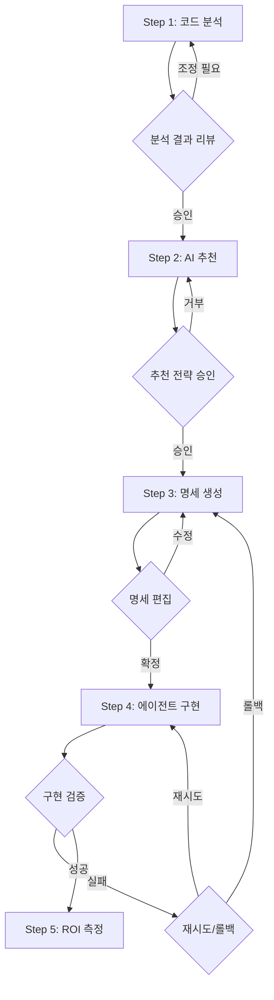

# spec-driven-team 팀 기획서 - 다각도 전문가 검토 및 보완안

## 목차
- [검토 개요](#검토-개요)
- [1. 아키텍처 관점 분석](#1-아키텍처-관점-분석)
- [2. 비판적 검토](#2-비판적-검토)
- [3. 시장 및 트렌드 분석](#3-시장-및-트렌드-분석)
- [4. UX 관점 분석](#4-ux-관점-분석)
- [5. 실행 가능성 분석](#5-실행-가능성-분석)
- [종합 보완 우선순위](#종합-보완-우선순위)
- [최종 권장사항](#최종-권장사항)

---

## 검토 개요

원본 기획서 `output/team-plan-spec-driven-team.md`에 대해 5개 관점의 전문가 에이전트가 독립적으로 분석 수행:

| 관점 | 담당 에이전트 | 주요 평가 기준 |
|------|--------------|---------------|
| 아키텍처 | omc-architect | 시스템 설계, 확장성, 책임 분리 |
| 비판적 검토 | omc-critic | 가정 검증, 리스크 식별, 근본적 질문 |
| 시장 분석 | omc-researcher | 경쟁사, 기술 트렌드, 차별화 요소 |
| 사용자 경험 | omc-analyst | 플로우 직관성, 학습 곡선, 자동화 균형 |
| 실행 가능성 | omc-planner | 구현 난이도, MVP 범위, 리소스 추정 |

---

## 1. 아키텍처 관점 분석

### 장점

- **도구 오케스트레이션 중심 설계**: 에이전트가 직접 코드 분석 대신 LSP/정적분석/린터 결과 해석 → 확장성 우수
- **다중 언어 지원 전략**: 언어별 전문 도구를 동적 선택하는 플러그인 방식
- **명확한 책임 분리**: 분석 → 전략 → 생성 → 구현 → 검증의 5단계 파이프라인
- **엔터프라이즈급 도구 구성**: SonarQube, CodeQL, Snyk 등 산업 표준 활용
- **ROI 중심 검증**: 기술 구현뿐 아니라 비즈니스 가치 측정 포함

### 위험 요소

| 위험 요소 | 심각도 | 영향 |
|----------|--------|------|
| 명세 버전 관리 시스템 부재 | 🔴 높음 | 명세 변경 추적 불가, 롤백 불가 |
| 명세-코드 동기화 전략 누락 | 🔴 높음 | 명세 수정 후 배포 프로세스 불명확 |
| 롤백 전략 부재 | 🟠 중간 | AI 에이전트 오류 시 복구 불가 |
| 에이전트 간 상태 공유 미정의 | 🟠 중간 | 중간 산출물 전달 방식 불명확 |
| 증분적 마이그레이션 전략 부족 | 🟡 낮음 | 대규모 시스템 적용 시 리스크 |
| 명세 충돌 해결 메커니즘 부재 | 🟡 낮음 | 협업 시 동시 수정 충돌 처리 |

### 보완 제안

#### 1. 명세 관리 레이어 추가

```yaml
신규 컴포넌트:
  spec-versioner:
    역할: Git 기반 명세 버전 관리, 브랜칭/머지 전략
    책임:
      - 명세 변경 이력 추적
      - 명세 버전별 태깅
      - 롤백 지점 관리

명세 저장소 구조:
  /specs
    /{version}      # v1.0.0, v1.1.0 등
      /{domain}     # auth, payment, notification
        /{component}.md
```

#### 2. 에이전트 간 데이터 파이프라인 정의

```yaml
pipeline:
  - stage: analysis
    agent: codebase-analyzer
    output: .omc/analysis-report.json
    schema:
      detected_languages: [python, typescript]
      business_logic_patterns: []
      dependency_graph: {}

  - stage: strategy
    agent: agent-strategist
    input: .omc/analysis-report.json
    output: .omc/strategy-plan.yaml
    schema:
      recommended_frameworks: []
      agent_candidates: []
      migration_phases: []

  # ... 각 단계별 입출력 스키마 명시
```

#### 3. 증분적 마이그레이션 프로토콜

| Phase | 범위 | 성공 지표 | 롤백 조건 |
|-------|------|----------|-----------|
| Phase 1 | 단위 기능 (예: 인증 모듈) | 테스트 커버리지 100%, 성능 저하 <5% | 에러율 >1% |
| Phase 2 | 통합 테스트 후 확대 | 통합 테스트 통과, 사용자 피드백 긍정 | 심각한 버그 발견 |
| Phase 3 | 전체 시스템 명세화 | ROI >150%, 유지보수 시간 50% 감소 | ROI <100% |

#### 4. 명세 충돌 해결 시스템

```python
# spec-merger 컴포넌트 설계
class SpecMerger:
    def merge(base, theirs, ours):
        # 3-way merge 알고리즘
        conflicts = detect_conflicts(base, theirs, ours)

        if auto_resolvable(conflicts):
            return auto_merge(conflicts)
        else:
            return request_user_intervention(conflicts)

    def lock_spec(spec_path, user_id):
        # 동시 수정 방지 락 메커니즘
        pass
```

[Top](#검토-개요)

---

## 2. 비판적 검토

### 과대평가된 부분

#### ❌ "코드 수정이 아닌 명세 수정으로 유지보수"

**문제점:**
- 명세 자체도 코드의 한 형태, 복잡도 이전일 뿐 소멸 아님
- 명세 디버깅 > 코드 디버깅 난이도 (추상화 레이어 증가 → 블랙박스화)
- 명세-실제동작 불일치 발견 시 더 복잡한 추적 필요

**현실 체크:**
```
기존: 코드 버그 → 코드 수정 → 배포
명세: 명세 버그 → 명세 수정 → AI 에이전트 재생성 → 검증 → 배포
      └─ 더 긴 파이프라인
```

#### ❌ AI 에이전트 자동 생성의 품질 보장

**과대 가정:**
- "자동 변환" = "최적화된 결과" 가정
- 엣지 케이스, 예외 처리 성공률 과대평가
- LLM 비결정적 동작 미고려

**현실 체크:**
- GitHub Copilot도 40-60% 수준의 제안 정확도
- 복잡한 비즈니스 로직은 수동 검토 필수

#### ❌ 도구 통합의 단순성

**과소평가:**
- 29개 언어, 6,500+ 규칙의 SonarQube 관리 복잡도
- 서로 다른 도구 결과 통합 및 일관성 유지 난이도

### 과소평가된 부분

#### ⚠️ 마이그레이션 리스크

| 리스크 | 현재 계획 | 실제 필요 |
|--------|----------|-----------|
| 전환 기간 운영 | 명시 없음 | 하이브리드 운영 6개월+ |
| 롤백 전략 | 부재 | 단계별 롤백 포인트 필수 |
| 부분 적용 시 복잡도 | 미고려 | 레거시+AI 이중 관리 부담 |

#### ⚠️ 인적 요소

**누락된 고려사항:**
- 개발팀의 AI/명세 기반 개발 학습 곡선: **3-6개월**
- 기존 개발자 저항 및 적응 기간
- 명세 작성/관리를 위한 새로운 역량 필요

#### ⚠️ 운영 복잡도

**추가 필요 인프라:**
- AI 에이전트 모니터링/로깅/디버깅 시스템
- LLM API 비용 최적화 (월 수백만원 수준 예상)
- 프롬프트 버전 관리 시스템

### 근본적 질문

#### 1. 왜 기존 Low-Code 플랫폼이 코드를 완전 대체 못했나?

**명세 기반 접근이 본질적으로 다른가?**
- Low-Code: 시각적 워크플로우 (Mendix, OutSystems)
- 이 플러그인: 텍스트 기반 명세 (Markdown/YAML)
- **차이점:** AI 에이전트 자동 생성 + 기존 코드 역변환

#### 2. 비결정적 AI가 결정적 비즈니스 로직을 보장하나?

**미션 크리티컬 영역 적용 가능성:**
```
금융 거래 로직:
  요구사항: 100% 정확도, 0% 오류율
  AI 에이전트: 95-99% 정확도 (현실)
  → 허용 불가

데이터 변환 로직:
  요구사항: 일관성
  AI 에이전트: 확률적 일관성
  → 추가 검증 필수
```

#### 3. 명세 복잡도 > 코드 복잡도 시점은?

**Turing Complete 명세 언어 = 또 다른 프로그래밍 언어?**
- 단순 CRUD: 명세 < 코드 복잡도 ✅
- 복잡한 상태 머신: 명세 ≈ 코드 복잡도 ⚠️
- 멀티스레딩/동시성: 명세 > 코드 복잡도 ❌

#### 4. AI 에이전트 실패 시 책임 소재는?

```
실패 시나리오:
  1. 명세 작성자 실수 → 명세 작성자 책임
  2. AI 에이전트 생성 오류 → 플러그인 개발자 책임?
  3. LLM 모델 오류 → OpenAI/Anthropic 책임?
  4. 프레임워크 버그 → Dify/LangChain 책임?

→ 명확한 책임 경계 정의 필요
```

#### 5. 버전 호환성 문제

**시나리오:**
- 2024년 1월: GPT-4로 생성한 명세 기반 에이전트
- 2024년 6월: GPT-4.5 출시 → 동일 명세로 다른 동작?
- **해결책:** 명세에 모델 버전 고정 필드 추가

### 보완 제안

#### 1. 단계적 적용 전략

```yaml
Phase 1 - Proof of Concept (1개월):
  범위: 단일 CRUD 모듈
  성공 지표: 100% 기능 동등성, 코드 50% 감소

Phase 2 - Pilot (3개월):
  범위: 3-5개 핵심 모듈
  성공 지표: 버그 발생률 <기존 대비, 유지보수 30% 감소

Phase 3 - Rollout (6-12개월):
  범위: 전체 시스템
  성공 지표: ROI 150%+, 개발자 만족도 80%+
```

#### 2. 구체적 제약 조건 명시

```markdown
AI 에이전트화 적합 기능:
  ✅ CRUD 연산
  ✅ 데이터 변환/매핑
  ✅ 규칙 기반 검증
  ✅ 반복적 워크플로우

AI 에이전트화 부적합 기능:
  ❌ 멀티스레딩/동시성 제어
  ❌ 실시간 처리 (<10ms 응답)
  ❌ 금융/의료 등 미션 크리티컬
  ❌ 복잡한 알고리즘 최적화
```

#### 3. 리스크 관리 체계

```python
# Fallback 메커니즘
class HybridExecutor:
    def execute(request):
        try:
            # 1차: AI 에이전트 실행
            result = ai_agent.execute(request)

            # 검증
            if validate(result):
                return result
            else:
                # 2차: 레거시 코드 실행
                return legacy_code.execute(request)
        except:
            # 폴백: 항상 레거시 코드 사용 가능
            return legacy_code.execute(request)
```

#### 4. 실증적 검증 방법론

**POC 프로젝트 선정 기준:**
```yaml
대상 프로젝트:
  - 규모: 1,000-5,000 LOC
  - 도메인: CRUD 중심 웹 애플리케이션
  - 기술 스택: Python/Django 또는 TypeScript/Express
  - 테스트 커버리지: 80% 이상

측정 지표:
  - 코드 라인 수 감소율
  - 버그 발생률 (기존 vs 명세 기반)
  - 수정 시간 (코드 vs 명세)
  - 개발자 학습 시간
  - LLM API 비용
```

[Top](#검토-개요)

---

## 3. 시장 및 트렌드 분석

### 유사 솔루션

#### 코드 현대화 도구

| 솔루션 | 주요 기능 | 차별점 vs spec-driven-team |
|--------|----------|---------------------------|
| IBM Modernization Suite | 레거시 → 클라우드 변환 | AI 에이전트화 미지원 |
| AWS Application Migration | 애플리케이션 마이그레이션 | 명세 기반 접근 없음 |
| Sourcegraph Batch Changes | 대규모 리팩토링 | 수동 코드 변경 (명세 X) |

#### AI 코드 생성 도구

| 솔루션 | 주요 기능 | 차별점 vs spec-driven-team |
|--------|----------|---------------------------|
| GitHub Copilot | AI 코드 자동완성 | 단발성, 유지보수 개념 없음 |
| Amazon CodeWhisperer | AWS 생태계 통합 | 명세 관리 미지원 |
| Tabnine | AI 코드 완성 | 로컬 기반, 에이전트화 X |

#### Low-Code/No-Code

| 솔루션 | 주요 기능 | 차별점 vs spec-driven-team |
|--------|----------|---------------------------|
| Microsoft Power Platform | 시각적 워크플로우 | 기존 코드 역변환 불가 |
| Mendix | 로우코드 앱 개발 | 텍스트 명세 미지원 |
| OutSystems | 엔터프라이즈 앱 신속 개발 | AI 자동 추천 없음 |

**결론: 유사 솔루션 존재하나, "기존 코드 → 명세 → AI 에이전트" 엔드투엔드는 독특함**

### 기술 스택 평가

#### ✅ 우수한 선택

| 기술 | 평가 | 근거 |
|------|------|------|
| LSP 서버 | ⭐⭐⭐⭐⭐ | IDE/에디터 생태계 표준, 언어 중립적 |
| SonarQube | ⭐⭐⭐⭐⭐ | 엔터프라이즈 검증, 29개 언어 지원 |
| CodeQL | ⭐⭐⭐⭐⭐ | GitHub 표준, 시맨틱 분석 강력 |
| Ruff (Python) | ⭐⭐⭐⭐⭐ | 2023년 급부상, 초고속 린터 |

#### ⚠️ 보완 필요

| 기술 | 평가 | 이슈 | 대안 |
|------|------|------|------|
| Dify 중심 | ⭐⭐⭐ | 신생 플랫폼 | LangChain 병행 지원 |
| OpenAI 중심 | ⭐⭐⭐ | 단일 LLM 의존 | Anthropic Claude, Google Gemini 추가 |
| 컨테이너화 누락 | ⭐⭐ | 배포 전략 부재 | Docker/K8s 지원 |

#### 🔄 트렌드 반영도

**2024-2025 트렌드 반영:**
- ✅ Agent-driven development (선진적)
- ✅ Specification-as-Code (혁신적)
- ❌ RAG (Retrieval-Augmented Generation) 미활용
- ❌ Vector Database (코드 유사성 분석 누락)
- ❌ Graph Database (의존성 분석 미흡)

**권장 추가 기술:**
```yaml
AI/ML:
  - Anthropic Claude API (OpenAI 대안)
  - Hugging Face Transformers (오픈소스 모델)
  - LangSmith (LangChain 관찰성)

벡터/그래프:
  - ChromaDB (경량 벡터 DB)
  - Neo4j (의존성 그래프)

DevOps:
  - Docker Compose
  - GitHub Actions
  - Terraform
```

### 차별화 요소

#### 🚀 강력한 차별화

1. **명세 우선 접근**: 코드 수정 → 명세 수정 패러다임 전환 (혁신적)
2. **AI 에이전트화 자동 추천**: 기존 도구는 수동 식별, 이 솔루션은 자동
3. **ROI 측정 내장**: 투자 대비 효과 정량 측정

#### ⭐ 경쟁 우위

1. **하이브리드 접근**: 정적 분석 + AI 에이전트 결합
2. **다중 언어**: 언어별 전문 도구 오케스트레이션
3. **검증 중심**: 성능/신뢰성 검증 프로세스 내장

### 보완 제안

#### 1. 시장 포지셔닝 전략

```yaml
타겟 시장 순차 공략:
  Phase 1 (6개월): 스타트업 (빠른 채택, 피드백)
  Phase 2 (12개월): 중견기업 (안정성 검증)
  Phase 3 (24개월): 엔터프라이즈 (대규모 계약)

파트너십:
  - GitHub (마켓플레이스 등록)
  - GitLab (CI/CD 통합)
  - JetBrains (IDE 플러그인)

오픈소스 전략:
  - 코어 분석 엔진: 오픈소스
  - AI 에이전트 생성기: 프리미엄 (SaaS)
```

#### 2. 비즈니스 모델

| 모델 | 타겟 | 가격 | 특징 |
|------|------|------|------|
| Community | 개인 개발자 | 무료 | 월 10회 분석 제한 |
| Pro | 스타트업 | $99/월 | 무제한 분석, 3개 언어 |
| Enterprise | 대기업 | $999/월 | 모든 기능, 온프레미스 지원 |
| Consulting | 맞춤형 | 협의 | 1:1 구현 서비스 |

[Top](#검토-개요)

---

## 4. UX 관점 분석

### 사용자 플로우 평가

#### 장점
- 5단계 구조 명확하고 순차적
- 각 단계가 명확한 산출물 생성
- 엔드투엔드 프로세스 완성도

#### 단점

| 문제점 | 영향 | 개선 방향 |
|--------|------|----------|
| 단계 간 사용자 확인 지점 부재 | 자동화 과도, 제어력 상실 | 체크포인트 추가 |
| 롤백/재시도 플로우 없음 | 오류 발생 시 막막함 | 재시도 옵션 제공 |
| 진행률 표시 방법 불명확 | 불안감, 대기 시간 불명 | 실시간 진행률 UI |

### 개입 지점 분석

#### 과도한 자동화

```yaml
Step 1-2 (코드 분석 + 추천):
  현재: 완전 자동
  문제: 사용자가 중간 개입 불가
  개선: 분석 결과 리뷰 단계 추가

Step 3 (명세 생성):
  현재: 자동 생성 → 바로 다음 단계
  문제: 명세 검토/수정 불가
  개선: 명세 편집 UI 제공
```

#### 적절한 균형

```yaml
AI 프레임워크 선택:
  ✅ 추천 + 사용자 선택 가능

에이전트화 영역 선택:
  ✅ 추천 목록 + 커스텀 지정
```

#### 개선된 플로우



### 학습 곡선

#### 사용자가 배워야 할 것

| 수준 | 내용 | 학습 시간 | 지원 현황 |
|------|------|----------|----------|
| 기본 | CLI 사용, 플러그인 실행 | 30분 | ❌ 튜토리얼 없음 |
| 중급 | 명세 형식, AI 프레임워크 특성 | 2-3일 | ❌ 가이드 부재 |
| 고급 | 에이전트화 판별, ROI 해석 | 1-2주 | ❌ 예제 없음 |

#### 학습 지원 부족

**누락된 요소:**
- 튜토리얼/가이드 문서
- 예제 프로젝트 (샘플 실행)
- 오류 트러블슈팅 가이드
- 인터랙티브 온보딩

### 보완 제안

#### 1. 대화형 프로세스

```yaml
Step 1.5 - 분석 결과 리뷰:
  내용: 감지된 언어, 비즈니스 로직 패턴, 추천 영역
  액션:
    - 분석 결과 확인
    - 제외할 영역 지정
    - 추가 분석 요청

Step 2.5 - 전략 승인:
  내용: AI 프레임워크, 에이전트화 우선순위, 마이그레이션 계획
  액션:
    - 프레임워크 변경
    - 우선순위 조정
    - 전략 승인

Step 3.5 - 명세 편집:
  내용: 생성된 명세 미리보기
  액션:
    - 웹 에디터로 명세 수정
    - 명세 검증 실행
    - 최종 확정
```

#### 2. 진행 상황 가시성

```bash
# CLI 출력 예시
[1/5] 코드베이스 분석 중...
├─ Python 파일 스캔 ████████████████░░░░ 78% (1,234/1,580 파일)
├─ LSP 서버 분석   ████████████████████ 100%
└─ 정적 분석       ██████░░░░░░░░░░░░░░ 32% (예상 3분 소요)

[2/5] AI 에이전트화 추천...
⏳ 비즈니스 로직 패턴 분석 중 (약 2분 소요)
```

#### 3. 에러 복구 전략

```yaml
오류 발생 시 옵션:
  1. 재시도 (Retry): 동일 단계 재실행
  2. 건너뛰기 (Skip): 현재 파일/모듈 제외하고 계속
  3. 롤백 (Rollback): 이전 단계로 돌아가기
  4. 디버그 (Debug): 상세 로그 확인 모드
  5. 중단 (Abort): 전체 프로세스 중단
```

#### 4. 온보딩 경험

```yaml
첫 실행 시:
  1. 샘플 프로젝트로 데모 실행 (2분)
     - 간단한 CRUD 앱 자동 명세화
     - 결과물 미리보기

  2. 인터랙티브 튜토리얼 (10분)
     - 각 단계 설명
     - 실제 명령어 실행
     - 결과 해석 방법

  3. 문서 링크 제공
     - 빠른 시작 가이드
     - FAQ
     - 트러블슈팅
```

#### 5. 실행 모드

```bash
# 전체 자동 모드 (기본)
$ dmap run --auto

# 단계별 확인 모드
$ dmap run --interactive

# 수동 모드
$ dmap analyze        # Step 1만 실행
$ dmap recommend      # Step 2만 실행
$ dmap generate-spec  # Step 3만 실행
# ...
```

[Top](#검토-개요)

---

## 5. 실행 가능성 분석

### 구현 난이도 평가

| 기능 | 난이도 | 리스크 | 구현 가능성 | 근거 |
|------|--------|--------|------------|------|
| 코드베이스 분석 | 🟠 중상 | 🟠 중 | ✅ 가능 | LSP/정적분석 도구 성숙 |
| AI 에이전트화 추천 | 🔴 상 | 🔴 상 | ⚠️ 제한적 | 패턴 인식 가능, 정확도 불확실 |
| 명세 자동 생성 | 🟡 중 | 🟡 중 | ✅ 가능 | AST 분석 기반 변환 기술 성숙 |
| AI 에이전트 구현 | 🟢 중하 | 🟢 하 | ✅ 가능 | Dify/LangChain 프레임워크 활용 |
| 성능/신뢰성 검증 | 🟡 중 | 🟢 하 | ✅ 가능 | 기존 테스트 프레임워크 활용 |

### MVP 제안

#### Phase 1: 기초 MVP (8주, 3명)

```yaml
범위:
  - Python 프로젝트 대상
  - 단순 CRUD 로직 AI 에이전트화
  - 마크다운 명세 생성 (수동 검토 필요)
  - Dify DSL 생성
  - 기본 성능 비교 리포트

산출물:
  - CLI 도구
  - 분석 리포트 JSON
  - 명세 Markdown 파일
  - Dify 워크플로우 JSON
  - ROI 측정 대시보드

성공 지표:
  - 100개 파일 프로젝트 분석 완료
  - CRUD 로직 명세화 정확도 80%+
  - Dify 워크플로우 정상 실행
```

#### Phase 2: 확장 MVP (추가 4주)

```yaml
범위:
  - JavaScript/TypeScript 지원
  - 데이터 변환 로직 자동 감지
  - YAML/JSON 구조화 명세
  - LangChain 에이전트 코드 생성
  - 회귀 테스트 자동화

추가 산출물:
  - 멀티 언어 지원
  - LangChain 에이전트 코드
  - 자동 테스트 스위트
```

### 개발 우선순위

| 단계 | 기간 | 주요 작업 | 산출물 |
|------|------|----------|--------|
| 1. 기반 구축 | 2주 | 프로젝트 스캐폴딩, LSP 통합 (Python) | 기본 분석 파이프라인 |
| 2. 핵심 기능 | 4주 | 패턴 분석, 영역 식별, 명세 생성, DSL 생성 | MVP 기능 완료 |
| 3. 검증 시스템 | 2주 | 벤치마크, 테스트 자동화, ROI 대시보드 | 검증 프레임워크 |
| 4. 확장성 | 2주 | 다중 언어, 플러그인 시스템, CI/CD | Production-ready |

### 리소스 추정

#### 인력

**최소 팀 (3명):**
- 백엔드 개발자 1명: 코드 분석, 명세 생성
- AI/ML 엔지니어 1명: 에이전트화 로직, AI 프레임워크 통합
- DevOps/QA 1명: 검증 시스템, CI/CD

**권장 팀 (5명):**
- 위 3명 +
- 프론트엔드 개발자 1명: 대시보드 UI
- 테크 리드 1명: 아키텍처, 코드 리뷰

#### 시간 및 비용

| 마일스톤 | 기간 | 팀 규모 | 비용 (인건비) |
|----------|------|---------|--------------|
| MVP (Phase 1) | 8주 | 3명 | 6,000만원 |
| Production Ready | 16주 | 5명 | 2억원 |
| Enterprise | 24주 | 5-7명 | 3억원+ |

**인프라 비용:**
- 초기: 월 50만원 (클라우드, LLM API)
- 운영: 월 200만원 (규모 확대 시)

### 보완 제안

#### 1. 기술적 보완

```yaml
점진적 마이그레이션:
  - 모듈별 단계적 전환
  - 하이브리드 운영 모드 (레거시 + AI 공존)
  - 단계별 롤백 포인트

실시간 모니터링:
  - AI 에이전트 실행 로그
  - 오류율/성능 저하 감지
  - 자동 롤백 트리거
```

#### 2. PoC 프로그램

```yaml
대상 프로젝트 선정:
  규모: 1,000-5,000 LOC
  도메인: CRUD 중심 웹앱
  기술: Python/Django 또는 TypeScript/Express
  테스트: 80% 커버리지

측정 지표:
  - 코드 라인 감소율
  - 버그 발생률
  - 수정 시간
  - 학습 시간
  - LLM API 비용

진행 방식:
  1주: 환경 구축
  2주: 분석 및 명세 생성
  3주: AI 에이전트 구현
  4주: 검증 및 보고서
```

#### 3. 리스크 관리

```python
# Fallback 메커니즘 예시
class ProductionExecutor:
    def __init__(self):
        self.ai_agent = AIAgent()
        self.legacy_code = LegacyCode()
        self.config = {
            'ai_failure_threshold': 0.05,  # 5% 에러율
            'performance_degradation': 0.20  # 20% 성능 저하
        }

    def execute(self, request):
        # AI 에이전트 우선 실행
        result, metrics = self.ai_agent.execute(request)

        # 품질 검증
        if self.validate_quality(metrics):
            return result

        # 품질 미달 시 레거시 폴백
        log.warning("AI agent quality below threshold, falling back")
        return self.legacy_code.execute(request)
```

[Top](#검토-개요)

---

## 종합 보완 우선순위

### 🔴 Critical (즉시 반영 필수)

| 항목 | 근거 | 해결 방안 |
|------|------|----------|
| 명세 버전 관리 시스템 | 롤백 불가 시 운영 리스크 심각 | Git 기반 명세 버전 관리 추가 |
| 명세-코드 동기화 전략 | 명세 수정 후 배포 프로세스 불명확 | CI/CD 파이프라인 정의 |
| AI 에이전트 적용 제약 명시 | 미션 크리티컬 영역 오적용 방지 | 적합/부적합 기능 기준 문서화 |
| 사용자 개입 지점 추가 | 과도한 자동화로 제어력 상실 | Step 1.5, 2.5, 3.5 체크포인트 추가 |

### 🟠 High (초기 개발에 포함)

| 항목 | 근거 | 해결 방안 |
|------|------|----------|
| 증분적 마이그레이션 전략 | 전체 전환 리스크 완화 | Phase 1-2-3 단계적 적용 계획 |
| 롤백 메커니즘 | AI 에이전트 오류 시 복구 필요 | Hybrid Executor 패턴 구현 |
| 온보딩 튜토리얼 | 학습 곡선 완화 | 샘플 프로젝트 + 인터랙티브 가이드 |
| RAG/Vector DB 통합 | 코드 유사성 분석 품질 향상 | ChromaDB 추가 |

### 🟡 Medium (MVP 이후 추가)

| 항목 | 근거 | 해결 방안 |
|------|------|----------|
| 다중 LLM 지원 | OpenAI 의존도 완화 | Anthropic, Google Gemini 추가 |
| Graph DB 통합 | 의존성 분석 고도화 | Neo4j 통합 |
| 프론트엔드 대시보드 | 사용자 경험 개선 | 웹 UI 개발 |
| 명세 충돌 해결 | 협업 시나리오 지원 | 3-way merge 도구 |

### 🟢 Low (장기 로드맵)

| 항목 | 근거 | 해결 방안 |
|------|------|----------|
| 엔터프라이즈 거버넌스 | 대기업 요구사항 | 승인 워크플로우, 컴플라이언스 |
| 도메인 특화 템플릿 | 산업별 최적화 | 전자상거래, 금융, 헬스케어 템플릿 |
| SaaS 버전 | 시장 확대 | 클라우드 기반 서비스 |

---

## 최종 권장사항

### 1. 기획서 보완 사항

```markdown
추가해야 할 섹션:

## 명세 관리 시스템
- 명세 버전 관리 전략 (Git 기반)
- 명세-코드 동기화 프로세스
- 롤백 메커니즘

## AI 에이전트화 적용 기준
- 적합 기능: CRUD, 데이터 변환, 규칙 검증, 워크플로우
- 부적합 기능: 멀티스레딩, 실시간 처리, 미션 크리티컬, 복잡 알고리즘

## 사용자 개입 지점
- Step 1.5: 분석 결과 리뷰 및 조정
- Step 2.5: AI 전략 승인
- Step 3.5: 명세 편집 및 검증

## 마이그레이션 전략
- Phase 1: PoC (단일 모듈)
- Phase 2: Pilot (3-5개 모듈)
- Phase 3: Rollout (전체 시스템)

## 온보딩 자료
- 빠른 시작 튜토리얼
- 샘플 프로젝트 (Python CRUD 앱)
- FAQ 및 트러블슈팅 가이드
```

### 2. 개발 로드맵 권장

```yaml
Month 1-2 (MVP Phase 1):
  - Python 프로젝트 분석
  - CRUD 로직 명세화
  - Dify DSL 생성
  - 기본 검증

Month 3 (MVP Phase 2):
  - TypeScript 지원
  - LangChain 통합
  - 회귀 테스트

Month 4 (PoC):
  - 3개 실제 프로젝트 적용
  - 피드백 수집
  - 품질 개선

Month 5-6 (Production):
  - 다중 LLM 지원
  - 웹 대시보드
  - 엔터프라이즈 기능
```

### 3. 성공 지표

```yaml
기술 지표:
  - 명세화 정확도: 85% 이상
  - AI 에이전트 정상 실행률: 95% 이상
  - 성능 저하: 10% 이내

비즈니스 지표:
  - 코드 라인 감소: 40% 이상
  - 유지보수 시간 단축: 30% 이상
  - ROI: 150% 이상 (12개월 기준)

사용자 만족:
  - 개발자 만족도: 4.0/5.0 이상
  - 재사용 의향: 80% 이상
```

### 4. 리스크 완화 체크리스트

```markdown
✅ 명세 버전 관리 시스템 구축
✅ 롤백 메커니즘 구현
✅ AI 적용 제약 조건 문서화
✅ 단계별 사용자 확인 지점 추가
✅ 온보딩 튜토리얼 제공
✅ PoC 프로그램 운영
✅ Fallback to legacy code 메커니즘
✅ 실시간 모니터링 대시보드
```

---

**결론:**

spec-driven-team은 혁신적인 아이디어와 강력한 기술 스택을 가지고 있으나, 운영 안정성과 사용자 경험 측면에서 보완이 필요함. 위 검토 내용을 반영하여 기획서를 업데이트하고, MVP → PoC → Production 단계적 접근으로 리스크를 관리하면서 개발을 진행할 것을 권장함.

[Top](#검토-개요)
