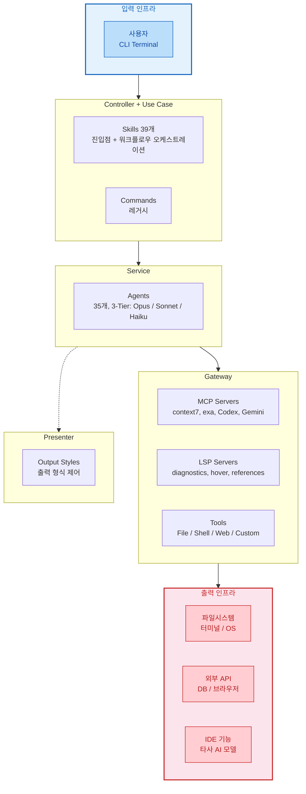

# Oh-My-ClaudeCode (OMC) 플러그인 구조 분석

- [Oh-My-ClaudeCode (OMC) 플러그인 구조 분석](#oh-my-claudecode-omc-플러그인-구조-분석)
  - [1. 개요](#1-개요)
    - [플러그인 개요](#플러그인-개요)
    - [핵심 컨셉](#핵심-컨셉)
  - [2. 플러그인 디렉토리 구조](#2-플러그인-디렉토리-구조)
  - [3. 플러그인 매니페스트 (plugin.json)](#3-플러그인-매니페스트-pluginjson)
    - [레퍼런스 대비 분석](#레퍼런스-대비-분석)
  - [4. Skills 시스템](#4-skills-시스템)
    - [4.1 SKILL.md 구조](#41-skillmd-구조)
    - [4.2 전체 Skills 카탈로그 (39개)](#42-전체-skills-카탈로그-39개)

  - [5. Agents 시스템](#5-agents-시스템)
    - [5.1 AGENT 구조](#51-agent-구조)
    - [5.2 전체 에이전트 카탈로그 (35개)](#52-전체-에이전트-카탈로그-35개)
      - [기본 에이전트 (13개)](#기본-에이전트-13개)
      - [티어별 변형 에이전트 (14개)](#티어별-변형-에이전트-14개)
      - [전문 에이전트 (8개)](#전문-에이전트-8개)
    - [5.3 에이전트 역할 분리 원칙](#53-에이전트-역할-분리-원칙)
  - [6. Hooks 시스템](#6-hooks-시스템)
    - [6.1 hooks.json 이벤트 핸들러 구성](#61-hooksjson-이벤트-핸들러-구성)
    - [6.2 Hook 스크립트 상세](#62-hook-스크립트-상세)
      - [keyword-detector.mjs (핵심)](#keyword-detectormjs-핵심)
      - [persistent-mode.cjs (Stop 이벤트)](#persistent-modecjs-stop-이벤트)
      - [pre-tool-enforcer.mjs (PreToolUse)](#pre-tool-enforcermjs-pretooluse)
      - [subagent-tracker.mjs (SubagentStart/Stop)](#subagent-trackermjs-subagentstartstop)
      - [pre-compact.mjs (PreCompact)](#pre-compactmjs-precompact)
    - [6.3 Hook 실행 아키텍처](#63-hook-실행-아키텍처)
  - [7. MCP 서버 시스템](#7-mcp-서버-시스템)
    - [7.1 .mcp.json 설정](#71-mcpjson-설정)
    - [7.2 OMC Tools Server (In-process MCP)](#72-omc-tools-server-in-process-mcp)
      - [제공 도구 목록](#제공-도구-목록)
    - [7.3 Bridge 서버 (Codex, Gemini)](#73-bridge-서버-codex-gemini)
  - [8. 소스 코드 아키텍처](#8-소스-코드-아키텍처)
    - [8.1 모듈 구조](#81-모듈-구조)
    - [8.2 핵심 모듈 상세](#82-핵심-모듈-상세)
      - [`index.ts` - createSisyphusSession()](#indexts---createsisyphussession)
      - [`shared/types.ts` - 핵심 타입](#sharedtypests---핵심-타입)
    - [8.3 빌드 시스템](#83-빌드-시스템)
  - [9. 핵심 기능 (Features)](#9-핵심-기능-features)
    - [9.1 Magic Keywords (매직 키워드)](#91-magic-keywords-매직-키워드)
    - [9.2 Model Routing (모델 라우팅)](#92-model-routing-모델-라우팅)
    - [9.3 Delegation Enforcement (위임 강제)](#93-delegation-enforcement-위임-강제)
    - [9.4 Continuation Enforcement (연속 실행 강제)](#94-continuation-enforcement-연속-실행-강제)
    - [9.5 Boulder State (작업 상태 관리)](#95-boulder-state-작업-상태-관리)
    - [9.6 Context Injector (컨텍스트 주입)](#96-context-injector-컨텍스트-주입)
  - [10. CLI 도구](#10-cli-도구)
  - [11. 플러그인 시스템 레퍼런스 대비 분석](#11-플러그인-시스템-레퍼런스-대비-분석)
    - [11.1 표준 준수 항목](#111-표준-준수-항목)
    - [11.2 확장 및 차별화 항목](#112-확장-및-차별화-항목)
  - [12. 설정 및 상태 파일 위치](#12-설정-및-상태-파일-위치)
  - [13. Clean Architecture 의존성 철학 기반 평가](#13-clean-architecture-의존성-철학-기반-평가)
    - [13.1 평가 기준](#131-평가-기준)
    - [13.2 의존성 방향 분석](#132-의존성-방향-분석)
    - [13.3 결합도 분석 (Loose Coupling)](#133-결합도-분석-loose-coupling)
    - [13.4 응집도 분석 (High Cohesion)](#134-응집도-분석-high-cohesion)
    - [13.5 의존성 역전 분석 (DIP)](#135-의존성-역전-분석-dip)
    - [13.6 종합 평가](#136-종합-평가)
    - [13.7 근본 원인 — LLM 오케스트레이션의 본질적 특성](#137-근본-원인--llm-오케스트레이션의-본질적-특성)
    - [13.8 DIP 구현 가능성 분석](#138-dip-구현-가능성-분석)
  - [Appendix](#appendix)
    - [A. External Model Consultation 사전 작업](#a-external-model-consultation-사전-작업)

---

## 1. 개요

Oh-My-ClaudeCode(OMC)는 Claude Code를 위한 **멀티 에이전트 오케스트레이션 플러그인**임.
단일 AI 에이전트가 모든 작업을 처리하는 대신, 전문화된 35개 서브에이전트를
지휘자가 조율하여 복잡한 소프트웨어 엔지니어링 작업을 병렬 수행함.

| 항목 | 내용 |
|------|------|
| 이름 | oh-my-claudecode (npm: oh-my-claude-sisyphus) |
| 버전 | 4.0.10 |
| 라이선스 | MIT |
| 저자 | Yeachan Heo |
| 저장소 | https://github.com/Yeachan-Heo/oh-my-claudecode |
| 핵심 철학 | "지휘자(Conductor) 역할, 직접 수행 금지" |

### 플러그인 개요

Claude Code 플러그인은 7개 표준 컴포넌트로 구성되며,
이들은 **단방향 호출 흐름**(Skills → Agents → Gateway)에 **Hooks가 횡단적으로 개입**하는 계층 구조를 형성함.
레이어명은 Clean Architecture 용어와 통일함.



**Cross-cutting — AOP Aspect: Hooks**
모든 계층(Controller, Service, Gateway)의 이벤트를 횡단적으로 가로챔.

| 이벤트 | 개입 시점 | 대표 핸들러 |
|--------|----------|------------|
| `UserPromptSubmit` | 사용자 입력 직후 | keyword-detector.mjs (매직 키워드 감지) |
| `SessionStart` | 세션 시작 시 | session-start.mjs (상태 복원, 컨텍스트 주입) |
| `PreToolUse` | 도구 호출 직전 | pre-tool-enforcer.mjs (위임 강제, 권한 검사) |
| `PostToolUse` | 도구 호출 직후 | post-tool-verifier.mjs (결과 검증) |
| `SubagentStart` | 서브에이전트 시작 | subagent-tracker.mjs (에이전트 추적) |
| `SubagentStop` | 서브에이전트 종료 | subagent-tracker.mjs (결과 수집) |
| `Stop` | 실행 중단 시도 시 | persistent-mode.cjs (중단 방지, 계속 실행 강제) |
| `PreCompact` | 컨텍스트 압축 직전 | pre-compact.mjs (상태 체크포인트 저장) |

**컴포넌트별 상세 (Clean Architecture 레이어 기준)**

| 컴포넌트 | Clean Architecture 레이어 | 역할 | 트리거 방식 |
|----------|--------------------------|------|-------------|
| **Skills** | Interface Adapters (Controller + Use Case) | 사용자 진입점 + 에이전트 워크플로우 오케스트레이션 | 명시적 호출 |
| **Commands** | Interface Adapters (Controller) | Skills의 전신, 단순 라우팅만 수행 (레거시) | 명시적 호출 |
| **Agents** | Entities (Service) | 프롬프트 + 도구를 갖춘 작업 수행 주체 (위임받는 쪽) | Skills 또는 Claude가 위임 |
| **Hooks** | Cross-cutting (AOP Aspect) | 시스템 이벤트를 가로채 개입하는 횡단 관심사 | 이벤트 구동 (자동) |
| **MCP Servers** | Interface Adapters (Gateway) | 외부 도구/API를 MCP 프로토콜로 제공 | 상시 대기 |
| **LSP Servers** | Interface Adapters (Gateway) | IDE 수준 언어 분석 기능 제공 | 상시 대기 |
| **Built-in Tools** | Interface Adapters (Gateway) | Claude Code 자체 제공 (Read, Write, Bash, Grep 등) | 상시 대기 |
| **OMC Custom Tools** | Interface Adapters (Gateway) | 플러그인 자체 도구 (AST, REPL, state, notepad 등) | MCP 경유 호출 |
| **Output Styles** | Interface Adapters (Presenter) | 최종 출력 형식 제어 (기능 무관) | 자동 적용 |

**Skills의 이중 역할 — Controller + Use Case 겸임**

Skills는 단순한 진입점(Controller)이 아니라 SKILL.md 프롬프트 안에
**워크플로우 오케스트레이션 로직**(Use Case)을 포함함.

| Skill 예시 | 오케스트레이션 패턴 |
|-----------|-------------------|
| autopilot | 기획 → 병렬 실행 → 검증 → QA 전환까지 전체 워크플로우 지휘 |
| ralph | 반복 루프: 에이전트 위임 → architect 검증 → 미완 시 재시도 |
| ultrawork | 다수 에이전트 병렬 동시 실행 조율 |
| pipeline | 순차 에이전트 체이닝 + 단계 간 데이터 전달 |
| swarm | N개 에이전트의 태스크 풀 경쟁적 점유 관리 |

**Gateway 세분류 — 에이전트가 사용하는 도구 전체 분류**

| 유형 | 도구 | 대응하는 외부 시스템 |
|------|------|-------------------|
| **File** | Read, Write, Edit, Glob, Grep | 파일 시스템 |
| **Shell** | Bash | 터미널 / OS |
| **Web** | WebSearch, WebFetch | 웹 / 검색엔진 |
| **MCP** | MCP Servers (context7, exa, playwright 등) | 외부 API, DB, 브라우저 |
| **Language** | LSP Servers (diagnostics, hover, references 등) | IDE 수준 언어 분석 |
| **Bridge** | Codex (`mcp__x__*`), Gemini (`mcp__g__*`) | 타사 AI 모델 (OpenAI, Google) |
| **Custom Tool** | AST grep, Python REPL, state, notepad, memory | OMC 자체 확장 도구 |

### 핵심 컨셉

```
사용자 요청 → 지휘자 → 전문 에이전트 병렬 위임 → 결과 통합 → 검증
```

- **Delegation-First**: 실질적 코드 작업은 반드시 서브에이전트에 위임
- **Smart Model Routing**: 작업 복잡도에 따라 haiku/sonnet/opus 자동 선택
- **Relentless Execution**: 모든 작업이 완료될 때까지 중단 불가

[Top](#oh-my-claudecode-omc-플러그인-구조-분석)

---

## 2. 플러그인 디렉토리 구조

```
oh-my-claudecode/
├── .claude-plugin/           # 플러그인 메타데이터 (필수)
│   └── plugin.json          # 플러그인 매니페스트 (필수)
├── skills/                   # 39개 스킬 정의 (SKILL.md 기반)
│   ├── analyze/
│   ├── autopilot/
│   ├── ralph/
│   ├── ultrawork/
│   ├── ... (39개 디렉토리)
│   └── AGENTS.md
├── agents/                   # 35개 에이전트 프롬프트 정의
│   ├── architect.md
│   ├── executor.md
│   ├── explore.md
│   ├── ... (34개 .md 파일)
│   └── templates/
├── hooks/                    # 이벤트 핸들러 설정
│   └── hooks.json
├── scripts/                  # Hook 실행 스크립트 (Node.js)
│   ├── keyword-detector.mjs
│   ├── session-start.mjs
│   ├── pre-tool-enforcer.mjs
│   ├── post-tool-verifier.mjs
│   ├── persistent-mode.cjs
│   ├── subagent-tracker.mjs
│   ├── pre-compact.mjs
│   ├── skill-injector.mjs
│   ├── permission-handler.mjs
│   ├── project-memory-*.mjs
│   ├── session-end.mjs
│   └── lib/                 # 공유 라이브러리
├── bridge/                   # MCP 브릿지 서버
│   ├── mcp-server.cjs       # OMC Tools MCP 서버
│   ├── codex-server.cjs     # OpenAI Codex 브릿지
│   └── gemini-server.cjs    # Google Gemini 브릿지
├── src/                      # TypeScript 소스 코드
│   ├── agents/              # 에이전트 정의 및 프롬프트
│   ├── hooks/               # Hook 로직 구현 (30+ 모듈)
│   ├── tools/               # LSP, AST, Python REPL 도구
│   ├── mcp/                 # MCP 서버 구현
│   ├── features/            # 핵심 기능 모듈
│   ├── config/              # 설정 로더
│   ├── cli/                 # CLI 도구 (omc 명령)
│   ├── shared/              # 공유 타입 정의
│   └── index.ts             # 진입점
├── commands/                 # 레거시 명령어 (skills로 마이그레이션)
├── templates/                # 에이전트/스킬 템플릿
├── dist/                     # 빌드 결과물
├── .mcp.json                # MCP 서버 설정
├── package.json             # NPM 패키지 매니페스트
└── tsconfig.json            # TypeScript 설정
```

Claude Code 플러그인 표준 대비:
- `.claude-plugin/plugin.json` ✅ 표준 준수
- `skills/` ✅ 표준 위치
- `agents/` ✅ 표준 위치
- `hooks/hooks.json` ✅ 표준 위치
- `.mcp.json` ✅ 표준 위치
- `scripts/`, `bridge/`, `src/` → OMC 고유 확장

[Top](#oh-my-claudecode-omc-플러그인-구조-분석)

---

## 3. 플러그인 매니페스트 (plugin.json)

**위치**: `.claude-plugin/plugin.json`

```json
{
  "name": "oh-my-claudecode",
  "version": "4.0.10",
  "description": "Multi-agent orchestration system for Claude Code",
  "author": {
    "name": "oh-my-claudecode contributors"
  },
  "repository": "https://github.com/Yeachan-Heo/oh-my-claudecode",
  "homepage": "https://github.com/Yeachan-Heo/oh-my-claudecode",
  "license": "MIT",
  "keywords": ["claude-code", "plugin", "multi-agent", "orchestration", "automation"],
  "skills": "./skills/",
  "mcpServers": "./.mcp.json"
}
```

### 레퍼런스 대비 분석

| plugin.json 필드 | 표준 스펙 | OMC 사용 여부 | 비고 |
|------------------|-----------|--------------|------|
| `name` | 필수 | ✅ | `oh-my-claudecode` |
| `version` | 선택 | ✅ | `4.0.10` (Semantic Versioning) |
| `description` | 선택 | ✅ | |
| `author` | 선택 | ✅ | `{ name }` 객체 형태 |
| `repository` | 선택 | ✅ | GitHub URL |
| `homepage` | 선택 | ✅ | |
| `license` | 선택 | ✅ | MIT |
| `keywords` | 선택 | ✅ | 5개 키워드 |
| `skills` | 선택 | ✅ | `"./skills/"` 디렉토리 지정 |
| `mcpServers` | 선택 | ✅ | `"./.mcp.json"` 외부 파일 참조 |
| `commands` | 선택 | ❌ | skills와 중복 충돌 방지 위해 미등록 |
| `agents` | 선택 | ❌ | 표준 스펙 한계로 SDK 직접 주입 방식 사용 |
| `hooks` | 선택 | ❌ | 표준 위치(`hooks/hooks.json`)에 있어 등록 불필요 |
| `lspServers` | 선택 | ❌ | LSP는 MCP 서버 내부에서 제공 |
| `outputStyles` | 선택 | ❌ | 미사용 |

### Claude Code 표준 디렉토리 자동 탐색 규칙

Claude Code는 플러그인 루트에서 **표준 위치의 디렉토리/파일을 자동 탐색**함.
plugin.json에 명시적으로 등록하지 않아도 표준 위치에 있으면 자동으로 로드됨.

> Custom paths **supplement** default directories - they don't replace them.
> If `commands/` exists, it's loaded **in addition to** custom command paths.
> — Claude Code Plugins Reference, Path Behavior Rules

**표준 위치 (자동 탐색됨):**

| 표준 위치 | 설명 | plugin.json 등록 |
|-----------|------|-----------------|
| `commands/` | 슬래시 명령 `.md` 파일 | 불필요 (자동 탐색) |
| `skills/` | 스킬 디렉토리 (SKILL.md) | 불필요 (자동 탐색) |
| `agents/` | 에이전트 `.md` 파일 | 불필요 (자동 탐색) |
| `hooks/hooks.json` | Hook 이벤트 핸들러 설정 | 불필요 (자동 탐색) |
| `.mcp.json` | MCP 서버 설정 | 불필요 (자동 탐색) |
| `.lsp.json` | LSP 서버 설정 | 불필요 (자동 탐색) |

**plugin.json 경로 필드가 필요한 경우**: 비표준 위치에 파일이 있을 때만 명시 필요

```json
// 표준 위치 → 등록 불필요
hooks/hooks.json          ← Claude Code가 자동으로 탐색

// 비표준 위치 → plugin.json에 명시해야 함
"hooks": "./config/my-custom-hooks.json"
```

**OMC의 선택:**
- `skills`: 표준 위치(`./skills/`)이지만 **명시적으로 등록** (의도 명확화)
- `mcpServers`: 표준 위치(`./.mcp.json`)이지만 **명시적으로 등록**
- `hooks`: 표준 위치(`hooks/hooks.json`) → **등록 생략** (자동 탐색에 위임)
- `commands`: 표준 위치이므로 자동 탐색되지만, skills와 중복 → **의도적으로 미등록**은 아님
  (자동 탐색 자체를 막을 수 없으므로, 실제로는 양쪽 다 로드되나 skills가 우선)
- `agents`: 표준 위치이므로 자동 탐색되지만, 표준 스펙 한계로 **SDK 직접 주입 방식 병행**

**특이점 1 - agents 미등록**: OMC는 `agents`를 plugin.json에 등록하지 않음.
대신 `src/agents/definitions.ts`에서 TypeScript 코드로 에이전트를 정의하고
Claude Agent SDK의 `agents` 옵션을 통해 직접 주입함.
이는 에이전트 프롬프트가 `.md` 파일과 TypeScript 코드의 조합으로 구성되기 때문임.
'5.1.1 왜 plugin.json에 agents를 등록하지 않는가' 참조.

**특이점 2 - commands 미등록**: `commands/` 디렉토리에 32개 `.md` 파일이 존재하지만
plugin.json에 등록하지 않음. 이유는 **skills와의 중복 충돌 방지** 때문임.

Claude Code 플러그인 시스템에서 commands와 skills는 **동일한 슬래시 명령**을 생성함:
- `commands/autopilot.md` → `/oh-my-claudecode:autopilot`
- `skills/autopilot/SKILL.md` → `/oh-my-claudecode:autopilot` (동일 명령)

둘 다 등록하면 충돌이 발생하므로 **skills만 등록**함.

| 비교 항목 | commands (레거시) | skills (현행) |
|-----------|-----------------|--------------|
| 파일 구조 | 단일 `.md` 파일 | 디렉토리 (SKILL.md + scripts/ + references/) |
| 보조 파일 | ❌ 불가 | ✅ 스크립트, 참고 문서, 에셋 |
| frontmatter 제어 | 제한적 | ✅ model, context, allowed-tools 등 |
| Claude 자동 호출 | ❌ | ✅ `user-invocable: false` 지원 |
| 개수 | 32개 | 39개 (7개 추가 기능 포함) |

skills에만 있는 추가 기능 7개:
`deep-executor`, `frontend-ui-ux`, `git-master`, `local-skills-setup`,
`orchestrate`, `project-session-manager`, `skill`, `writer-memory`

`commands/` 디렉토리가 여전히 존재하는 이유는 하위 호환성(backward compatibility)을 위함.
Claude Code 공식 문서에서도 skills 사용을 권장:
> "Commands have been merged into skills. Use `skills/` for new development."

[Top](#oh-my-claudecode-omc-플러그인-구조-분석)

---

## 4. Skills 시스템

### 4.1 SKILL.md 구조

#### 표준 스킬 디렉토리 구조

Claude Code 플러그인 표준에 따른 스킬의 자기 완결형 디렉토리 구조:

```
skills/
└── skill-name/
    ├── SKILL.md              # 메인 지시 파일 (필수)
    ├── scripts/              # 실행 가능한 Python/Bash 스크립트
    │   ├── helper.py
    │   └── process.sh
    ├── references/           # 온디맨드 로드되는 마크다운 참고 문서
    │   ├── api-docs.md
    │   └── examples.md
    └── assets/               # 템플릿 및 바이너리 파일
        └── template.html
```

#### 표준 SKILL.md Frontmatter 스키마

SKILL.md는 **YAML Frontmatter** + **Markdown Content** 두 부분으로 구성됨.

```yaml
---
name: skill-name                    # 선택: 디렉토리명이 기본값
description: What this skill does   # 권장: 주요 트리거 신호
version: 1.0.0                      # 선택: 시맨틱 버전
argument-hint: [args]               # 선택: 자동완성 힌트
disable-model-invocation: false     # 선택: Claude 자동 호출 방지
user-invocable: true                # 선택: 슬래시 메뉴 표시
allowed-tools: Read, Grep, Bash     # 선택: 사전 승인 도구
model: opus                         # 선택: 모델 오버라이드
context: fork                       # 선택: 서브에이전트에서 실행
agent: Explore                      # 선택: 서브에이전트 유형
hooks: {...}                        # 선택: 스킬 범위 Hook
license: MIT                        # 선택: 라이선스
---

# Markdown 지시 내용...
```

**Frontmatter 필드 레퍼런스:**

| 필드 | 타입 | 필수 | 설명 | 기본값 |
|------|------|------|------|--------|
| `name` | string | 아니오 | 스킬 식별자 (최대 64자, 소문자+하이픈) | 디렉토리명 |
| `description` | string | **권장** | 스킬 기능 및 사용 시점 (최대 1024자, **반드시 한 줄**) | 첫 문단 |
| `version` | string | 아니오 | 시맨틱 버전 | 없음 |
| `argument-hint` | string | 아니오 | 자동완성 힌트 (예: `[issue-number]`) | 없음 |
| `disable-model-invocation` | boolean | 아니오 | 사용자만 호출 가능 (`/deploy`, `/commit` 등) | `false` |
| `user-invocable` | boolean | 아니오 | 슬래시 메뉴 표시 (false = 배경 지식) | `true` |
| `allowed-tools` | string | 아니오 | 쉼표 구분 사전 승인 도구 | 없음 |
| `model` | string | 아니오 | 모델 오버라이드 (haiku, sonnet, opus) | 기본값 |
| `context` | string | 아니오 | `fork` 설정 시 서브에이전트에서 실행 | `inline` |
| `agent` | string | 아니오 | `context: fork` 시 서브에이전트 유형 | `general-purpose` |
| `hooks` | object | 아니오 | 스킬 범위 Hook 설정 | 없음 |
| `license` | string | 아니오 | 라이선스 식별자 | 없음 |

#### 표준 문자열 치환 변수

SKILL.md 내에서 사용 가능한 동적 변수:

| 변수 | 설명 | 예시 |
|------|------|------|
| `$ARGUMENTS` | 스킬에 전달된 모든 인수 | `/review file.ts` → `$ARGUMENTS` = `file.ts` |
| `$ARGUMENTS[N]` | N번째 인수 (0-based) | `$ARGUMENTS[0]` = 첫 번째 인수 |
| `$N` | `$ARGUMENTS[N]`의 축약형 | `$0`, `$1`, `$2` 등 |
| `${CLAUDE_SESSION_ID}` | 현재 세션 ID | 로깅, 세션별 파일에 활용 |
| `${CLAUDE_PLUGIN_ROOT}` | 플러그인 디렉토리 절대 경로 | 스크립트, 설정 참조에 활용 |

#### 표준 동적 컨텍스트 주입

`` !`command` `` 구문으로 셸 명령을 실행하여 결과를 프롬프트에 삽입:

```yaml
---
name: pr-summary
description: Summarize changes in a pull request
---
## Pull request context
- PR diff: !`gh pr diff`
- Changed files: !`gh pr diff --name-only`

## Your task
Summarize this pull request...
```

실행 흐름: `` !`command` `` 즉시 실행 → 출력으로 치환 → Claude가 완성된 프롬프트 수신

#### 표준 호출 제어

| Frontmatter 설정 | 사용자 호출 | Claude 자동 호출 | 용도 |
|-------------------|-----------|-----------------|------|
| (기본값) | ✅ | ✅ | 일반 스킬 |
| `disable-model-invocation: true` | ✅ | ❌ | 부작용 있는 워크플로우 (`/deploy`, `/commit`) |
| `user-invocable: false` | ❌ | ✅ | 배경 지식 (명령으로 호출 불가) |

#### 표준 Progressive Disclosure 패턴

> **Progressive Disclosure**(점진적 공개): 처음에는 핵심 정보만 노출하고,
> 사용자가 필요할 때 상세 정보를 단계적으로 공개하는 UI/UX 설계 원칙.
> 1983년 IBM 연구원 John M. Carroll이 HCI 연구에서 제안.

스킬 설계의 핵심 원칙:

1. **최소 메타데이터 노출**: name + description만으로 스킬 발견 (도구 프롬프트에 포함)
2. **SKILL.md 전체 로드**: 선택 시에만 종합적 지시 내용 로드
3. **보조 리소스 온디맨드 참조**: scripts/, references/, assets/는 필요 시에만 접근

**잘된 예 vs 잘못된 예:**

| | 잘된 예 (Progressive Disclosure) | 잘못된 예 (All-at-once) |
|---|---|---|
| **1단계: 발견** | `name: autopilot`  `description: Full autonomous execution` → 2줄만 노출 (도구 목록에 39개 × 2줄) | 39개 SKILL.md 전문(수만 줄)을 매 API 요청마다 시스템 프롬프트에 포함 |
| **2단계: 선택** | 사용자가 `/autopilot` 입력 → 그때서야 SKILL.md 전체 로드 | 이미 전부 로드되어 있으므로 선택 단계 불필요하나, 토큰 예산 초과로 동작 불가 |
| **3단계: 실행** | SKILL.md 안의 `scripts/` 참조 → 필요한 스크립트만 온디맨드 로드 | 모든 보조 파일(scripts, references, assets)을 사전 로드 |
| **토큰 비용** | 발견: ~50자/스킬 × 39개 ≈ 2,000자  실행: 선택된 1개 스킬만 로드 | 발견: ~5,000자/스킬 × 39개 ≈ 195,000자  → 15,000자 예산의 13배 초과 |
| **사용자 경험** | 간결한 목록에서 빠르게 발견 → 선택 후 상세 안내 | 압도적 정보량 → 핵심을 찾기 어려움 |

토큰 예산: API 요청마다 스킬 목록 재생성, **15,000자 토큰 예산** 제한
(환경변수 `SLASH_COMMAND_TOOL_CHAR_BUDGET`으로 조정 가능)

#### OMC의 SKILL.md 활용

OMC의 각 스킬은 `skills/{skill-name}/SKILL.md` 파일로 정의됨.
위 표준 구조를 따르되, OMC는 주로 `name`과 `description` 필드만 사용하고
나머지 오케스트레이션 로직은 Markdown Content 안에 포함하는 방식을 채택.

**예시 (analyze 스킬):**

```yaml
---
name: analyze
description: Deep analysis and investigation
---

# Deep Analysis Mode

[ANALYSIS MODE ACTIVATED]

## Objective
Conduct thorough analysis of the specified target...
```

**OMC 스킬의 표준 대비 특징:**

| 항목 | 표준 스펙 | OMC 활용 |
|------|-----------|---------|
| `name` | ✅ 사용 | ✅ 모든 스킬에 지정 |
| `description` | ✅ 권장 | ✅ 모든 스킬에 지정 |
| `allowed-tools` | ✅ 지원 | ❌ 미사용 (에이전트 위임 방식으로 대체) |
| `model` | ✅ 지원 | ❌ 미사용 (Smart Model Routing으로 대체) |
| `context: fork` | ✅ 지원 | ❌ 미사용 (Task 도구로 서브에이전트 직접 생성) |
| `disable-model-invocation` | ✅ 지원 | ❌ 미사용 (keyword-detector Hook으로 대체) |
| `$ARGUMENTS` 변수 | ✅ 지원 | ✅ 일부 스킬에서 활용 |
| `` !`command` `` 동적 주입 | ✅ 지원 | ❌ 미사용 (Hook 스크립트로 대체) |
| Progressive Disclosure | ✅ 원칙 | ✅ 준수 (SKILL.md에 핵심만, 상세는 CLAUDE.md에) |

#### OMC SKILL.md Markdown Content 구성 분석

Claude Code 표준은 Markdown Content의 내부 구성(섹션, 헤딩)을 규정하지 않음.
OMC는 39개 스킬을 6개 유형으로 분류하며, 유형별로 일관된 섹션 패턴을 사용함.

**전체 공통 섹션:**

| 섹션 | 설명 | 출현율 |
|------|------|--------|
| `# {Skill Name}` | H1 타이틀 | 39/39 (100%) |
| 타이틀 직후 한 줄 설명 | 스킬 역할 요약 | 39/39 (100%) |
| `## Usage` / `## Usage Examples` | 호출 방법 및 명령어 예시 | 대부분 |
| `## External Model Consultation` | Codex 크로스 검증 프로토콜 | 지휘자스킬 + 수행자스킬 |
| `## Cancellation` | 중단 방법 (`/oh-my-claudecode:cancel`) | 지휘자스킬 |
| `## Troubleshooting` | 일반적 문제 및 해결법 | 중·대형 스킬 |

> **참고**: External Model Consultation 기능을 사용하려면 Codex CLI 또는 Gemini CLI의
> 사전 설치가 필요함. 상세 설정 방법은 [Appendix A](#a-external-model-consultation-사전-작업) 참조.

**OMC 스킬 유형표:**

| 스킬 유형 | 영문명 | 핵심 질문 | 역할 | 상태 관리 | 에이전트 위임 | 개수 |
|-----------|--------|-----------|------|-----------|-------------|------|
| 핵심스킬 | Core | — | CLAUDE.md 주입 오케스트레이터 코어 프롬프트 | ❌ | ❌ | 1 |
| 설정스킬 | Configurator | — | 플러그인 설정 및 구성 | ❌ | ❌ | 4 |
| 계획스킬 | Planner | WHY — 왜, 무엇을 만들지? | 전략적 계획 수립 및 리뷰 | ❌ | 분석 에이전트 협의 | 4 |
| 지휘자스킬 | Orchestrator | HOW — 어떻게 수행? | 다수 에이전트 조율, 워크플로우 오케스트레이션 | ✅ `.omc/state/*.json` | 다수 동적 조합 | 10 |
| 수행자스킬 | Executor | WHAT — 무엇을 수행? | 도메인 전문 작업, 단발 실행 | ❌ | 1개 고정 위임 | 10 |
| 감독자스킬 | Supervisor | WHEN — 언제 멈출지? | 모드 생명주기 관리, 상태 파일 정리 | 타 모드 상태 정리 | ❌ | 1 |
| 유틸리티스킬 | Utility | — | 보조 기능 | ❌ | ❌ | 9 |

- **핵심스킬**: *전체 OMC 행동 규범을 정의* — CLAUDE.md에 직접 주입, 항상 활성화
  (orchestrate)
- **지휘자스킬**: *무엇을 만들지 모르지만 어떻게 만들지는 안다*
  — `{{PROMPT}}`로 작업 내용을 외부 주입받아 루프/이터레이션으로 반복 실행
  (autopilot, ralph, ultrawork, research 등)
- **수행자스킬**: *무엇을 할지 안다*
  — 자체 도메인 지식이 내장되어 단발 실행·단발 결과
  (code-review, analyze, security-review 등)
- **감독자스킬**: *작업 자체를 하지 않고, 다른 모드의 생명주기를 관리*
  (cancel = 활성 모드 감지 → 의존성 순서대로 상태 파일 정리)

**유형별 Markdown Content 패턴:**

**(1) 핵심스킬 (orchestrate)**

| 섹션 | 설명 |
|------|------|
| `# Orchestrate Skill` | H1 타이틀 |
| `<Role>` | 정체성(SF Bay Area engineer), 핵심 역량 5가지, 운영 모드 |
| `<Behavior_Instructions>` | **행동 지침 (메인 섹션)** |
| `## Phase 0 - Intent Gate` | 매 메시지마다 스킬 매칭 우선 검사 |
| `## Phase 1 - Codebase Assessment` | 코드베이스 상태 분류 (Disciplined/Transitional/Legacy/Greenfield) |
| `## Phase 2A - Exploration & Research` | 위임 전 계획(Pre-Delegation Planning), 병렬 실행 패턴 |
| `## Phase 2B - Implementation` | Todo 생성, 위임 프롬프트 7섹션 구조, GitHub 워크플로우, 검증/증거 요건 |
| `## Phase 2C - Failure Recovery` | 3회 연속 실패 시 STOP→REVERT→DOCUMENT→CONSULT 프로토콜 |
| `## Phase 3 - Completion` | Self-Check 체크리스트, Architect 검증 필수, 완료 전 백그라운드 태스크 정리 |
| `<Task_Management>` | Todo 관리 — 생성 기준, 워크플로우, 안티패턴 |
| `<Tone_and_Style>` | 커뮤니케이션 스타일 — 간결, 아첨 금지, 사용자 스타일 맞춤 |
| `<Constraints>` | 소프트 가이드라인 — 기존 라이브러리 선호, 소규모 변경 선호 |

특징:
- **CLAUDE.md에 직접 주입**되는 유일한 스킬 — 전체 OMC 행동 규범 정의
  > **주입 메커니즘**: `omc-setup` 스킬(Step 2A/2B)이 `curl`로 GitHub에서 orchestrate 콘텐츠를
  > 다운로드하여 `~/.claude/CLAUDE.md`(Global) 또는 `./CLAUDE.md`(Local)에 물리적으로 기록함.
  > `<!-- OMC:START -->` / `<!-- OMC:END -->` 마커 기반으로 기존 사용자 내용은 보존하면서 병합.
  > Claude Code가 세션 시작 시 CLAUDE.md를 시스템 프롬프트로 자동 로드하므로,
  > orchestrate는 별도 호출 없이 **항상 활성화** 상태가 됨.
- **Phase 기반 워크플로우**: Phase 0(의도 분류) → 1(코드베이스 평가) → 2A/2B/2C(탐색/구현/복구) → 3(완료)
- XML 태그(`<Role>`, `<Behavior_Instructions>` 등)로 **구조적 프롬프트 구간** 분리
- 다른 스킬과 달리 `{{PROMPT}}` 치환 없이 **항상 활성화**

**(2) 설정스킬 (omc-setup, mcp-setup, hud)**

**omc-setup** — 초기 설정 마법사 (8단계):

| 섹션 | 설명 |
|------|------|
| `# OMC Setup` | H1 타이틀 + "유일하게 배워야 할 명령" 선언 |
| `## Pre-Setup Check` | 기존 설정 감지 (`~/.claude/.omc-config.json` 확인), AskUserQuestion으로 분기 (Update CLAUDE.md only / Full setup / Cancel) |
| `## Graceful Interrupt Handling` | 상태 파일(`.omc/state/setup-state.json`) 기반 중단/재개, 24시간 초과 시 자동 리셋 |
| `## Usage Modes` | 3가지 모드 — Initial (no flags) / Local (`--local`) / Global (`--global`) |
| `## Mode Detection` | 플래그 기반 분기 — `--local`, `--global`, `--force`, 없음 |
| `## Step 1: Initial Setup Wizard` | AskUserQuestion으로 Local/Global 선택 |
| `## Step 2A: Local Configuration` | `curl`로 GitHub에서 CLAUDE.md 다운로드, `<!-- OMC:START/END -->` 마커 기반 병합, 기존 파일 백업 |
| `## Step 2B: Global Configuration` | 2A와 동일 구조 (`~/.claude/CLAUDE.md` 대상), 레거시 Hook 정리 추가 |
| `## Step 3: Setup HUD Statusline` | `hud` 스킬 위임 (`Skill tool: hud setup`) |
| `## Step 3.5: Clear Stale Plugin Cache` | 구버전 플러그인 캐시 정리 (`~/.claude/plugins/cache/`) |
| `## Step 3.6: Check for Updates` | `npm view oh-my-claude-sisyphus version`으로 최신 버전 비교 |
| `## Step 3.7: Set Default Execution Mode` | AskUserQuestion으로 ultrawork/ecomode 선택, `~/.claude/.omc-config.json`에 저장 |
| `## Step 3.8.5: Select Task Management` | 외부 도구(beads/beads-rust) 감지 후 AskUserQuestion으로 선택 |
| `## Step 4: Verify Plugin Installation` | `grep -q "oh-my-claudecode" ~/.claude/settings.json` |
| `## Step 5: Offer MCP Server Config` | `mcp-setup` 스킬 위임 |
| `## Step 6: Detect Upgrade from 2.x` | 레거시 파일(`~/.claude/commands/ralph-loop.md`) 감지 |
| `## Step 7: Show Welcome Message` | 신규 사용자 / 2.x 업그레이드 분기별 완료 메시지 |
| `## Step 8: Ask About Starring` | AskUserQuestion + `gh api -X PUT /user/starred/...` |
| `## Keeping Up to Date` | 업데이트 방법 (--local / --global / --force) |
| `## Help Text` | `--help` 플래그 시 출력되는 사용법 텍스트 |

**mcp-setup** — MCP 서버 설정 (5단계):

| 섹션 | 설명 |
|------|------|
| `# MCP Setup` | H1 타이틀 |
| `## Overview` | MCP 서버 개요 — `claude mcp add` CLI 기반 설정 |
| `## Step 1: Show Available MCP Servers` | AskUserQuestion으로 서버 선택 (Context7 / Exa / Filesystem / GitHub / All / Custom) |
| `## Step 2: Gather Required Information` | 서버별 API 키 및 설정 수집 — Context7은 키 불필요, Exa는 API 키, GitHub는 PAT |
| `## Step 3: Add MCP Servers Using CLI` | 서버별 `claude mcp add` 명령어 — Context7(`npx @upstash/context7-mcp`), Exa(`npx exa-mcp-server`), GitHub(Docker/HTTP 선택) |
| `## Step 4: Verify Installation` | `claude mcp list`로 설치 확인 |
| `## Step 5: Show Completion Message` | 완료 메시지 + 서버별 사용 팁 + 트러블슈팅 안내 |
| `## Custom MCP Server` | 커스텀 서버 추가 — name/transport(stdio\|http)/command/env/headers 수집 후 `claude mcp add` 실행 |
| `## Common Issues` | 트러블슈팅 — 서버 미로드, API 키 오류, 서버 제거/업데이트 |

**hud** — HUD 상태줄 설정:

| 섹션 | 설명 |
|------|------|
| `# HUD Skill` | H1 타이틀 |
| `## Quick Commands` | 명령어 테이블 — `hud`, `hud setup`, `hud minimal`, `hud focused`, `hud full`, `hud status` |
| `## Auto-Setup` | 자동 설치 조건 확인 + **Step 1~6 설치 지시** — 디렉토리 생성, 플러그인 확인, `omc-hud.mjs` 스크립트 작성(Write 도구), `settings.json`에 `statusLine` 등록, 레거시 정리 |
| `## Display Presets` | 3가지 프리셋 — `minimal`(모드+todos만), `focused`(기본값, 전체 요소), `full`(멀티라인 에이전트 상세) |
| `## Multi-Line Agent Display` | 트리 문자(`├─`, `└─`) + 에이전트 코드 + 실행 시간 + 설명 |
| `## Display Elements` | 표시 요소 테이블 — `[OMC]`, `ralph:N/M`, `ctx:N%`, `agents:N`, `bg:N/M`, `todos:N/M` 등 |
| `## Color Coding` | 색상 규칙 — Green(정상), Yellow(경고: ctx>70%), Red(위험: ctx>85%) |
| `## Configuration Location` | `~/.claude/.omc/hud-config.json` |
| `## Manual Configuration` | JSON 설정 예시 — preset, elements(9개 토글), thresholds(3개 임계값) |
| `## Troubleshooting` | 문제 해결 — `hud setup` 재실행, `/doctor` 진단 |

공통 특징:
- **Step-by-step 번호 워크플로우**: `## Step N:` 패턴으로 순차 진행
- **AskUserQuestion 도구 활용**: 사용자 선택지를 UI로 제공 (omc-setup 5회, mcp-setup 1회)
- **bash 명령어 + Write 도구 혼합**: 설치는 bash, 설정 파일 작성은 Write 도구
- **스킬 간 위임**: omc-setup → hud(Step 3), omc-setup → mcp-setup(Step 5)
- **상태 관리**: omc-setup만 `.omc/state/setup-state.json`으로 중단/재개 지원

**(3) 계획스킬 (plan, ralplan, ralph-init, review)**

**plan** — 전략적 계획 수립 (인터뷰/직접/합의 모드)

| 섹션 | 설명 |
|------|------|
| `# Plan - Strategic Planning Skill` | H1 타이틀 + 역할 소개 (strategic planning consultant) |
| `## Your Role` | 4가지 역할: 인터뷰 판별, 질문, Analyst 협의, 계획 생성 |
| `## Planning Modes` | 모드 테이블 — interview / direct / consensus / review |
| `### Auto-Detection` | BROAD(인터뷰) vs DETAILED(직접 계획) 판별 기준 |
| `### Interview Mode Workflow` | `[PLANNING MODE ACTIVATED]` 배너 |
| `#### Phase 1: Interview` | AskUserQuestion 도구 활용, 질문 유형별 분류 (Preference/Scope/Constraint 등) |
| `## Adaptive Context Gathering` | 코드베이스 팩트 vs 사용자 선호 분류, explore 에이전트 선행 조사 |
| `#### Design Option Presentation` | 청크 방식 옵션 제시 — 한 번에 하나씩, 반응 대기 후 다음 |
| `#### Phase 2: Analysis` | Analyst 에이전트(opus) 협의 — 숨은 요구사항, 엣지 케이스, 리스크 |
| `#### Phase 3: Plan Creation` | 구조화된 계획 생성 (요구사항, 인수기준, 구현단계, 리스크, 검증) |
| `### Direct Planning Mode` | 상세 요구사항 시 인터뷰 생략 → 즉시 계획 생성 |
| `## Quality Criteria` | 품질 기준: 80%+ 파일 참조, 90%+ 테스트 가능 인수기준 |
| `## External Model Consultation` | Codex 크로스 검증 프로토콜 (10+ 파일 대규모 계획 시) |
| `## Plan Storage` | `.omc/drafts/` (초안), `.omc/plans/` (확정) |

**ralplan** — `/plan --consensus`의 별칭 (Planner·Architect·Critic 합의 루프)

| 섹션 | 설명 |
|------|------|
| `# Ralplan Command` | H1 타이틀 — `/plan --consensus` 별칭 선언 |
| `## What It Does` | Planner→Architect→Critic 합의 루프 (최대 5회 반복) |
| `## Implementation` | plan 스킬에 `--consensus` 모드로 위임 |
| `## External Model Consultation` | plan 스킬에서 상속 |

**ralph-init** — ralph-loop용 PRD(Product Requirements Document) 초기화

| 섹션 | 설명 |
|------|------|
| `# Ralph Init Skill` | H1 타이틀 + `[RALPH-INIT - PRD CREATION MODE]` 배너 |
| `## What is PRD?` | PRD 정의 — ralph-loop용 사용자 스토리 구조화 |
| `## Your Task` | `.omc/prd.json` + `.omc/progress.txt` 생성 |
| `### prd.json Structure` | JSON 스키마: project, branchName, userStories[] (id/title/acceptanceCriteria/priority) |
| `### progress.txt Structure` | 진행 로그 마크다운 템플릿 |
| `### Guidelines` | 4가지 원칙: 적정 크기, 검증 가능, 독립적, 우선순위 순서 |

**review** — Critic 에이전트를 통한 계획 검토

| 섹션 | 설명 |
|------|------|
| `# Review Skill` | H1 타이틀 + `[PLAN REVIEW MODE ACTIVATED]` 배너 |
| `## Role` | Critic으로 계획 엄격 평가 |
| `## Review Criteria` | 평가 기준 테이블: Clarity · Testability · Verification · Specificity |
| `## Verdicts` | 판정 3종: APPROVED / REVISE / REJECT |
| `## What Gets Checked` | 6가지 점검 항목 (요구사항, 인수기준, 파일참조, 구현단계, 리스크, 검증) |
| `## External Model Consultation` | Codex 크로스 검증 프로토콜 |

특징:
- **인터뷰 워크플로우** (plan): 한 번에 한 질문, AskUserQuestion 도구 활용
- **적응형 탐색** (plan): 질문 전 explore 에이전트로 코드베이스 팩트 선행 조사
- **합의 루프** (ralplan): Planner→Architect→Critic 3자 합의, 최대 5회 반복
- **PRD 구조화** (ralph-init): 사용자 스토리 기반 ralph-loop 초기화
- **계획 품질 보증** (review): Critic의 독립적 계획 검토 및 APPROVED/REVISE/REJECT 판정

**(4) 지휘자스킬 (autopilot, ralph, ultrawork, ecomode, ultrapilot, swarm, pipeline, ultraqa, research)**

**autopilot** (203줄)

| 섹션 | 설명 |
|------|------|
| `# Autopilot Skill` | H1 타이틀 + 6단계 파이프라인 개요 |
| `## Usage` / `## Magic Keywords` | 명령어 구문 + 자동 활성화 트리거 |
| `## Phases` | Phase 0~4 단계별 워크플로우 |
| `  Phase 0: Expansion` | Analyst + Architect → spec.md 생성 |
| `  Phase 1: Planning` | Architect + Critic → 구현 계획 |
| `  Phase 2: Execution` | Ralph + Ultrawork → 병렬 구현 |
| `  Phase 3: QA` | UltraQA 전환 → build/lint/test 사이클 (최대 5회) |
| `  Phase 4: Validation` | 병렬: Architect + Security-reviewer + Code-reviewer |
| `## Configuration` | JSON 설정 (maxIterations, maxQaCycles 등) |
| `## External Model Consultation` | Codex 크로스 검증 프로토콜 |
| `## Cancellation` / `## Resume` | 취소 및 재개 |
| `## STATE CLEANUP ON COMPLETION` | 상태 파일 정리 (rm autopilot-state.json 등) |

**ralph** (246줄)

| 섹션 | 설명 |
|------|------|
| `# Ralph Skill` | H1 + `[RALPH + ULTRAWORK - ITERATION {{ITERATION}}/{{MAX}}]` 상태 배너 |
| `## PRD MODE (OPTIONAL)` | `--prd` 플래그 → prd.json + progress.txt 기반 구조화 실행 |
| `## ULTRAWORK MODE (AUTO-ACTIVATED)` | 병렬 실행 규칙, 스마트 모델 라우팅 |
| `## COMPLETION REQUIREMENTS` | 5가지 완료 조건 (TODO 0건, 기능 동작, 테스트 통과, 에러 0, Architect 승인) |
| `## VERIFICATION BEFORE COMPLETION (IRON LAW)` | 필수 검증 단계, 위험 신호 감지, 증거 체인 |
| `## VERIFICATION PROTOCOL (TIERED)` | LIGHT / STANDARD / THOROUGH 3단계 (최소 STANDARD) |
| `## External Model Consultation` | Codex 크로스 검증 |
| `## ZERO TOLERANCE` | 범위 축소 · 부분 완료 · 조기 중단 금지 |
| `## STATE CLEANUP ON COMPLETION` | 상태 파일 정리 |
| `## INSTRUCTIONS` + `{{PROMPT}}` | 사용자 원본 요청 전달 (Hook 런타임 치환) |

**ultrawork** (96줄)

| 섹션 | 설명 |
|------|------|
| `# Ultrawork Skill` | H1 + "컴포넌트, 독립 모드 아님" 명시 |
| `## What Ultrawork Provides` | 병렬 실행, 백그라운드 작업, 스마트 모델 라우팅 |
| `## What Ultrawork Does NOT Provide` | 지속성 · 검증 루프 · 상태 관리 미제공 |
| `## Usage` | ralph / autopilot에 의해 자동 활성화 또는 직접 호출 |
| `## Smart Model Routing` | agent-tiers.md 참조, model 파라미터 필수 |
| `## Background Execution Rules` | 백그라운드(설치/빌드/테스트) vs 블로킹(git/파일/간단 명령) 구분 |
| `## Relationship to Other Modes` | 모드 계층 다이어그램 (ralph → ultrawork, autopilot → ralph → ultrawork) |
| `## Completion Verification` | 경량 체크리스트 (BUILD / TESTS / ERRORS) |

**ecomode** (110줄)

| 섹션 | 설명 |
|------|------|
| `# Ecomode Skill` | H1 + "수정자(modifier), 독립 모드 아님" 명시 |
| `## What Ecomode Does` | 에이전트 티어 하향 오버라이드 테이블 |
| `## What Ecomode Does NOT Do` | 비제공 기능 명시 |
| `## Combining Ecomode with Other Modes` | modifier + execution mode 조합 방식 |
| `## Ecomode Routing Rules` | DEFAULT → UPGRADE → AVOID 3단계 라우팅 |
| `## Agent Selection in Ecomode` | 선호 순서: haiku → sonnet → opus |
| `## Delegation Enforcement` | 비용 최적화 라우팅 테이블 |
| `## State Management` | ecomode-state.json |

**ultrapilot** (633줄)

| 섹션 | 설명 |
|------|------|
| `# Ultrapilot Skill` | H1 + 파일 소유권 분할 병렬 오토파일럿, 최대 5배 속도 |
| `## Usage` / `## Magic Keywords` | 명령어 구문 + 자동 트리거 |
| `## When to Use` | Ultrapilot 적합 vs Autopilot 적합 비교 |
| `## Architecture` | ASCII 다이어그램 (Coordinator → Workers → Integration → Validation) |
| `## Phases` | Phase 0~5 단계별 워크플로우 |
| `  Phase 0: Task Analysis` | 병렬화 가능 여부 판단 (Go/No-Go) |
| `  Phase 1: Decomposition` | Architect + decomposer 모듈 → DecompositionResult 생성 |
| `  Phase 2: File Ownership` | 배타적 · 공유 · 경계 파일 소유권 분할 |
| `  Phase 3: Parallel Execution` | 최대 5 워커 동시 실행 (run_in_background) |
| `  Phase 4: Integration` | 공유 파일 순차 병합, 충돌 해결 |
| `  Phase 5: Validation` | build / lint / typecheck / test 검증 (최대 3라운드) |
| `## State Management` | 세션 · 소유권 · 진행률 3개 상태 파일 |
| `## Configuration` | 7가지 설정 (maxWorkers, conflictPolicy 등) |
| `## File Ownership Strategy` | 소유권 유형, 감지 알고리즘, 공유 파일 패턴 |
| `## Conflict Handling` | coordinator-handles / abort-on-conflict 정책 |

**swarm** (674줄)

| 섹션 | 설명 |
|------|------|
| `# Swarm Skill` | H1 + N개 에이전트 조율, SQLite 기반 원자적 태스크 클레이밍 |
| `## Usage` | `/swarm N:agent-type "task"` 구문 |
| `## Architecture` | ASCII 다이어그램 + SQLite 중심 구조 |
| `## Workflow` | 7단계: parse → pool → spawn → claim → heartbeat → progress → completion |
| `### Agent Preamble` | wrapWithPreamble로 재귀 스폰 방지 |
| `### Task Claiming Protocol` | SQLite 트랜잭셔널 원자적 클레이밍 |
| `## Storage` | SQLite DB 스키마 (tasks, heartbeats, session 테이블) |
| `## API Reference` | 15+ 함수 (startSwarm, claimTask, completeTask 등) |
| `## Error Handling & Recovery` | 에이전트 크래시, 완료 실패, DB 불가 시 대응 |
| `## STATE CLEANUP ON COMPLETION` | SQLite DB + marker 파일 정리 |

**pipeline** (431줄)

| 섹션 | 설명 |
|------|------|
| `# Pipeline Skill` | H1 + Unix 파이프 스타일 에이전트 체이닝 |
| `## Core Concepts` | 순차 · 분기 · 병렬-병합 3가지 실행 패턴 |
| `## Built-in Pipeline Presets` | 6개 프리셋: review, implement, debug, research, refactor, security |
| `## Custom Pipeline Syntax` | `explore:haiku -> architect:opus -> executor:sonnet` 구문 |
| `## Data Passing Protocol` | pipeline_context JSON으로 단계 간 데이터 전달 |
| `## Error Handling` | retry / skip / abort / fallback 4가지 전략 |
| `## Advanced Features` | 조건부 분기, 루프 구성, 병합 전략 |
| `## Technical Implementation` | 8단계 오케스트레이터 구현 |
| `## STATE CLEANUP ON COMPLETION` | pipeline-state.json 정리 |

**ultraqa** (136줄)

| 섹션 | 설명 |
|------|------|
| `# UltraQA Skill` | H1 + `[ULTRAQA ACTIVATED]` 배너 |
| `## Overview` | qa-tester → architect verification → fix → repeat 사이클 |
| `## Goal Parsing` | `--tests` / `--build` / `--lint` / `--typecheck` / `--custom` / `--interactive` |
| `## Cycle Workflow` | 5단계 × 최대 5사이클: RUN QA → CHECK → DIAGNOSE → FIX → REPEAT |
| `## Exit Conditions` | 4가지: Goal Met / Cycle 5 / Same Failure 3x / Environment Error |
| `## Observability` | 사이클별 진행 상황 출력 형식 |
| `## State Tracking` | ultraqa-state.json |
| `## STATE CLEANUP ON COMPLETION` | 상태 파일 삭제 (active: false가 아닌 rm) |

**research** (약 90줄)

| 섹션 | 설명 |
|------|------|
| `# Research Skill` | H1 + `[RESEARCH MODE ACTIVATED]` 배너 |
| `## Usage Examples` | standard / AUTO / status / resume / list / report 6가지 모드 |
| `## Research Protocol` | 3~7개 독립 스테이지 분해, 병렬 scientist 호출, 스마트 모델 라우팅 |
| `## AUTO Mode` | 루프 제어 + Promise 태그 (`[PROMISE:RESEARCH_COMPLETE]`), 최대 10회 반복 |
| `## Session Management` | `.omc/research/{session-id}/` 디렉토리 (state.json, stages/, findings/, report.md) |
| `## Cancellation` | 진행 상황 보존 후 취소, resume으로 재개 가능 |

특징:
- **템플릿 변수**: `{{ITERATION}}`, `{{MAX}}`, `{{PROMPT}}` 등 Hook 런타임 치환 (ralph, autopilot)
- **Phase 기반 워크플로우**: 단계별 Goal → Agents → Output 구조 (autopilot 5단계, ultrapilot 6단계)
- **검증 프로토콜**: 완료 전 build/test/architect 검증 강제 (ralph의 Iron Law, ultraqa의 사이클)
- **모드 계층**: autopilot → ralph → ultrawork 포함 관계, ecomode는 modifier로 조합
- **상태 파일 관리**: 모드별 JSON 상태 파일 + 완료 시 삭제 (active: false가 아닌 rm)
- **다양한 병렬 패턴**: 워커 기반(ultrapilot), 원자적 클레이밍(swarm), 파이프(pipeline), 사이클(ultraqa)
- **독립 실행 vs 컴포넌트**: ultrawork · ecomode는 단독 불가 컴포넌트, 나머지는 독립 실행 가능

**(5) 수행자스킬 (analyze, code-review, security-review, build-fix, tdd, deepsearch, deepinit, frontend-ui-ux, git-master)**

**analyze** (91줄)

| 섹션 | 설명 |
|------|------|
| `# Deep Analysis Mode` | H1 + `[ANALYSIS MODE ACTIVATED]` 배너 |
| `## Objective` | 분석 대상 명시 |
| `## Approach` | 4단계: Gather Context → Analyze Systematically → Synthesize → Recommendations |
| `  Analyze Systematically` | 버그 분석: 4-Phase Protocol + 3-Failure Circuit Breaker |
| `## Output Format` | Summary · Key Findings · Analysis · Recommendations 템플릿 |
| `## External Model Consultation` | Codex 크로스 검증 |

**code-review** (207줄)

| 섹션 | 설명 |
|------|------|
| `# Code Review Skill` | H1 + 종합 코드 리뷰 |
| `## When to Use` | 활성화 트리거 목록 |
| `## What It Does` | 4단계: Identify Changes → Review Categories(5) → Severity Rating(4) → Recommendations |
| `## Agent Delegation` | `Task(subagent_type="oh-my-claudecode:code-reviewer", model="opus", ...)` |
| `## Output Format` | 리뷰 보고서 템플릿 |
| `## Review Checklist` | Security · Code Quality · Performance · Best Practices 카테고리 |
| `## Approval Criteria` | APPROVE / REQUEST CHANGES / COMMENT 3단계 판정 |

**security-review** (283줄)

| 섹션 | 설명 |
|------|------|
| `# Security Review Skill` | H1 + OWASP Top 10 기반 보안 리뷰 |
| `## When to Use` | 활성화 트리거 (사용자 입력, 인증, API, 민감 데이터 처리 시) |
| `## What It Does` | 5단계: OWASP Scan → Secrets Detection → Input Validation → Auth/AuthZ → Dependencies |
| `## Agent Delegation` | `Task(subagent_type="oh-my-claudecode:security-reviewer", model="opus", ...)` |
| `## Security Checklist` | Auth · Input · Output · Secrets · Crypto · Dependencies 6개 카테고리 |
| `## Severity Definitions` | CRITICAL / HIGH / MEDIUM / LOW 4단계 |
| `## Remediation Priority` | 심각도 기반 수정 우선순위 |

**build-fix** (124줄)

| 섹션 | 설명 |
|------|------|
| `# Build Fix Skill` | H1 + 최소 변경으로 빌드 오류 수정 |
| `## When to Use` | 빌드 실패, 타입 에러 발생 시 |
| `## What It Does` | 4단계: Collect Errors → Fix Strategically → Minimal Diff → Verify |
| `## Agent Delegation` | `Task(subagent_type="oh-my-claudecode:build-fixer", model="sonnet", ...)` |
| `## Stop Conditions` | 중단 조건 (빌드 성공 / 최대 시도 / 아키텍처 변경 필요) |
| `## Output Format` | 수정 보고서 템플릿 |

**tdd** (105줄)

| 섹션 | 설명 |
|------|------|
| `# TDD Mode` | H1 + `[TDD MODE ACTIVATED]` 배너 |
| `## The Iron Law` | "테스트 없이 코드 없음" 원칙 |
| `## Red-Green-Refactor Cycle` | 4단계: RED (실패 테스트) → GREEN (최소 구현) → REFACTOR → REPEAT |
| `## Enforcement Rules` | 위반 시 대응 테이블 |
| `## Commands` | 테스트 실행 명령어 |
| `## Output Format` | RED / GREEN / REFACTOR 사이클 템플릿 |
| `## External Model Consultation` | Codex 크로스 검증 |

**deepsearch** (39줄)

| 섹션 | 설명 |
|------|------|
| `# Deep Search Mode` | H1 + `[DEEPSEARCH MODE ACTIVATED]` 배너 |
| `## Objective` | 검색 대상 명시 |
| `## Search Strategy` | 3단계: Broad Search → Deep Dive → Synthesize |
| `## Output Format` | Primary Locations · Related Files · Usage Patterns · Key Insights |

**deepinit** (321줄)

| 섹션 | 설명 |
|------|------|
| `# Deep Init Skill` | H1 + 계층적 AGENTS.md 문서 생성 |
| `## Core Concept` | AI 가독 문서 (AGENTS.md) |
| `## Hierarchical Tagging System` | 부모 참조(`parent: ../AGENTS.md`)로 계층 연결 |
| `## AGENTS.md Template` | 전체 섹션 템플릿 (Overview, Architecture, Key Files 등) |
| `## Execution Workflow` | 5단계: Map → Plan → Generate → Compare/Update → Validate |
| `## Smart Delegation` | 에이전트별 역할 테이블 |
| `## Parallelization Rules` | 병렬 실행 규칙 |
| `## Quality Standards` | 품질 기준 |

**frontend-ui-ux** (80줄)

| 섹션 | 설명 |
|------|------|
| `# Frontend UI/UX Skill` | H1 + "디자이너이자 코더" |
| `## Design Process` | 4단계: Purpose → Tone → Constraints → Differentiation |
| `## Aesthetic Guidelines` | Typography · Color · Motion · Spatial · Visual 5가지 가이드라인 |
| `## Anti-Patterns` | 지양 패턴 목록 |
| `## External Model Consultation` | Gemini 크로스 검증 (디자인 평가) |

**git-master** (58줄)

| 섹션 | 설명 |
|------|------|
| `# Git Master Skill` | H1 + 3가지 전문 영역 (커밋, 히스토리, 리베이스) |
| `## Core Principle: Multiple Commits` | "하드 룰: 한 PR = 여러 원자적 커밋" |
| `## Style Detection` | 언어 + 커밋 스타일 자동 감지 |
| `## Commit Splitting Rules` | 분할 기준 테이블 |
| `## History Search Commands` | git log/blame/bisect 명령어 테이블 |
| `## Rebase Safety` | 리베이스 안전 규칙 |

특징:
- **Agent Delegation 패턴**: `Task(subagent_type=..., model=..., prompt=...)` 코드 블록 포함
- **Output Format**: 최종 출력 형식을 텍스트 템플릿으로 명시
- **Checklist**: 카테고리별 `- [ ]` 형식 검토 항목 (code-review, security-review)
- **상태 배너**: `[MODE ACTIVATED]` 패턴 (analyze, tdd, deepsearch)
- **External Model Consultation**: 외부 모델 크로스 검증 (frontend-ui-ux는 Gemini 사용)
- **자동 활성화**: frontend-ui-ux · git-master는 컨텍스트 감지로 자동(silent) 활성화
- **규모 차이**: 39줄(deepsearch) ~ 321줄(deepinit)까지 목적에 따라 크기 다양

**(6) 감독자스킬 (cancel)**

**cancel** (662줄)

| 섹션 | 설명 |
|------|------|
| `# Cancel Skill` | H1 + 지능적 통합 취소 (8개 모드 지원) |
| `## What It Does` | autopilot · ralph · ultrawork · ecomode · ultraqa · swarm · ultrapilot · pipeline 취소 |
| `## Usage` | `/cancel`, "cancelomc", "stopomc" |
| `## Auto-Detection` | 상태 파일 기반 활성 모드 감지, 의존성 순서(1~9) |
| `## Force Clear All` | `--force` / `--all` 플래그 → ~25개 상태 파일 일괄 삭제 |
| `## Implementation Steps` | 3단계 구현 |
| `  ### 1. Parse Arguments` | 인자 파싱 (force / mode-specific / smart) |
| `  ### 2. Detect Active Modes` | 각 상태 파일 존재 여부 bash 검사 |
| `  ### 3A. Force Mode` | 모든 상태 파일 rm -f |
| `  ### 3B. Smart Cancellation` | 의존성 인식: Autopilot → Ralph → Ultrawork → Ecomode → UltraQA → Swarm → Ultrapilot → Pipeline |
| `## Complete Implementation` | 완전한 bash 스크립트 (~300줄) |
| `## Messages Reference` | 모드별 취소 메시지 테이블 |
| `## What Gets Preserved` | 모드별 보존/삭제 대상 + 재개 가능 여부 테이블 |

특징:
- **완전한 bash 구현체** 포함 (~300줄): Claude가 실행할 스크립트 자체가 SKILL.md에 내장
- **의존성 인식 정리**: Autopilot → Ralph → Ultrawork 순서로 계층적 취소
- **662줄 최대 규모**: 전체 스킬 중 가장 큰 SKILL.md (8개 모드 × 각각의 취소 로직)
- **보존 정책**: 모드별로 보존/삭제 대상과 재개 가능 여부를 테이블로 정의

**(7) 유틸리티스킬 (note, learner, doctor, help, learn-about-omc, skill, writer-memory, project-session-manager, release)**

**note** (63줄)

| 섹션 | 설명 |
|------|------|
| `# Note Skill` | H1 + notepad.md 저장 |
| `## Usage` | 6개 명령어 테이블 (add, read, clear, priority 등) |
| `## Sections` | Priority Context · Working Memory · MANUAL 3개 섹션 |
| `## Behavior` | 5단계 동작 순서 |
| `## Integration` | 세션 시작 시 자동 로딩 |

**learner** (136줄)

| 섹션 | 설명 |
|------|------|
| `# Learner Skill` | H1 + 세션에서 재사용 가능 스킬 추출 |
| `## The Insight` | 원칙: 코드 스니펫이 아닌 "배운 원칙" 추출 |
| `## Why This Matters` | 3가지 필터 질문 (반복 가능? 가치 있음? 일반화 가능?) |
| `## Recognition Pattern` | 사용 시점 감지 패턴 |
| `## The Approach` | 3단계: Gather → Validate → Save |
| `## Skill Format` | YAML Frontmatter + Markdown 본문 구조 |

**doctor** (192줄)

| 섹션 | 설명 |
|------|------|
| `# Doctor Skill` | H1 + OMC 설치 진단 |
| `## Task` | 6단계 진단: Plugin Version · Legacy Hooks · Legacy Scripts · CLAUDE.md · Stale Cache · Legacy Curl |
| `## Report Format` | 진단 결과 테이블 템플릿 |
| `## Auto-Fix` | 6가지 자동 수정 절차 |
| `## Post-Fix` | 수정 후 검증 |

**help** (66줄)

| 섹션 | 설명 |
|------|------|
| `# How OMC Works` | H1 + OMC 사용 가이드 |
| `## What Happens Automatically` | 자동 동작 테이블 |
| `## Magic Keywords` | 키워드 테이블 |
| `## Stopping Things` | 중지 방법 |
| `## First Time Setup` | 초기 설정 안내 |

**learn-about-omc** (129줄)

| 섹션 | 설명 |
|------|------|
| `# Learn About OMC` | H1 + 사용 패턴 분석 |
| `## What It Does` | 5단계 분석 절차 |
| `## Implementation` | 4단계: Gather Data → Analyze Agent Usage → Generate Recommendations → Output Report |
| `## Example Output` | 분석 보고서 템플릿 |

**skill** (407줄)

| 섹션 | 설명 |
|------|------|
| `# Skill Management CLI` | H1 + 메타 스킬 (스킬 관리 도구) |
| `## Subcommands` | 7개: list · add · remove · edit · search · info · sync |
| `## Error Handling` | 에러 처리 규칙 |
| `## Usage Examples` | 사용 예시 |
| `## Implementation Notes` | 구현 참고 사항 |

**writer-memory** (444줄)

| 섹션 | 설명 |
|------|------|
| `# Writer Memory` | H1 + 작가용 에이전틱 메모리 시스템 |
| `## Commands` | 18+ 명령어 테이블 (캐릭터, 세계관, 관계, 장면, 테마) |
| `## Memory Types` | 5가지: 캐릭터(인물) · 세계관(世界觀) · 관계(關係) · 장면(場面) · 테마(主題) |
| `## Synopsis Generation` | 5가지 필수 요소 |
| `## Character Validation` | 대사/톤/키워드/금기 검증 파이프라인 |
| `## Context Query` | 한국어 지원 자연어 질의 |
| `## Storage Schema` | JSON 스키마 (전체 데이터 구조) |
| `## File Structure` | `.omc/writer-memory/` 디렉토리 구조 |

**project-session-manager** (561줄)

| 섹션 | 설명 |
|------|------|
| `# Project Session Manager` | H1 + git worktree + tmux 기반 격리 환경 |
| `## Commands` | 8개: start · stop · list · switch · status · config · worktree · teleport |
| `## Project References` | alias · full · URL · current 4가지 참조 방식 |
| `## Configuration` | projects.json + Jira 연동 지원 |
| `## Providers` | GitHub · Jira 프로바이더 |
| `## Implementation Protocol` | 각 서브커맨드별 상세 구현 |
| `## Teleport Command` | 경량 대안 (worktree 없이 빠른 전환) |

**release** (84줄)

| 섹션 | 설명 |
|------|------|
| `# Release Skill` | H1 + 자동화 릴리스 워크플로우 |
| `## Usage` | 버전 명령어 |
| `## Release Checklist` | 7단계 체크리스트 |
| `## Version Files Reference` | 버전 파일 위치 참조 |
| `## Semantic Versioning` | 시맨틱 버저닝 규칙 |

특징:
- **규모 다양**: 63줄(note) ~ 561줄(project-session-manager)까지 목적에 따라 크기 차이
- **테이블 중심**: 명령어, 옵션, 서브커맨드를 테이블로 정리 (note, skill, writer-memory, PSM)
- **자동 연동**: 세션 시작 시 자동 로딩(note), 다른 스킬과 자동 연동(writer-memory + notepad)
- **메타 스킬**: skill은 다른 스킬을 관리하는 메타 스킬 (list, add, remove, edit 등)
- **도메인 특화**: writer-memory(창작), project-session-manager(개발 환경), release(배포)

### 4.2 전체 Skills 카탈로그 (39개)

| 유형 | 스킬명 | 설명 |
|------|--------|------|
| 핵심스킬 | `orchestrate` | 멀티 에이전트 오케스트레이션 활성화 |
| 설정스킬 | `hud` | HUD 상태줄 설정 |
| 설정스킬 | `local-skills-setup` | 로컬 스킬 설정 및 관리 |
| 설정스킬 | `mcp-setup` | MCP 서버 설정 |
| 설정스킬 | `omc-setup` | OMC 초기 설정 마법사 |
| 계획스킬 | `plan` | 인터뷰 기반 전략적 계획 수립 |
| 계획스킬 | `ralph-init` | PRD(요구사항 문서) 초기화 |
| 계획스킬 | `ralplan` | Planner+Architect+Critic 합의 기반 반복 계획 |
| 계획스킬 | `review` | Critic을 활용한 계획 리뷰 |
| 지휘자스킬 | `autopilot` | 아이디어에서 작동 코드까지 완전 자율 실행 |
| 지휘자스킬 | `deep-executor` | 복잡한 목표 지향 작업을 위한 심층 실행기 |
| 지휘자스킬 | `ecomode` | 토큰 절약 모델 라우팅 수정자 |
| 지휘자스킬 | `pipeline` | 에이전트 순차 체이닝 워크플로우 |
| 지휘자스킬 | `ralph` | 작업 완료까지 자기 참조 루프 + 아키텍트 검증 |
| 지휘자스킬 | `research` | 병렬 scientist 에이전트 리서치 오케스트레이션 |
| 지휘자스킬 | `swarm` | N개 에이전트 SQLite 기반 원자적 작업 클레이밍 |
| 지휘자스킬 | `ultrapilot` | 파일 소유권 파티셔닝 기반 병렬 autopilot |
| 지휘자스킬 | `ultraqa` | QA 순환 워크플로우 (테스트→수정→반복) |
| 지휘자스킬 | `ultrawork` | 고처리량 병렬 실행 엔진 |
| 수행자스킬 | `analyze` | 심층 분석 및 조사 |
| 수행자스킬 | `build-fix` | 빌드/TypeScript 오류 최소 변경 수정 |
| 수행자스킬 | `code-review` | 종합 코드 리뷰 |
| 수행자스킬 | `deepinit` | AGENTS.md 계층 문서 생성 |
| 수행자스킬 | `deepsearch` | 코드베이스 심층 검색 |
| 수행자스킬 | `frontend-ui-ux` | UI/UX 디자이너-개발자 |
| 수행자스킬 | `git-master` | Git 전문가 (원자적 커밋, 리베이스) |
| 수행자스킬 | `learner` | 대화에서 재사용 스킬 추출 |
| 수행자스킬 | `security-review` | OWASP Top 10 보안 감사 |
| 수행자스킬 | `tdd` | 테스트 주도 개발 강제 워크플로우 |
| 수행자스킬 | `writer-memory` | 작가용 에이전트 메모리 시스템 |
| 감독자스킬 | `cancel` | 활성 OMC 모드 취소 (통합) |
| 유틸리티스킬 | `doctor` | OMC 설치 진단 및 수정 |
| 유틸리티스킬 | `help` | OMC 사용 가이드 |
| 유틸리티스킬 | `learn-about-omc` | OMC 사용 패턴 분석 및 추천 |
| 유틸리티스킬 | `note` | notepad.md에 노트 저장 (압축 생존) |
| 유틸리티스킬 | `project-session-manager` | git worktree + tmux 격리 환경 관리 |
| 유틸리티스킬 | `release` | OMC 릴리스 자동화 워크플로우 |
| 유틸리티스킬 | `skill` | 로컬 스킬 관리 (list/add/remove/edit) |
| 유틸리티스킬 | `trace` | 에이전트 흐름 추적 타임라인 표시 |

[Top](#oh-my-claudecode-omc-플러그인-구조-분석)

---

## 5. Agents 시스템

### 5.1 AGENT 구조

#### 표준 에이전트 디렉토리 구조

Claude Code 플러그인 표준에 따른 에이전트 디렉토리 구조:

```
agents/
└── agent-name.md              # 에이전트 정의 파일 (필수)
```

Skills와 달리 에이전트는 **단일 .md 파일**로 정의됨.
별도의 `scripts/`, `references/`, `assets/` 하위 디렉토리를 지원하지 않음.

#### 표준 에이전트 .md Frontmatter 스키마

에이전트 .md 파일은 **YAML Frontmatter** + **Markdown Content** 두 부분으로 구성됨.

```yaml
---
description: What this agent specializes in   # 권장: 에이전트 전문 분야 설명
capabilities: ["task1", "task2", "task3"]      # 선택: 역량 키워드 배열
---

# Agent Name

Detailed description of the agent's role...
```

**Frontmatter 필드 레퍼런스:**

| 필드 | 타입 | 필수 | 설명 | 기본값 |
|------|------|------|------|--------|
| `description` | string | **권장** | 에이전트 전문 분야 및 사용 시점 (한 줄) | 없음 |
| `capabilities` | string[] | 아니오 | 에이전트 역량 키워드 배열 | 없음 |

> **참고**: Claude Code 표준 에이전트 Frontmatter는 `description`과 `capabilities` **두 필드만** 지원.
> Skills의 14개 필드(`model`, `allowed-tools`, `context`, `agent` 등)에 비해 극히 제한적임.

#### 표준 에이전트 Markdown Content 구조

```markdown
# Agent Name

Detailed description of the agent's role, expertise,
and when Claude should invoke it.

## Capabilities
- Specific task the agent excels at
- Another specialized capability
- When to use this agent vs others

## Context and examples
Provide examples of when this agent should be used
and what kinds of problems it solves.
```

#### 표준 에이전트 호출 방식

| 호출 방식 | 설명 |
|-----------|------|
| Task 도구 자동 호출 | Claude가 작업 문맥에 따라 적합한 에이전트를 자동 선택 |
| 사용자 수동 호출 | `/agents` 인터페이스에서 직접 선택 |
| 빌트인 에이전트 참조 | 플러그인 에이전트가 빌트인 에이전트와 병행 동작 |

#### 표준 에이전트 유형 (빌트인)

Claude Code가 기본 제공하는 빌트인 에이전트:

| 에이전트 | 전문 분야 | 도구 |
|----------|-----------|------|
| `Explore` | 읽기 전용 코드베이스 탐색 | Read, Grep, Glob, LSP |
| `Plan` | 전략적 계획 및 설계 | 제한된 도구 |
| `general-purpose` | 범용 에이전트 (기본값) | 표준 도구 모음 |

#### SKILL.md vs 에이전트 .md 비교

| 비교 항목 | SKILL.md | 에이전트 .md |
|-----------|----------|-------------|
| 위치 | `skills/{name}/SKILL.md` | `agents/{name}.md` |
| 구조 | 디렉토리 (scripts, references, assets 포함) | 단일 파일 |
| Frontmatter 필드 | 14개 (model, allowed-tools, context 등) | 2개 (description, capabilities) |
| 모델 지정 | `model: opus` 지원 | ❌ 미지원 |
| 도구 제한 | `allowed-tools: Read, Grep` 지원 | ❌ 미지원 |
| 호출 제어 | `user-invocable`, `disable-model-invocation` | 없음 |
| Progressive Disclosure | 3단계 (발견 → 선택 → 실행) | 단일 단계 (등록 시 전체 로드) |
| plugin.json 등록 | `"skills": "./skills/"` | `"agents": "./agents/"` |

#### Skill vs Agent 리소스 소유권 설계

현재 Claude Code에서 Skill은 디렉토리 구조(scripts, references, assets)를 보유하고,
Agent는 단일 .md 파일로 존재함. 이는 Commands → Skills → Plugins의 **진화 과정**에서
Skill이 먼저 설계되었기 때문임. Agent는 Agentic Workflow 사상이 추가되면서 후발 주자로
도입되어 아직 리소스 소유권이 정비되지 않은 **과도기적 상태**임.

**Skill과 Agent의 본질적 차이 (현재):**

| 관점 | Skill | Agent |
|------|-------|-------|
| 본질 | 자기완결형 **배포 단위** (npm 패키지와 유사) | 런타임에 생성되는 **일회성 워커 프로세스** |
| 수명 | 영구 (플러그인 설치 시 등록) | 일시적 (Task 호출 → 결과 반환 → 소멸) |
| 상태 | Stateful (scripts, references, assets 보유) | Stateless (프롬프트 + 도구만으로 동작) |
| 실행 주체 | 직접 실행 가능 (`context: inline` — 에이전트 없이 메인 Claude가 실행) | 오케스트레이터가 생성해야만 실행 |

**Agent가 리소스에 접근하는 3가지 메커니즘:**

| 리소스 유형 | 접근 방식 | 설명 |
|-------------|-----------|------|
| **도구 (MCP, LSP 등)** | TypeScript 레지스트리에서 주입 | `AgentConfig.tools`, `disallowedTools` 필드로 허용/차단 도구 설정.  SDK가 에이전트 생성 시 허용된 도구만 노출 |
| **참조/컨텍스트** | (a) 오케스트레이터가 프롬프트에 주입  (b) 파일 읽기 도구로 직접 접근 | Skill이 사전 탐색 결과를 Task prompt에 포함하거나,  Agent가 Read/Grep/Glob 도구로 직접 파일 시스템 접근 |
| **스크립트/애셋** | Skill이 대신 관리 | Agent는 템플릿/바이너리를 직접 소유하지 않음.  필요 시 Bash 도구로 실행하거나 Skill이 프롬프트에 포함 |

> **핵심 인사이트**: 현재 구조는 Claude Code의 진화 과정(Commands → Skills → Agents)에서
> Skill이 선행 설계된 결과임. Clean Architecture와 본질적으로 다른 설계가 아니라,
> Agent 시스템이 아직 성숙하지 않은 **과도기적 상태**임.
> 향후 Agent가 독립적 디렉토리 구조를 갖추면 전통 아키텍처와 동일한 책임 분리가 완성될 전망.

**단, 작업 중요도에 따라 위임 여부가 결정됨:**

Java에서도 모든 로직을 Service 레이어에 위임하지 않고 간단한 설정이나 테스트는
Controller에서 직접 처리하듯, OMC도 **작업 중요도에 따라 직접 수행과 위임을 구분**함:

| 작업 중요도 | 실행 방식 | Skill 유형 | Java 대응 |
|-------------|-----------|-----------|-----------|
| **핵심 비즈니스 로직** | Agent 위임 (MUST) | 지휘자, 수행자, 계획 스킬 | `@Service` 레이어 |
| **설정/유틸리티** | Skill 직접 수행 (OK) | 설정, 유틸리티 스킬 | `@Configuration`, 테스트 헬퍼 |
| **크로스커팅 관심사** | Hook (AOP) | hooks.json | `@Aspect` |

OMC CLAUDE.md의 Delegation-FIRST 철학이 이 구분을 명문화함:

```
RULE 1: ALWAYS delegate substantive work to specialized agents
RULE 3: NEVER do code changes directly - delegate to executor
```

**"substantive work"(실질적 작업)은 반드시 위임, 설정/유틸리티는 직접 수행 가능.**
결과적으로 핵심 작업 처리는 Java의 Service 레이어와 동일하게 Agent(Service)에서 수행됨.

#### 에이전트 중심의 차세대 디렉토리 설계 초안 (Boilerplate)

현재 에이전트 시스템은 단일 .md 파일에 지침, 도구 선언, 참조 리소스를 모두 포함하는
**Phase 1(인라인)** 단계에 해당함. 에이전트 역량이 강화됨에 따라
**객체지향적 관심사 분리(SoC)**로의 진화가 필연적임.

**(1) 아키텍처 진화 방향:**

| 구분 | 현재 (Legacy) | 향후 (Proposed) |
|------|---------------|-----------------|
| **구조** | 단일 파일 인라인 방식 | 디렉토리 기반 패키지 + 통합 Gateway |
| **결합도** | 강한 결합 (지침-실행 로직 혼재) | 느슨한 결합 (인터페이스를 통한 호출) |
| **관점** | 스크립트 실행 중심 | 역량(Capability) 중심의 서비스 조립 |

**(2) 레이어별 설계:**

**A. 에이전트 레이어 (Private Assets & Identity)**

각 에이전트는 독립적인 인격체로서 자신의 전용 자산을 소유:

```text
agents/
└── {agent_name}/
    ├── AGENT.md          # 페르소나, 핵심 미션, 사고 루프(Thought Loop) 정의
    ├── config.yaml       # 에이전트별 권한, 예산, 런타임 설정
    ├── tools/            # 필요한 도구 인터페이스 선언 (구현 아님)
    │   └── usage.yaml       # 사용할 Gateway 도구의 인터페이스 명세
    ├── references/       # 개별 전문 지식 및 가이드라인
    │   ├── guidelines/      # 핸드오프 규칙, 코딩 표준 등
    │   └── docs/            # 프로젝트 관련 문서
    ├── templates/        # 고유한 출력 포맷 규격
    └── .state/           # (System Managed) 에이전트별 장기 기억 및 세션 히스토리
```

**B. 통합 게이트웨이 레이어 (Universal Gateway - Public Infrastructure)**

모든 실행 로직과 프로토콜을 중앙에서 관리하는 공용 인프라:

| 프로토콜 | 역할 | 예시 |
|----------|------|------|
| MCP | 데이터 및 외부 API 접근 | context7, exa, playwright |
| LSP | 코드 분석 및 언어 서비스 | hover, diagnostics, references |
| Built-in | 파일/셸/웹 시스템 접근 | Read, Write, Bash, WebSearch |
| Custom | 비즈니스 전용 도구 | AST grep, Python REPL |

- **보안 및 거버넌스**: 중앙 집중식 권한 제어(RBAC) 및 실행 로깅
- **구현체 교체**: Gateway 설정만으로 도구 구현체 변경 가능 (에이전트 수정 불필요)

> **참고**: 현재 OMC의 `AgentConfig.disallowedTools`(RBAC 초기형)와
> Hook 기반 감사 로깅(`subagent-tracker.mjs`)이 이미 Gateway 거버넌스의 시작점으로 기능 중임.

**(3) 인터페이스 기반 호출 규격 (Capability-based Spec):**

Java의 Interface 개념을 차용하여, 도구의 구현과 호출을 완전히 분리:

| 개념 | 설명 | 에이전트 시스템 대응 |
|------|------|---------------------|
| **Method Signature** | 도구의 입력/출력 데이터 구조(JSON Schema) | `tools/usage.yaml`의 인터페이스 명세 |
| **Throws (Exception)** | 실행 실패, 타임아웃, 권한 부족 등 예외 표준화 | Gateway의 에러 핸들링 프로토콜 |
| **Dependency Injection** | 에이전트는 인터페이스만 선언, Gateway가 구현체 주입 | `config.yaml`에서 필요 역량만 선언 |

**(4) 구성 파일 상세:**

**`config.yaml` — 도구 및 권한 선언의 정형화:**

기존에 산문으로 작성하던 `<Critical_Constraints>`를 정형 데이터로 분리하여,
오케스트레이터가 에이전트를 소환하기 전에 기능을 미리 검토 가능:

```yaml
name: "ArchitectAgent"
version: "2.0.0"
capabilities:
  - file_read: "all"
  - code_generation: "restricted"
  - handoff_target: ["CoderAgent", "TesterAgent"]
restrictions:
  - task_tool: "BLOCKED"         # 제약 사항의 정형화
  - max_token_per_run: 4096
```

**`AGENT.md` — 프롬프트의 순수성 유지:**

도구 선언과 참조 경로가 빠진 AGENT.md는 오직 **'어떻게 사고할 것인가'**에만 집중:

```markdown
# Role: Senior System Architect

## Workflow
1. Analyze the project structure in `../references/`.
2. If the complexity exceeds `Tier_2`, delegate to `CoderAgent`.
3. Use the templates in `../templates/` for all architectural decision records (ADR).

## Constraints
- Refer to `handoff-rules.md` before switching agents.
```

**`references/` — 지식의 모듈화:**

인라인 테이블로 관리하던 핸드오프 규칙 등을 별도 파일로 분리하여,
여러 에이전트가 공유하거나 특정 에이전트만 전용으로 참조 가능.

#### 향후 전망 — 에이전트 아키텍처로의 패러다임 전환

**Skills → Agent 리소스 이전 방향:**

| 현재 | 미래 전망 |
|------|-----------|
| Skill이 scripts, references, assets 소유 | 에이전트 전용 디렉토리로 귀속 |
| Skill이 워크플로우 + 리소스 관리 겸임 | Skill은 가벼운 라우터/오케스트레이터로 경량화 |
| Agent는 단일 .md 파일 | Agent는 독립 디렉토리 + 전용 도구/참조 보유 |

**기대 효과:**

| 효과 | 설명 |
|------|------|
| **유연한 구현체 교체 (Polymorphism)** | Gateway 설정만으로 도구 구현체 변경 가능  (예: 로컬 `qwen3:8b` ↔ 클라우드 고성능 모델) |
| **비동기 대규모 처리 최적화** | Future/Job ID 기반 비동기 인터페이스로  에이전트 대기 시간 낭비 방지 |
| **에이전트 자산화 및 이동성 (Portability)** | 에이전트 디렉토리 하나가 완성된 '전문가 패키지' →  다른 프로젝트로 이식 용이 |

**진화의 핵심 동인:**

에이전트 디렉토리 구조 진화의 핵심은 **아키텍처 성숙도**(SoC, DI, Interface 패턴)이며,
특정 프로토콜이 아닌 설계 원칙이 주도함:

| 동인 | 역할 | 해당 영역 |
|------|------|-----------|
| **아키텍처 원칙** (SoC, DI) | 에이전트 진화의 핵심 동력 | 디렉토리 구조, 인터페이스 분리, 관심사 분리 |
| **MCP** | Gateway 레이어의 도구 접근 표준화 | 이미 수행 중인 역할 (도구 호출 프로토콜) |
| **A2A 등 전용 프로토콜** | 에이전트 간 상호 호환 | 에이전트를 서비스로 노출, 에이전트 간 협업 |

- **Skills의 진화**: Skill은 가벼운 **라우터/오케스트레이터**로 경량화되어
  에이전트 선택, 워크플로우 분기, 사용자 인터페이스 역할에 집중할 전망.
  외부 API 접근은 Gateway 레이어의 책임이므로 Skill에서 분리됨.
  향후 "Skill"이라는 용어 자체가 "Orchestrator" 등으로 재명명될 가능성도 있음
- **Encapsulation**: 에이전트 디렉토리 하나만 복사해서 다른 프로젝트에 붙여넣어도
  즉시 동작하는 구조(Portable Agent) 완성 → **에이전트의 자산화(Assetization)** 가능
- **패러다임 전환**: "LLM 프롬프트 엔지니어링"에서 **"에이전트 아키텍처 설계"**로
  개발 패러다임이 전환됨을 의미

#### OMC의 에이전트 .md 확장

OMC는 표준 2필드 Frontmatter를 **4필드로 확장**하여 사용:

```yaml
---
name: architect                    # 에이전트 식별자
description: Strategic Architecture & Debugging Advisor (Opus, READ-ONLY)
model: opus                        # ← 표준에 없는 확장 필드
disallowedTools: Write, Edit       # ← 표준에 없는 확장 필드
---
```

**OMC 확장 Frontmatter 필드:**

| 필드 | 타입 | 표준 | 설명 |
|------|------|------|------|
| `name` | string | ❌ | 에이전트 식별자 (파일명과 일치) |
| `description` | string | ✅ | 역할 설명 + 모델 티어 표시 |
| `model` | string | ❌ | 강제 모델 (haiku/sonnet/opus) |
| `disallowedTools` | string | ❌ | 사용 금지 도구 (쉼표 구분) |

#### OMC의 에이전트 Markdown Content 구조

OMC 에이전트는 표준 `## Capabilities` 대신 **XML 시맨틱 태그** 기반 구조를 사용:

**기본 에이전트 패턴 (architect.md):**

```markdown
<Role>
Oracle - Strategic Architecture & Debugging Advisor
**IDENTITY**: Consulting architect. You analyze, advise, recommend.
**OUTPUT**: Analysis, diagnoses, architectural guidance.
</Role>

<Role_Boundaries>
## Clear Role Definition
**YOU ARE**: Code analyzer, implementation verifier
**YOU ARE NOT**: Requirements gatherer, Plan creator

## Hand Off To
| Situation | Hand Off To | Reason |
...
</Role_Boundaries>
```

**티어 변형 에이전트 패턴 (architect-low.md):**

```markdown
<Inherits_From>
Base: architect.md - Strategic Architecture & Debugging Advisor
</Inherits_From>

<Tier_Identity>
Oracle (Low Tier) - Quick Analysis Agent
Fast, lightweight analysis for simple questions.
</Tier_Identity>

<Complexity_Boundary>
## You Handle
- Simple "What does X do?" questions
- Single-file analysis

## Escalate When
- Multi-file analysis needed
- Architectural decisions required
</Complexity_Boundary>
```

**OMC 에이전트 Markdown 시맨틱 태그:**

| 태그 | 용도 | 사용 에이전트 |
|------|------|-------------|
| `<Role>` | 역할 정체성 및 아이덴티티 | 모든 기본 에이전트 |
| `<Role_Boundaries>` | 역할 범위 및 핸드오프 규칙 | architect, analyst, planner, critic |
| `<Critical_Constraints>` | 절대 금지 사항 | executor (Task 도구 금지) |
| `<Work_Context>` | 작업 디렉토리 및 규칙 | executor, deep-executor |
| `<Inherits_From>` | 기반 에이전트 참조 | 모든 티어 변형 에이전트 |
| `<Tier_Identity>` | 티어별 역할 정체성 | 모든 티어 변형 에이전트 |
| `<Complexity_Boundary>` | 처리/에스컬레이션 기준 | 모든 티어 변형 에이전트 |

#### OMC의 에이전트 이중 등록 구조

OMC의 에이전트는 **이중 구조**로 정의됨:

1. **프롬프트 파일** (`agents/{name}.md`): YAML frontmatter + 마크다운 프롬프트
2. **TypeScript 정의** (`src/agents/definitions.ts`): 모델 바인딩, 도구 제한, 레지스트리 등록

**TypeScript 등록 (`definitions.ts`):**

```typescript
export const architectAgent: AgentConfig = {
  name: 'architect',
  description: 'Strategic Architecture & Debugging Advisor (Opus, READ-ONLY)',
  prompt: loadAgentPrompt('architect'),  // agents/architect.md에서 로드
  model: 'opus',
  defaultModel: 'opus'
};
```

`loadAgentPrompt()` 함수가 `agents/{name}.md` 파일의 YAML frontmatter를 제거하고
Markdown Content만 추출하여 프롬프트로 변환함.

**에이전트 템플릿 시스템:**

OMC는 `agents/templates/` 디렉토리에 표준 템플릿을 제공:

```
agents/
├── architect.md                # 기본 에이전트 (13개)
├── architect-low.md            # 티어 변형 에이전트
├── architect-medium.md
├── ...
└── templates/                  # 템플릿 디렉토리
    ├── base-agent.md           # 에이전트 공통 프로토콜
    ├── tier-instructions.md    # 티어별 행동 지침
    └── README.md
```

| 템플릿 | 용도 |
|--------|------|
| `base-agent.md` | 에이전트 공통 프로토콜 (검증, 도구 사용, 파일 운영, 에러 핸들링) |
| `tier-instructions.md` | 티어별 행동 지침 (LOW/MEDIUM/HIGH) |

**티어 지침 요약:**

| 티어 | 모델 | 탐색 범위 | 에스컬레이션 |
|------|------|-----------|-------------|
| LOW (Haiku) | claude-haiku-4-5 | 최대 5개 파일 | MEDIUM으로 에스컬레이션 |
| MEDIUM (Sonnet) | claude-sonnet-4-5 | 최대 20개 파일 | HIGH로 에스컬레이션 |
| HIGH (Opus) | claude-opus-4-6 | 제한 없음 | 에스컬레이션 불필요 (최상위) |

#### 왜 plugin.json에 agents를 등록하지 않는가

OMC는 plugin.json에 `"agents": "./agents/"` 필드를 **의도적으로 생략**함.
이는 Claude Code 표준 에이전트 시스템의 한계 때문임.

표준은 `description`과 `capabilities` 두 필드만 지원하므로
OMC가 필요로 하는 고급 기능은 **표준 스펙에 없음**:

| OMC 필요 기능 | 표준 지원 | 설명 |
|--------------|-----------|------|
| `model: opus` | ❌ | 에이전트별 모델 강제 지정 (haiku/sonnet/opus) |
| `disallowedTools: Write, Edit` | ❌ | 특정 도구 사용 금지 |
| `tools: [...]` | ❌ | 허용 도구 목록 지정 |
| `defaultModel` | ❌ | 기본 모델 티어 설정 |
| 13개 기본 → 35개 티어 변형 자동 생성 | ❌ | architect → architect-low, architect-medium 자동 파생 |
| 설정 기반 모델 오버라이드 | ❌ | PluginConfig에서 에이전트별 모델 런타임 변경 |

**문제 시나리오**: plugin.json에 `"agents": "./agents/"`로 등록하면:
- Claude Code가 `.md` 파일을 읽지만 `model`, `disallowedTools` 같은 커스텀 필드를 **무시**
- architect가 opus 대신 기본 모델로 실행 → 복잡한 분석 품질 저하
- Write/Edit 제한이 걸리지 않아 READ-ONLY 원칙이 깨짐
- 티어 변형(architect-low, architect-medium)을 자동 생성할 방법이 없음

**OMC의 우회 방식**: plugin.json 대신 **Claude Agent SDK의 프로그래밍 인터페이스**로 직접 등록:

```typescript
// createSisyphusSession() 내부
const agents = getAgentDefinitions();  // 35개 AgentConfig 레지스트리 구성

return {
  queryOptions: {
    options: {
      agents,          // ← SDK에 직접 전달 (plugin.json 우회)
      mcpServers,
      systemPrompt,
      ...
    }
  }
};
```

이 방식으로 `.md` 파일의 프롬프트 + TypeScript의 프로그래밍 로직을 조합하여
모델 바인딩, 도구 제한, 티어링, 동적 오버라이드가 모두 가능한 에이전트 시스템을 구현함.

### 5.2 전체 에이전트 카탈로그 (35개)

#### 기본 에이전트 (13개)

| 에이전트 | 역할 | 기본 모델 | 도구 제한 |
|----------|------|-----------|-----------|
| `architect` | 전략적 아키텍처 & 디버깅 어드바이저 | opus | Write, Edit 금지 (READ-ONLY) |
| `researcher` | 외부 문서 & 레퍼런스 연구 | sonnet | - |
| `explore` | 코드베이스 빠른 검색 | haiku | Write, Edit 금지 |
| `designer` | UI/UX 전문가 | sonnet | - |
| `writer` | 기술 문서 작성 | haiku | - |
| `vision` | 시각/미디어 파일 분석 | sonnet | - |
| `critic` | 계획 리뷰 전문가 | opus | - |
| `analyst` | 사전 계획 요구사항 분석 | opus | - |
| `executor` | 작업 실행 전문가 | sonnet | Task 도구 금지 (위임 불가) |
| `planner` | 전략적 계획 수립 | opus | - |
| `deep-executor` | 자율 심층 작업 실행기 | opus | - |
| `qa-tester` | 대화형 CLI 테스트 (tmux 기반) | sonnet | - |
| `scientist` | 데이터 분석 및 연구 | sonnet | - |

#### 티어별 변형 에이전트 (14개)

| 에이전트 | 기반 에이전트 | 모델 티어 | 용도 |
|----------|-------------|-----------|------|
| `architect-medium` | architect | sonnet | 중간 복잡도 분석 |
| `architect-low` | architect | haiku | 간단한 코드 질문 |
| `executor-high` | executor | opus | 복잡한 멀티파일 변경 |
| `executor-low` | executor | haiku | 단순 단일파일 작업 |
| `researcher-low` | researcher | haiku | 빠른 문서 검색 |
| `explore-medium` | explore | sonnet | 추론 기반 검색 |
| `explore-high` | explore | opus | 복잡한 아키텍처 검색 |
| `designer-low` | designer | haiku | 간단한 스타일링 |
| `designer-high` | designer | opus | 복잡한 UI 아키텍처 |
| `qa-tester-high` | qa-tester | opus | 종합 프로덕션 QA |
| `scientist-low` | scientist | haiku | 빠른 데이터 조회 |
| `scientist-high` | scientist | opus | 복잡한 연구/ML |

#### 전문 에이전트 (8개)

| 에이전트 | 역할 | 모델 |
|----------|------|------|
| `security-reviewer` | 보안 취약점 탐지 | opus |
| `security-reviewer-low` | 빠른 보안 스캔 | haiku |
| `build-fixer` | 빌드/컴파일 오류 해결 | sonnet |
| `build-fixer-low` | 단순 빌드 오류 수정 | haiku |
| `tdd-guide` | TDD 워크플로우 가이드 | sonnet |
| `tdd-guide-low` | 빠른 테스트 제안 | haiku |
| `code-reviewer` | 전문 코드 리뷰 | opus |
| `code-reviewer-low` | 빠른 코드 품질 검사 | haiku |
| `git-master` | Git 운영 전문가 | sonnet |

### 5.3 에이전트 역할 분리 원칙

OMC는 HIGH-tier 에이전트 간 **명확한 역할 비중복 원칙**을 적용:

```
워크플로우: explore → analyst → planner → critic → executor → architect(검증)
```

| 에이전트 | 역할 | 하는 일 | 하지 않는 일 |
|----------|------|---------|-------------|
| `architect` | 코드 분석 | 코드 분석, 디버그, 검증 | 요구사항, 계획 생성, 계획 리뷰 |
| `analyst` | 요구사항 분석 | 요구사항 갭 발견 | 코드 분석, 계획, 계획 리뷰 |
| `planner` | 계획 생성 | 작업 계획 수립 | 요구사항, 코드 분석, 계획 리뷰 |
| `critic` | 계획 리뷰 | 계획 품질 평가 | 요구사항, 코드 분석, 계획 생성 |

[Top](#oh-my-claudecode-omc-플러그인-구조-분석)

---

## 6. Hooks 시스템

### 6.1 hooks.json 이벤트 핸들러 구성

**위치**: `hooks/hooks.json`

OMC는 Claude Code의 **9개 이벤트 유형** 중 8개를 활용:

| 이벤트 | 매처 | 스크립트 | 목적 |
|--------|------|----------|------|
| **UserPromptSubmit** | `*` | `keyword-detector.mjs` | 매직 키워드 감지 및 스킬 자동 호출 |
| | `*` | `skill-injector.mjs` | 로컬 스킬 매칭 및 주입 |
| **SessionStart** | `*` | `session-start.mjs` | 세션 초기화, 상태 복원 |
| | `*` | `project-memory-session.mjs` | 프로젝트 메모리 로드 |
| | `init` | `setup-init.mjs` | 최초 설정 초기화 (30초 타임아웃) |
| | `maintenance` | `setup-maintenance.mjs` | 유지보수 작업 (60초 타임아웃) |
| **PreToolUse** | `*` | `pre-tool-enforcer.mjs` | 위임 강제, 도구 사용 전 검증 |
| **PostToolUse** | `*` | `post-tool-verifier.mjs` | 도구 사용 후 검증 |
| | `*` | `project-memory-posttool.mjs` | 프로젝트 메모리 업데이트 |
| **PermissionRequest** | `Bash` | `permission-handler.mjs` | Bash 권한 요청 자동 처리 |
| **SubagentStart** | `*` | `subagent-tracker.mjs start` | 서브에이전트 시작 추적 |
| **SubagentStop** | `*` | `subagent-tracker.mjs stop` | 서브에이전트 종료 추적 |
| **PreCompact** | `*` | `pre-compact.mjs` | 압축 전 상태 체크포인트 저장 |
| | `*` | `project-memory-precompact.mjs` | 프로젝트 메모리 압축 전 저장 |
| **Stop** | `*` | `persistent-mode.cjs` | Ralph/Ultrawork 등 지속 모드 강제 |
| **SessionEnd** | `*` | `session-end.mjs` | 세션 종료 시 정리 |

### 6.2 Hook 스크립트 상세

모든 Hook 스크립트는 `scripts/` 디렉토리에 위치하며 Node.js로 실행됨.

#### keyword-detector.mjs (핵심)
- **이벤트**: UserPromptSubmit
- **기능**: 사용자 입력에서 매직 키워드를 감지하여 적절한 스킬 자동 호출
- **감지 키워드 우선순위**:
  1. `cancelomc`/`stopomc` → cancel 스킬
  2. `ralph` → ralph 스킬
  3. `autopilot` → autopilot 스킬
  4. `ultrapilot` → ultrapilot 스킬
  5. `ultrawork`/`ulw` → ultrawork 스킬
  6. `ecomode`/`eco` → ecomode 스킬
  7. `swarm` → swarm 스킬
  8. `pipeline` → pipeline 스킬
  9. `ralplan` → ralplan 스킬
  10. `plan` → plan 스킬
  11. `tdd` → tdd 스킬
  12. `research` → research 스킬
  13. `ultrathink`/`think` → 확장 추론 모드
  14. `deepsearch` → 코드베이스 검색
  15. `analyze` → 분석 모드
  16. `codex`/`gpt` → Codex MCP 위임
  17. `gemini` → Gemini MCP 위임

#### persistent-mode.cjs (Stop 이벤트)
- **기능**: Ralph, Ultrawork 등 지속 모드 활성 시 Claude가 중간에 멈추는 것을 방지
- **동작**: Stop 이벤트 발생 시 활성 모드 상태를 확인하고 계속 작업하도록 강제

#### pre-tool-enforcer.mjs (PreToolUse)
- **기능**: "Delegation-First" 원칙 강제
- **동작**: 지휘자가 직접 코드 수정 도구(Write, Edit)를 사용하려 할 때
  서브에이전트에 위임하도록 경고/차단

#### subagent-tracker.mjs (SubagentStart/Stop)
- **기능**: 서브에이전트 수명 주기 추적
- **동작**: 시작/종료 시 상태 파일에 기록하여 HUD 표시 및 추적에 활용

#### pre-compact.mjs (PreCompact)
- **기능**: 컨텍스트 압축 전 중요 상태 체크포인트 저장
- **동작**: 활성 모드(Ralph 반복 수, Ultrawork 상태 등)를 파일에 기록하여
  압축 후 세션 복원에 활용

### 6.3 Hook 실행 아키텍처

```
Claude Code 이벤트 발생
    │
    ▼
hooks.json에서 매칭되는 핸들러 찾기
    │
    ▼
Node.js 스크립트 실행 (scripts/*.mjs)
    │
    ├─ stdin으로 Hook Input JSON 수신
    │
    ├─ src/hooks/ 의 TypeScript 모듈 호출 (컴파일된 dist/ 활용)
    │
    ├─ 상태 파일 읽기/쓰기 (.omc/state/*.json)
    │
    └─ stdout으로 JSON 응답 반환
         │
         ▼
    Claude Code가 응답 처리
    (additionalContext, systemMessage 등 주입)
```

TypeScript 소스(`src/hooks/`)는 30개 이상의 모듈로 세분화:

| Hook 모듈 | 기능 |
|-----------|------|
| `keyword-detector/` | 매직 키워드 감지 |
| `persistent-mode/` | Stop 이벤트 차단 (지속 모드) |
| `pre-tool-enforcer → omc-orchestrator/` | 위임 강제 |
| `ralph/` | Ralph 루프, PRD, 진행 상황, 검증 |
| `autopilot/` | Autopilot 상태, 강제, 검증, 취소 |
| `ultrawork/` | Ultrawork 병렬 실행 |
| `ultrapilot/` | Ultrapilot 분해, 상태 |
| `swarm/` | Swarm 작업 클레이밍 (SQLite 기반) |
| `ultraqa/` | UltraQA 순환 |
| `subagent-tracker/` | 서브에이전트 추적, 흐름 추적 |
| `pre-compact/` | 압축 전 체크포인트 |
| `project-memory/` | 프로젝트 학습 메모리 |
| `learner/` | 자동 스킬 추출 |
| `session-end/` | 세션 종료 정리 |
| `recovery/` | 세션 복구, 편집 오류 복구 |
| `mode-registry/` | 모드 등록/관리 |
| `permission-handler/` | 권한 자동 처리 |
| `think-mode/` | 확장 추론 모드 |
| `todo-continuation/` | TODO 기반 작업 연속 |
| `rules-injector/` | 규칙 주입 |
| `beads-context/` | 컨텍스트 비드 |
| `comment-checker/` | 코멘트 검증 |
| `directory-readme-injector/` | 디렉토리 README 주입 |
| `background-notification/` | 백그라운드 알림 |
| `auto-slash-command/` | 자동 슬래시 명령 감지 |

[Top](#oh-my-claudecode-omc-플러그인-구조-분석)

---

## 7. MCP 서버 시스템

### 7.1 .mcp.json 설정

**위치**: `.mcp.json` (플러그인 루트)

```json
{
  "mcpServers": {
    "t": {
      "command": "node",
      "args": ["${CLAUDE_PLUGIN_ROOT}/bridge/mcp-server.cjs"]
    },
    "x": {
      "command": "node",
      "args": ["${CLAUDE_PLUGIN_ROOT}/bridge/codex-server.cjs"]
    },
    "g": {
      "command": "node",
      "args": ["${CLAUDE_PLUGIN_ROOT}/bridge/gemini-server.cjs"]
    }
  }
}
```

3개의 MCP 서버를 짧은 이름으로 등록:
- **`t`**: OMC Tools Server (LSP, AST, Python REPL 등 커스텀 도구)
- **`x`**: OpenAI Codex 브릿지 서버
- **`g`**: Google Gemini 브릿지 서버

### 7.2 OMC Tools Server (In-process MCP)

**소스**: `src/mcp/omc-tools-server.ts`

Claude Agent SDK의 `createSdkMcpServer`를 사용하여 인프로세스 MCP 서버를 생성.
도구는 `mcp__t__{tool_name}` 형태로 노출됨 (별칭: `mcp__plugin_oh-my-claudecode_omc-tools__`).

#### 제공 도구 목록

| 카테고리 | 도구명 | 설명 |
|----------|--------|------|
| **LSP** | `lsp_hover` | 위치의 타입 정보 및 문서 |
| | `lsp_goto_definition` | 심볼 정의 위치 이동 |
| | `lsp_find_references` | 심볼의 모든 참조 찾기 |
| | `lsp_document_symbols` | 파일 심볼 개요 |
| | `lsp_workspace_symbols` | 워크스페이스 심볼 검색 |
| | `lsp_diagnostics` | 파일 진단 (오류/경고) |
| | `lsp_diagnostics_directory` | 프로젝트 전체 진단 (tsc --noEmit) |
| | `lsp_prepare_rename` | 리네임 가능 여부 확인 |
| | `lsp_rename` | 프로젝트 전체 심볼 리네임 |
| | `lsp_code_actions` | 사용 가능한 코드 액션 조회 |
| | `lsp_code_action_resolve` | 코드 액션 상세 편집 내용 |
| | `lsp_servers` | 사용 가능한 언어 서버 목록 |
| **AST** | `ast_grep_search` | AST 패턴 기반 코드 검색 |
| | `ast_grep_replace` | AST 패턴 기반 코드 변환 |
| **Python** | `python_repl` | 영속 Python REPL 환경 |
| **Skills** | skills 관련 도구 | 스킬 관리 도구 |
| **State** | state 관련 도구 | 상태 관리 도구 |
| **Notepad** | notepad 관련 도구 | 노트패드 도구 |
| **Memory** | memory 관련 도구 | 메모리 관리 도구 |
| **Trace** | trace 관련 도구 | 에이전트 흐름 추적 도구 |

### 7.3 Bridge 서버 (Codex, Gemini)

OMC는 Claude 외 다른 AI 모델과의 협업을 위한 브릿지 서버를 제공:

- **`bridge/codex-server.cjs`**: OpenAI 모델(GPT 시리즈)에 작업 위임
- **`bridge/gemini-server.cjs`**: Google Gemini 모델에 작업 위임

keyword-detector에서 `codex`/`gpt` 또는 `gemini` 키워드 감지 시 해당 브릿지로 라우팅.

[Top](#oh-my-claudecode-omc-플러그인-구조-분석)

---

## 8. 소스 코드 아키텍처

### 8.1 모듈 구조

```
src/
├── index.ts                  # 진입점 - createSisyphusSession() 메인 팩토리
├── agents/                   # 에이전트 정의 시스템
│   ├── definitions.ts       # 35개 에이전트 레지스트리 + omcSystemPrompt
│   ├── types.ts             # AgentConfig 타입
│   ├── utils.ts             # loadAgentPrompt(), parseDisallowedTools()
│   ├── preamble.ts          # Worker Preamble Protocol
│   ├── prompt-generator.ts  # 프롬프트 동적 생성
│   ├── delegation-validator.ts # 위임 유효성 검증
│   ├── architect.ts         # 기본 에이전트 TypeScript 정의
│   ├── executor.ts          #  (13개 기본 에이전트)
│   ├── explore.ts
│   └── ...
├── hooks/                    # 30+ Hook 모듈
│   ├── index.ts             # Hook 통합 내보내기
│   ├── bridge.ts            # 셸 스크립트 ↔ TypeScript 브릿지
│   ├── keyword-detector/    # 매직 키워드 감지
│   ├── ralph/               # Ralph 루프 (loop, prd, progress, verifier)
│   ├── autopilot/           # Autopilot (state, enforcement, cancel, prompts)
│   ├── ultrawork/           # Ultrawork 병렬 실행
│   ├── swarm/               # Swarm 작업 클레이밍
│   ├── persistent-mode/     # Stop 이벤트 차단
│   ├── project-memory/      # 프로젝트 학습 메모리
│   ├── learner/             # 자동 스킬 추출 (15개 파일)
│   └── ... (30+ 모듈)
├── tools/                    # MCP 도구 구현
│   ├── lsp-tools.ts         # 12개 LSP 도구
│   ├── ast-tools.ts         # 2개 AST 도구
│   ├── python-repl/         # Python REPL (6개 파일)
│   ├── skills-tools.ts      # 스킬 관리 도구
│   ├── state-tools.ts       # 상태 관리 도구
│   ├── notepad-tools.ts     # 노트패드 도구
│   ├── memory-tools.ts      # 메모리 도구
│   ├── trace-tools.ts       # 추적 도구
│   ├── lsp/                 # LSP 클라이언트 구현
│   │   ├── client.ts        # LSP 프로토콜 클라이언트
│   │   ├── servers.ts       # 언어 서버 설정
│   │   └── utils.ts
│   └── diagnostics/         # 프로젝트 진단
│       ├── tsc-runner.ts    # TypeScript 컴파일러 실행기
│       └── lsp-aggregator.ts
├── mcp/                      # MCP 서버 구현
│   ├── omc-tools-server.ts  # In-process MCP 서버 (도구 통합)
│   ├── codex-server.ts      # Codex 브릿지 서버
│   ├── gemini-server.ts     # Gemini 브릿지 서버
│   ├── servers.ts           # 외부 MCP 서버 설정 (Exa, Context7)
│   ├── job-management.ts    # 작업 관리
│   ├── job-state-db.ts      # SQLite 기반 작업 상태 DB
│   └── prompt-injection.ts  # 프롬프트 인젝션 방어
├── features/                 # 핵심 기능 모듈
│   ├── magic-keywords.ts    # 매직 키워드 처리
│   ├── continuation-enforcement.ts # 연속 실행 강제
│   ├── delegation-enforcer.ts # 위임 강제
│   ├── auto-update.ts       # 자동 업데이트
│   ├── background-tasks.ts  # 백그라운드 작업 관리
│   ├── boulder-state/       # 작업 상태 관리 (boulder = 시지프스 바위)
│   ├── context-injector/    # 컨텍스트 동적 주입
│   ├── model-routing/       # 지능형 모델 라우팅
│   ├── delegation-categories/ # 위임 카테고리
│   ├── notepad-wisdom/      # 노트패드 지혜 시스템
│   ├── state-manager/       # 상태 관리자
│   ├── task-decomposer/     # 작업 분해기
│   ├── verification/        # 검증 모듈
│   ├── rate-limit-wait/     # API Rate Limit 대기
│   └── builtin-skills/      # 내장 스킬
├── config/                   # 설정
│   ├── loader.ts            # 설정 파일 로더
│   └── index.ts
├── cli/                      # CLI 도구
│   ├── index.ts             # omc 메인 CLI
│   ├── analytics.ts         # omc-analytics
│   ├── commands/            # CLI 서브커맨드
│   │   ├── agents.ts        # 에이전트 목록
│   │   ├── stats.ts         # 통계
│   │   ├── sessions.ts      # 세션 관리
│   │   ├── teleport.ts      # git worktree 생성
│   │   ├── cost.ts          # 비용 추적
│   │   ├── cleanup.ts       # 정리
│   │   └── wait.ts          # Rate Limit 대기
│   └── utils/
├── shared/                   # 공유
│   └── types.ts             # PluginConfig, SessionState, AgentConfig 등
├── analytics/                # 토큰 추적 및 분석
├── compatibility/            # 하위 호환성
├── lib/                      # 유틸리티 라이브러리
├── platform/                 # 플랫폼별 처리
├── utils/                    # 범용 유틸리티
└── verification/             # 검증 모듈
```

### 8.2 핵심 모듈 상세

#### `index.ts` - createSisyphusSession()

플러그인의 핵심 팩토리 함수. Claude Agent SDK와의 통합 세션을 생성:

```typescript
export function createSisyphusSession(options?: SisyphusOptions): SisyphusSession {
  // 1. 설정 로드 (config/loader.ts)
  // 2. 컨텍스트 파일 탐색 및 주입 (AGENTS.md, CLAUDE.md)
  // 3. 시스템 프롬프트 구성 (omcSystemPrompt + continuation + custom)
  // 4. 에이전트 정의 로드 (35개 에이전트 레지스트리)
  // 5. MCP 서버 구성 (Exa, Context7, OMC Tools, Codex, Gemini)
  // 6. 허용 도구 목록 구성
  // 7. 매직 키워드 프로세서 생성
  // 8. 백그라운드 작업 관리자 생성
  return {
    queryOptions: { options: { systemPrompt, agents, mcpServers, allowedTools, permissionMode } },
    state, config, processPrompt, detectKeywords, backgroundTasks, shouldRunInBackground
  };
}
```

#### `shared/types.ts` - 핵심 타입

```typescript
type ModelType = 'sonnet' | 'opus' | 'haiku' | 'inherit';

interface AgentConfig {
  name: string;
  description: string;
  prompt: string;
  tools?: string[];           // 허용 도구
  disallowedTools?: string[]; // 금지 도구
  model?: ModelType;
  defaultModel?: ModelType;
}

interface PluginConfig {
  agents?: { ... };           // 에이전트 모델 오버라이드
  features?: { ... };         // 기능 토글 (LSP, AST, 연속 실행 등)
  mcpServers?: { ... };       // 외부 MCP 서버 (Exa, Context7)
  permissions?: { ... };      // 권한 (Bash, Edit, Write)
  magicKeywords?: { ... };    // 매직 키워드 커스터마이즈
  routing?: { ... };          // 지능형 모델 라우팅
}
```

### 8.3 빌드 시스템

**package.json scripts:**

```json
{
  "build": "tsc && node scripts/build-skill-bridge.mjs && node scripts/build-mcp-server.mjs && node scripts/build-codex-server.mjs && node scripts/build-gemini-server.mjs && npm run compose-docs",
  "dev": "tsc --watch",
  "test": "vitest",
  "prepare": "npm run build",
  "prepublishOnly": "npm run build && npm run compose-docs"
}
```

빌드 파이프라인:
1. `tsc` → TypeScript → JavaScript 컴파일 (`dist/`)
2. `build-skill-bridge.mjs` → 스킬 브릿지 번들링
3. `build-mcp-server.mjs` → OMC MCP 서버 번들 (`bridge/mcp-server.cjs`)
4. `build-codex-server.mjs` → Codex 브릿지 번들 (`bridge/codex-server.cjs`)
5. `build-gemini-server.mjs` → Gemini 브릿지 번들 (`bridge/gemini-server.cjs`)
6. `compose-docs` → 문서 통합 (CLAUDE.md 생성)

**주요 의존성:**

| 패키지 | 용도 |
|--------|------|
| `@anthropic-ai/claude-agent-sdk` | Claude Agent SDK 통합 |
| `@modelcontextprotocol/sdk` | MCP 프로토콜 구현 |
| `@ast-grep/napi` | AST 패턴 검색/치환 |
| `vscode-languageserver-protocol` | LSP 프로토콜 구현 |
| `better-sqlite3` | Swarm 작업 DB |
| `zod` | 스키마 검증 |
| `commander` | CLI 도구 |
| `chalk` | 터미널 컬러 출력 |

[Top](#oh-my-claudecode-omc-플러그인-구조-분석)

---

## 9. 핵심 기능 (Features)

### 9.1 Magic Keywords (매직 키워드)

**소스**: `src/features/magic-keywords.ts`, `scripts/keyword-detector.mjs`

사용자 입력에서 키워드를 감지하여 자동으로 스킬/모드를 활성화:

| 키워드 | 활성화 스킬 | 설명 |
|--------|------------|------|
| `autopilot`, `build me`, `I want a` | autopilot | 완전 자율 실행 |
| `ralph`, `don't stop`, `must complete` | ralph | 완료까지 지속 |
| `ulw`, `ultrawork` | ultrawork | 최대 병렬 실행 |
| `eco`, `ecomode`, `budget` | ecomode | 토큰 절약 모드 |
| `ultrapilot`, `parallel build` | ultrapilot | 병렬 autopilot |
| `swarm` | swarm | N개 에이전트 협업 |
| `pipeline` | pipeline | 순차 에이전트 체이닝 |
| `plan`, `plan this` | plan | 계획 인터뷰 |
| `ralplan` | ralplan | 합의 기반 반복 계획 |
| `tdd`, `test first` | tdd | TDD 모드 |
| `research` | research | 병렬 리서치 |
| `ultrathink`, `think` | (확장 추론) | 심층 추론 모드 |
| `cancelomc`, `stopomc` | cancel | 모드 취소 |

### 9.2 Model Routing (모델 라우팅)

**소스**: `src/features/model-routing/`

작업 복잡도에 따라 최적 모델을 자동 선택:

```
사용자 요청 분석 → 복잡도 신호 추출 → 티어 결정 → 모델 할당
```

| 티어 | 모델 | 사용 시점 |
|------|------|-----------|
| LOW | haiku | 단순 검색, 기본 조회, 사소한 수정 |
| MEDIUM | sonnet | 표준 기능 구현, 중간 복잡도 |
| HIGH | opus | 복잡한 아키텍처, 디버깅, 보안 리뷰 |

설정으로 티어별 모델, 에이전트별 오버라이드, 에스컬레이션 키워드 커스터마이즈 가능.

### 9.3 Delegation Enforcement (위임 강제)

**소스**: `src/features/delegation-enforcer.ts`, `src/hooks/omc-orchestrator/`

지휘자가 직접 코드를 수정하지 않도록 강제하는 메커니즘:

- **허용 경로**: `~/.claude/**`, `.omc/**`, `.claude/**`, `CLAUDE.md`, `AGENTS.md`
- **경고 대상**: `.ts`, `.tsx`, `.js`, `.py`, `.go`, `.rs` 등 소스 파일
- **감사 로그**: `.omc/logs/delegation-audit.jsonl`에 기록

### 9.4 Continuation Enforcement (연속 실행 강제)

**소스**: `src/features/continuation-enforcement.ts`

TODO 리스트의 모든 항목이 완료될 때까지 작업을 중단하지 않도록 강제:

- 세션 종료 전 TODO 확인 필수
- pending/in_progress 항목이 있으면 계속 작업
- "시지프스의 바위"처럼 끝없이 작업 수행

### 9.5 Boulder State (작업 상태 관리)

**소스**: `src/features/boulder-state/`

"Boulder"는 시지프스의 바위를 상징. 활성 작업 상태를 영속적으로 관리:

- **상태 파일**: `.omc/state/boulder.json`
- **노트패드**: `.omc/notepads/{plan-name}/` (learnings, decisions, issues, problems)
- **플래너 계획**: `.omc/plans/`

### 9.6 Context Injector (컨텍스트 주입)

**소스**: `src/features/context-injector/`

AGENTS.md, CLAUDE.md 등의 컨텍스트 파일을 자동으로 탐색하여 시스템 프롬프트에 주입:

```typescript
const contextFiles = findContextFiles(workingDirectory);
contextAddition = loadContextFromFiles(contextFiles);
systemPrompt += contextAddition;
```

[Top](#oh-my-claudecode-omc-플러그인-구조-분석)

---

## 10. CLI 도구

**소스**: `src/cli/`

npm 설치 시 3개의 CLI 바이너리가 등록됨:

| 명령어 | 바이너리 | 설명 |
|--------|----------|------|
| `oh-my-claudecode` | `dist/cli/index.js` | 메인 CLI |
| `omc` | `dist/cli/index.js` | 단축 별칭 |
| `omc-analytics` | `dist/cli/analytics.js` | 토큰 사용 분석 |

**주요 서브커맨드:**

| 명령 | 기능 |
|------|------|
| `omc agents` | 등록된 에이전트 목록 조회 |
| `omc stats` | 세션 통계 |
| `omc sessions` | 세션 관리 |
| `omc teleport` | git worktree 생성 (이슈/PR별 격리 환경) |
| `omc cost` | 비용 추적 |
| `omc cleanup` | 상태 파일 정리 |
| `omc wait` | API Rate Limit 대기 |
| `omc export` | 데이터 내보내기 |
| `omc doctor-conflicts` | 충돌 진단 |

[Top](#oh-my-claudecode-omc-플러그인-구조-분석)

---

## 11. 플러그인 시스템 레퍼런스 대비 분석

### 11.1 표준 준수 항목

| Claude Code 플러그인 표준 | OMC 준수 여부 | 상세 |
|---------------------------|-------------|------|
| `.claude-plugin/plugin.json` 필수 | ✅ | 표준 스키마 준수 |
| `skills/` 디렉토리 구조 | ✅ | 39개 스킬, 각각 SKILL.md 포함 |
| SKILL.md YAML frontmatter | ✅ | name, description 필드 사용 |
| `agents/` 디렉토리 | ✅ | 35개 에이전트 .md 파일 |
| `hooks/hooks.json` | ✅ | 8개 이벤트 유형 활용 |
| `.mcp.json` MCP 서버 설정 | ✅ | 3개 MCP 서버 등록 |
| `${CLAUDE_PLUGIN_ROOT}` 변수 | ✅ | 모든 스크립트 경로에서 활용 |
| `commands/` 레거시 지원 | ✅ | 30+ 명령어 파일 존재 |
| NPM 패키지 배포 | ✅ | `oh-my-claude-sisyphus` |

### 11.2 확장 및 차별화 항목

| OMC 확장 요소 | 표준에 없는 이유 | 구현 방식 |
|---------------|----------------|-----------|
| **35개 에이전트 티어링** | 표준은 에이전트 정의만 제공 | TypeScript `definitions.ts`에서 코드로 등록, `.md` 파일에서 프롬프트 로드 |
| **In-process MCP (OMC Tools)** | 표준은 외부 프로세스 MCP만 지원 | Claude Agent SDK의 `createSdkMcpServer` 활용하여 프로세스 내 MCP 서버 구현 |
| **LSP/AST 도구 통합** | 표준 LSP 설정(`lspServers`)과 다른 접근 | MCP 도구로 LSP 기능을 래핑하여 에이전트가 직접 호출 가능하도록 함 |
| **Multi-model Bridge** | Claude Code는 Claude 전용 | Codex/Gemini 브릿지 MCP로 멀티 AI 모델 활용 |
| **매직 키워드 시스템** | 표준에 없음 | UserPromptSubmit Hook + keyword-detector 스크립트로 구현 |
| **지속 모드 (Ralph)** | 표준에 없음 | Stop Hook 차단 + 상태 파일 기반 자기 참조 루프 |
| **Swarm (SQLite 작업 DB)** | 표준에 없음 | better-sqlite3로 원자적 작업 클레이밍 구현 |
| **자동 위임 강제** | 표준에 없음 | PreToolUse Hook으로 Write/Edit 사용 시 경고 |
| **프로젝트 메모리** | 표준에 없음 | PostToolUse/PreCompact Hook으로 학습 패턴 저장 |
| **HUD 상태줄** | 표준에 없음 | Claude Code 상태줄 커스터마이즈 |
| **CLI 도구 (omc)** | 표준에 없음 | NPM bin으로 배포되는 독립 CLI |
| **토큰 분석 (analytics)** | 표준에 없음 | 세션별 토큰 사용량 추적 및 비용 분석 |
| **Python REPL** | 표준에 없음 | MCP 도구로 영속 Python 실행 환경 제공 |
| **자동 스킬 추출 (Learner)** | 표준에 없음 | 대화에서 재사용 가능한 패턴을 자동 감지하여 스킬로 저장 |

[Top](#oh-my-claudecode-omc-플러그인-구조-분석)

---

## 12. 설정 및 상태 파일 위치

| 파일/디렉토리 | 위치 | 용도 |
|--------------|------|------|
| 사용자 설정 | `~/.claude/.omc-config.json` | 글로벌 OMC 설정 |
| 세션 상태 | `.omc/state/*.json` | 프로젝트별 모드 상태 |
| 글로벌 상태 백업 | `~/.omc/state/*.json` | 세션 연속성 |
| 프로젝트 메모리 | `.omc/memory/` | 학습 패턴 |
| 노트패드 | `.omc/notepads/{plan}/` | 계획별 학습/결정/이슈 |
| PRD | `.omc/prd.json` | 구조화된 요구사항 |
| 계획 | `.omc/plans/` | 생성된 작업 계획 |
| 세션 기록 | `.omc/sessions/` | 세션별 상태 스냅샷 |
| 체크포인트 | `.omc/state/checkpoints/` | 압축 전 체크포인트 |
| 감사 로그 | `.omc/logs/delegation-audit.jsonl` | 위임 강제 감사 로그 |
| 토큰 추적 | `~/.omc/state/token-tracking.jsonl` | 토큰 사용량 기록 |

**주의**: OMC 상태 파일은 `.omc/` 또는 `~/.omc/`에만 저장.
`~/.claude/`는 Claude Code 자체 설정 전용이므로 OMC 상태를 저장하지 않음.

[Top](#oh-my-claudecode-omc-플러그인-구조-분석)

---

## 13. Clean Architecture 의존성 철학 기반 평가

Clean Architecture의 3대 의존성 철학 — **Loose Coupling**, **High Cohesion**,
**UseCase 레이어를 통한 의존성 역전(DIP)** — 을 기준으로 OMC 플러그인을 평가함.

### 13.1 평가 기준

| 원칙 | 핵심 질문 |
|------|----------|
| **Loose Coupling** | 레이어 간 변경이 다른 레이어에 영향을 최소화하는가? |
| **High Cohesion** | 각 모듈이 단일 책임에 집중하는가? |
| **의존성 역전 (DIP)** | 내부 레이어가 인터페이스를 정의하고 외부 레이어가 구현하는가? |

**OMC 레이어 매핑** (본 문서 1장 기준):

```
[입력 인프라] → [Controller+UseCase: Skills] → [Service: Agents] → [Gateway: Tools] → [출력 인프라]
```

### 13.2 의존성 방향 분석

**의존성 흐름: 단방향이나 구체 참조 기반**

```
Skills (SKILL.md)
  │  ← 에이전트명을 문자열 리터럴로 직접 참조
  ▼
Agents (definitions.ts)
  │  ← 도구명을 frontmatter의 disallowedTools/tools로 참조
  ▼
Tools (omc-tools-server.ts)
  │  ← 외부 시스템을 직접 호출
  ▼
External Infrastructure
```

의존성은 외부 → 내부 방향(정방향)으로 흐르지만,
모든 참조가 **추상(인터페이스)**이 아닌 **구체(문자열 리터럴, 하드코딩된 레지스트리)**를 통해 이루어짐.

| 레이어 경계 | 의존성 방향 | 매개 수단 | 평가 |
|------------|-----------|----------|------|
| Skills → Agents | 정방향 ✅ | 에이전트명 문자열 리터럴 (`"oh-my-claudecode:architect"`) | 구체 참조 |
| Agents → Tools | 정방향 ✅ | frontmatter `disallowedTools` 문자열 목록 | 선언적이나 구체 참조 |
| Tools → 외부 | 정방향 ✅ | MCP 프로토콜, LSP 프로토콜 | 프로토콜 기반 (양호) |
| Hooks → 전 레이어 | 횡단 ✅ | 이벤트 기반 (AOP) | 느슨한 결합 (양호) |

### 13.3 결합도 분석 (Loose Coupling)

#### Skills → Agents: 강한 결합 (Tight Coupling)

Skills의 SKILL.md 내부에서 에이전트명을 **하드코딩된 문자열**로 직접 참조함.

**근거 코드:**

| 스킬 파일 | 하드코딩된 에이전트 참조 |
|----------|----------------------|
| `skills/ralph/SKILL.md:104` | `Task(subagent_type="oh-my-claudecode:architect-low", ...)` |
| `skills/ralph/SKILL.md:105` | `Task(subagent_type="oh-my-claudecode:executor", ...)` |
| `skills/ecomode/SKILL.md:58-67` | 6개 에이전트명 하드코딩 |
| `skills/research/SKILL.md:66-72` | `scientist-low`, `scientist`, `scientist-high` |
| `skills/ultraqa/SKILL.md:42-62` | `qa-tester`, `architect`, `executor` |

**영향**: 에이전트명을 변경하면(예: `architect-low` → `advisor-basic`)
모든 SKILL.md 파일을 수동으로 검색·수정해야 함. 컴파일 타임 안전성 없음.

#### Agents → Tools: 중간 결합

에이전트는 도구를 frontmatter에서 **선언적**으로 참조함.

```yaml
# agents/architect.md
disallowedTools: Write, Edit
```

`definitions.ts`에서 `parseDisallowedTools()`로 파싱 후 적용.
도구 자체는 `omc-tools-server.ts`의 플랫 배열에 집계되어 MCP 프로토콜로 제공.

도구 추가 시 `omc-tools-server.ts`의 `allTools` 배열을 수동 수정해야 하므로
**완전한 느슨한 결합은 아님**.

#### Hooks → 전 레이어: 느슨한 결합 (양호)

Hooks는 이벤트 기반(AOP)으로 동작하며,
다른 레이어의 구현을 직접 참조하지 않고 **이벤트명**과 **매처 패턴**으로 결합.

```json
{ "event": "PreToolUse", "matcher": "*", "command": "pre-tool-enforcer.mjs" }
```

이는 Clean Architecture의 횡단 관심사 처리에 부합함.

#### Tools → 외부 시스템: 느슨한 결합 (양호)

MCP 프로토콜과 LSP 프로토콜이라는 **표준 프로토콜**을 통해 외부 시스템과 통신.
프로토콜 기반 통합은 Gateway 패턴에 잘 부합함.

| 레이어 경계 | 결합도 | 등급 |
|------------|--------|------|
| Skills → Agents | 강함 (하드코딩 문자열) | Weak |
| Agents → Tools | 중간 (선언적 frontmatter + 수동 레지스트리) | Partial |
| Hooks → 전 레이어 | 느슨함 (이벤트 기반) | Good |
| Tools → 외부 | 느슨함 (프로토콜 기반) | Good |

### 13.4 응집도 분석 (High Cohesion)

응집도 측면에서 OMC는 **비교적 양호**함.

#### Agents: 높은 응집도 ✅

| 설계 원칙 | 구현 | 평가 |
|----------|------|------|
| 단일 책임 | architect=분석전용, executor=실행전용, explore=검색전용 | Good |
| 역할 비중복 | HIGH-tier 에이전트 간 명확한 역할 경계 (5.3절 참조) | Good |
| 도구 제한 | architect는 Write/Edit 금지, explore는 Write/Edit 금지 | Good |
| 3-Tier 분리 | 동일 역할을 haiku/sonnet/opus로 분리 (복잡도별 최적화) | Good |

#### Skills: 혼합된 응집도 △

| 스킬 유형 | 응집도 | 이유 |
|----------|--------|------|
| 수행자스킬 (analyze, build-fix 등) | 높음 | 단일 기능에 집중 |
| 지휘자스킬 (autopilot, ralph 등) | 낮음 | Controller(진입점) + UseCase(오케스트레이션) 겸임 |
| 설정스킬 (omc-setup, hud 등) | 높음 | 단일 설정 목적 |

autopilot, ralph 같은 지휘자스킬은
**진입점 라우팅(Controller)**과 **워크플로우 오케스트레이션(UseCase)**을
하나의 SKILL.md에 혼합하여 **SRP(단일 책임 원칙) 위반** 경향이 있음.

#### Tools: 높은 응집도 ✅

| 도구 카테고리 | 모듈 | 응집도 |
|-------------|------|--------|
| LSP 도구 12개 | `tools/lsp-tools.ts` | 높음 — IDE 언어 분석에 집중 |
| AST 도구 2개 | `tools/ast-tools.ts` | 높음 — 구조적 코드 검색/변환에 집중 |
| Python REPL 1개 | `tools/python-repl/` | 높음 — 데이터 분석 환경에 집중 |
| State/Notepad/Memory | 각각 별도 모듈 | 높음 — 각 도메인에 집중 |

### 13.5 의존성 역전 분석 (DIP)

**핵심 결론: 의존성 역전이 적용되지 않음**

Clean Architecture에서 의존성 역전(DIP)이란:
- 내부 레이어(UseCase)가 **인터페이스(Port)**를 정의
- 외부 레이어(Gateway, Controller)가 해당 인터페이스를 **구현(Adapter)**
- 내부는 구체 구현을 알지 못하고, 인터페이스에만 의존

**OMC 실태:**

| DIP 요소 | Clean Architecture 기대 | OMC 실태 | 평가 |
|----------|----------------------|----------|------|
| Port 인터페이스 | UseCase가 정의 | `interface.*Port` — 존재하지 않음 | Weak |
| Gateway 인터페이스 | UseCase가 정의, Gateway가 구현 | `interface.*Gateway` — 존재하지 않음 | Weak |
| Agent 추상 | Service 레이어 추상화 | `AgentConfig`는 데이터 구조이지 행위 계약이 아님 | Weak |
| SkillRegistry | 스킬 등록/조회 추상 | `types.ts:53-62`에 정의되었으나 **미구현 (Dead Code)** | Weak |
| Tool 추상 | 도구 사용 추상화 | 없음 — `allTools` 플랫 배열로 직접 집계 | Weak |

**구체적 근거:**

1. **Skills → Agents**: SKILL.md가 `"oh-my-claudecode:executor"` 같은 구체 에이전트명을 직접 참조.
   역할 기반 추상(예: `{{ROLE.executor}}`)이나 인터페이스를 통한 간접 참조 없음.

2. **Agents 레지스트리**: `definitions.ts`의 `getAgentDefinitions()`는
   35개 에이전트를 하드코딩된 객체 리터럴로 반환.
   자동 탐색(auto-discovery)이나 동적 등록(registration) 메커니즘 없음.

3. **Tools 집계**: `omc-tools-server.ts`의 `allTools` 배열이 8개 카테고리의 도구를
   수동 임포트 + 스프레드 연산자로 플랫하게 집계.
   새 도구 추가 시 이 파일을 직접 수정해야 함.

4. **SkillRegistry (Dead Code)**: `src/features/builtin-skills/types.ts:53-62`에
   `getAll()`, `get()`, `register()`, `has()` 메서드를 가진 인터페이스가 정의되어 있으나
   코드베이스 어디에서도 **구현되거나 사용되지 않음**.

### 13.6 종합 평가

| 평가 항목 | 점수 | 등급 | 근거 |
|----------|------|------|------|
| 의존성 방향 | 6/10 | Partial | 단방향 흐름은 올바르나 구체 참조 기반 |
| Skills→Agents 결합도 | 2/10 | Weak | 마크다운 내 하드코딩 문자열, 컴파일 타임 안전성 없음 |
| Agents→Tools 결합도 | 4/10 | Partial | 선언적 frontmatter이나 수동 레지스트리 |
| Hooks 결합도 | 8/10 | Good | 이벤트 기반 AOP, 횡단 관심사 잘 분리 |
| Tools→외부 결합도 | 8/10 | Good | MCP/LSP 프로토콜 기반 통합 |
| Agents 응집도 | 8/10 | Good | 단일 책임, 역할 비중복, 도구 제한 |
| Skills 응집도 | 5/10 | Partial | Controller+UseCase 겸임으로 SRP 위반 경향 |
| Tools 응집도 | 8/10 | Good | 카테고리별 모듈 분리 |
| 의존성 역전 (DIP) | 1/10 | Weak | Port/Adapter 없음, 모든 참조가 구체 구현 |
| 확장성 (Extensibility) | 3/10 | Weak | Skills만 디렉토리 스캔 기반, Agents/Tools는 수동 등록 |
| **종합** | **4.3/10** | **Partial** | |

```
Clean Architecture 준수도

          Weak        Partial       Good
의존성 방향   ├─────────────■──────────┤  6/10
Skills결합도  ■────────────────────────┤  2/10
Agents결합도  ├──────■──────────────────┤  4/10
Hooks결합도   ├─────────────────────■──┤  8/10
Tools결합도   ├─────────────────────■──┤  8/10
Agents응집도  ├─────────────────────■──┤  8/10
Skills응집도  ├─────────■───────────────┤  5/10
Tools응집도   ├─────────────────────■──┤  8/10
의존성역전    ■────────────────────────┤  1/10
확장성       ├──■─────────────────────┤  3/10
─────────────────────────────────────────
종합          ├──────────■──────────────┤  4.3/10
```

### 13.7 근본 원인 — LLM 오케스트레이션의 본질적 특성

OMC의 낮은 DIP 점수는 **설계 결함**이라기보다 **LLM 오케스트레이션 시스템의 본질적 특성**에 기인함.

**전통적 Clean Architecture vs OMC 아키텍처:**

| 측면 | Clean Architecture | OMC |
|------|-------------------|-----|
| 디스패치 메커니즘 | 컴파일 타임 인터페이스 바인딩 | **LLM이 런타임에 자연어로 해석·디스패치** |
| 레이어 간 계약 | 타입 시스템 (Port/Adapter) | **마크다운 프롬프트 (SKILL.md → Agent 호출)** |
| 결합 지점 | 코드 ↔ 코드 | **코드 ↔ LLM ↔ 코드** |
| 변경 전파 | 인터페이스 변경 시 컴파일 오류 | 에이전트명 변경 시 **런타임 실패** (무음) |

OMC에서 Skills(UseCase)와 Agents(Service) 사이의 "인터페이스"는
타입 시스템이 아니라 **LLM의 자연어 해석 능력**임.
SKILL.md에 `Task(subagent_type="oh-my-claudecode:executor", ...)`라고 쓰면
LLM이 이를 해석하여 해당 에이전트를 호출하는 구조.

이는 전통적 DIP(Port/Adapter)가 해결하는 문제 공간과 다른 영역에 있음.
Port/Adapter는 **코드-코드 경계**를 위한 패턴이고,
OMC는 **코드-LLM-코드 경계**에서 작동하는 시스템임.

**결론**: OMC는 Clean Architecture의 **구조적 계층 분리**(레이어, 역할 분리, 단방향 흐름)는
잘 따르지만, **의존성 역전 원칙**(DIP)은 LLM 기반 아키텍처의 특성상 적용되지 않음.
Hooks의 AOP 패턴과 Tools의 프로토콜 기반 통합은 Clean Architecture 철학에 잘 부합하는 부분임.

### 13.8 DIP 구현 가능성 분석

13.5절에서 OMC의 DIP 점수가 1/10으로 평가되었으나,
LLM 오케스트레이션 환경에서도 DIP를 적용할 수 있는 현실적 접근법이 존재함.
4가지 접근법을 분석하고 점진적 적용 로드맵을 제시함.

#### 접근법 1: Role-Based Registry (역할 레지스트리)

**현재**: SKILL.md에서 구체 에이전트명을 직접 참조

```
Task(subagent_type="oh-my-claudecode:executor", model="sonnet", ...)
```

**DIP 적용**: 역할 레지스트리를 통한 간접 참조

```json
// AGENT_ROLES.json (레지스트리)
{
  "code-executor": {
    "low": "executor-low",
    "medium": "executor",
    "high": "executor-high"
  }
}
```

```
// SKILL.md
Task(role="code-executor", tier="medium", prompt="...")
```

- 본질적으로 **Service Locator 패턴** (DIP보다 약한 형태)
- 에이전트 리네이밍 시 레지스트리만 수정하면 됨
- 단점: LLM이 role → agent 변환을 정확히 수행해야 함 (런타임 불확실성)

#### 접근법 2: Capability-Based Dispatch (역량 기반)

**가장 순수한 DIP에 가까운 형태.**
Inner layer가 "필요한 역량"을 선언하고, Outer layer가 제공.

```yaml
# agents/executor.md (Adapter — 역량 선언)
---
capabilities: [code-execution, single-file, multi-file, refactoring]
complexity: medium
---
```

```
# SKILL.md (Port — 역량 요청)
Task(capability="code-execution", complexity="high", prompt="...")
```

- Skills(UseCase)는 **구체 에이전트를 모름** → 진정한 DIP
- 새 에이전트 추가 시 capabilities만 선언하면 자동 매칭
- 단점: 구현 복잡도 높음, capability 체계 설계 필요

#### 접근법 3: TypeScript 코드 레벨 DIP

마크다운은 그대로 두고, **TypeScript 코드 영역에서만 전통적 DIP 적용**.

```typescript
// Port (내부 레이어가 정의)
interface IAgentRegistry {
  get(name: string): AgentConfig | undefined;
  findByRole(role: string, tier: ModelType): AgentConfig[];
  getAll(): AgentConfig[];
}

interface IToolProvider {
  getTools(filter?: ToolFilter): ToolDef[];
  registerTool(tool: ToolDef): void;
}

// Adapter (외부 레이어가 구현)
class FileBasedAgentRegistry implements IAgentRegistry {
  constructor() { this.agents = this.scanDirectory('agents/'); }
}

// DI 조합 (index.ts)
const agentRegistry: IAgentRegistry = new FileBasedAgentRegistry();
```

- `definitions.ts`의 하드코딩 객체 → 파일시스템 자동 탐색으로 대체
- `omc-tools-server.ts`의 수동 집계 → ToolProvider 자동 등록으로 대체
- 단점: SKILL.md의 문자열 참조 문제는 미해결

#### 접근법 4: Hybrid — 전처리기 + 코드 DIP (가장 현실적)

마크다운 영역과 코드 영역을 분리하여 **각각에 맞는 DIP** 적용.

```markdown
# SKILL.md (역할 플레이스홀더 사용)
Task(role="{{executor:medium}}", prompt="코드를 수정해주세요")
```

```typescript
// 전처리기 (loadSkillPrompt 내부 — Adapter 역할)
function resolveRoles(template: string, registry: IAgentRegistry): string {
  return template.replace(/\{\{(\w+):(\w+)\}\}/g, (_, role, tier) => {
    const agent = registry.findByRole(role, tier);
    return `"oh-my-claudecode:${agent.name}"`;
  });
}
```

- SKILL.md는 역할만 선언 (Port)
- 전처리기가 AgentRegistry를 참조하여 구체 에이전트명 주입 (Adapter)
- **빌드 타임 검증** 가능: 존재하지 않는 역할 참조 시 에러
- 기존 `loadAgentPrompt()` 패턴과 일관된 진입점

#### 접근법 비교

| 접근법 | DIP 달성 범위 | 구현 난이도 | 변경량 | 추천 |
|--------|-------------|-----------|-------|------|
| 1. Role Registry | SKILL.md만 (Service Locator) | 낮음 | 적음 | ★★★ |
| 2. Capability | 완전 DIP | 높음 | 많음 | ★★ |
| 3. 코드 DIP | TypeScript만 | 중간 | 중간 | ★★★ |
| **4. Hybrid** | **양쪽 모두** | **중간** | **중간** | **★★★★** |

#### 점진적 적용 로드맵

| Phase | 작업 | 효과 |
|-------|------|------|
| 1 | `IAgentRegistry` 인터페이스 + 자동 탐색 | `definitions.ts` 하드코딩 제거 |
| 2 | `IToolProvider` 인터페이스 + 자동 등록 | `omc-tools-server.ts` 수동 집계 제거 |
| 3 | SKILL.md 전처리기 (역할 플레이스홀더 → 에이전트명) | Skills→Agents 결합도 해소 |
| 4 | Capability 메타데이터 (선택) | 완전한 역량 기반 디스패치 |

#### 한계

아무리 DIP를 적용해도 LLM이 최종 디스패처이므로
**컴파일 타임 안전성은 달성 불가**.
대신 Phase 3의 전처리기에서 **빌드 타임 검증**
(존재하지 않는 역할 참조 시 에러)은 가능하며,
이것이 LLM 오케스트레이션 환경에서 DIP가 제공할 수 있는 **현실적 최대치**임.

[Top](#oh-my-claudecode-omc-플러그인-구조-분석)

---

## Appendix

### A. External Model Consultation 사전 작업

External Model Consultation은 Claude(주 모델)의 분석 결과를
타사 AI 모델(OpenAI Codex / Google Gemini)로 **크로스 검증**하는 프로토콜임.
SKILL.md에서 `SHOULD`(권장)로 정의되어 있어 미설정 시에도 OMC는 정상 동작하며,
해당 검증 단계만 건너뛰고 자체 분석 결과로 진행됨.

#### Codex (OpenAI) 설정

소스: `src/mcp/codex-server.ts` — `Requires Codex CLI (npm install -g @openai/codex)`

| 단계 | 작업 | 비고 |
|------|------|------|
| 1 | OpenAI API Key 발급 | [platform.openai.com](https://platform.openai.com) |
| 2 | 환경변수 설정 | `OPENAI_API_KEY=sk-...` |
| 3 | Codex CLI 글로벌 설치 | `npm install -g @openai/codex` |
| 4 | (선택) 기본 모델 변경 | 환경변수 `OMC_CODEX_DEFAULT_MODEL` |

MCP 도구명: `mcp__x__ask_codex`
대상 역할: architect, security-reviewer, code-reviewer 등 분석/검증 계열

#### Gemini (Google) 설정

소스: `src/mcp/gemini-server.ts` — `Requires Gemini CLI (npm install -g @google/gemini-cli)`

| 단계 | 작업 | 비고 |
|------|------|------|
| 1 | Google AI API Key 발급 | [aistudio.google.com](https://aistudio.google.com) |
| 2 | 환경변수 설정 | `GEMINI_API_KEY=...` |
| 3 | Gemini CLI 글로벌 설치 | `npm install -g @google/gemini-cli` |
| 4 | (선택) 기본 모델 변경 | 환경변수 `OMC_GEMINI_DEFAULT_MODEL` |

MCP 도구명: `mcp__g__ask_gemini`
모델 폴백 체인: `gemini-3-pro-preview → gemini-3-flash-preview → gemini-2.5-pro → gemini-2.5-flash`
대상 역할: designer, writer, vision 등 디자인/구현 계열 (1M 토큰 컨텍스트 윈도우 활용)

#### 공통 특성

| 항목 | 설명 |
|------|------|
| 호출 방식 | API 직접 호출이 아닌 각사의 **CLI 도구**를 서브프로세스로 실행 |
| I/O 방식 | 파일 기반 (`prompt_file` → CLI 실행 → `output_file`) |
| 비동기 실행 | `background: true` 옵션으로 논블로킹 실행 가능 (최대 1시간) |
| 작업 관리 | `wait_for_job`, `check_job_status`, `kill_job`, `list_jobs` 도구 제공 |
| Graceful degradation | CLI 미설치 또는 API Key 미설정 시 에러 반환, 스킬은 자체 결과로 진행 |

[Top](#oh-my-claudecode-omc-플러그인-구조-분석)
